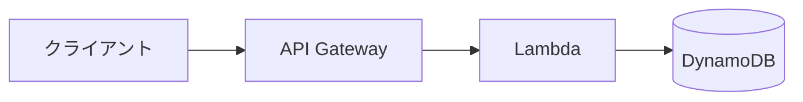

# Diagram skill (mermaid)

This project renders diagrams in two ways. Pick by **where the diagram lives**.

## A. In the mdBook (default)

Write a `mermaid` fenced block directly in the chapter's Markdown. The `mdbook-mermaid` preprocessor renders it in the browser via `mermaid.min.js`.

````markdown

````

**No SVG file is produced or needed for in-book diagrams.** Do not commit pre-rendered SVGs unless step B applies.

## B. Standalone SVG (when explicitly needed)

Generate when the user asks for an exportable image (PR description, slide, README outside the book, validation preview, etc.).

```bash
# Source: src/diagrams/chNN-name.mmd  →  Output: src/diagrams/chNN-name.svg
npx -y @mermaid-js/mermaid-cli@11.12.0 \
  -i src/diagrams/chNN-name.mmd \
  -o src/diagrams/chNN-name.svg \
  -t default \
  -b transparent
```

Notes:
- Use **`@mermaid-js/mermaid-cli@11.12.0`** (pinned). Do not omit the version.
- Headless Chrome via Puppeteer is required; first run downloads it under `~/.cache/puppeteer`.
- For batch regeneration, loop over `src/diagrams/*.mmd`.

## Conventions for this book

| Item | Rule |
|---|---|
| Source location | `src/diagrams/chNN-<slug>.mmd` (only when step B applies) |
| Image location | `src/diagrams/chNN-<slug>.svg` |
| Naming | Lowercase kebab, chapter prefix: `ch07-app-signals-overview` |
| Diagram type | `flowchart TD` for vertical flow, `flowchart LR` for left-right pipelines, `sequenceDiagram` for protocol/timing, `erDiagram` for data model |
| Labels | Japanese OK; keep node labels short (≤ 20 chars). Long captions go in body text, not in the diagram |
| Edges | Always label cross-boundary edges (e.g., `--"OTLP"-->`); leave intra-component edges unlabelled |
| Theme | `default`; the plugin auto-switches with mdBook light/dark mode — do not hard-code colors |
| Direction | Top-to-bottom for layered architecture, left-to-right for request/data pipelines |

## When to choose mermaid over a table or prose

- **Use mermaid**: relationships between 3+ components, data flow, sequence of calls, state transitions
- **Use a table**: enumerated comparison (feature × variant), spec values, supported lists
- **Use prose**: 1-2 step processes, single component description

Don't replace a clear table with a diagram. Don't replace a clear sentence with a diagram either.

## Validation before committing

If the user is editing complex mermaid and you suspect syntax errors, run mmdc once to validate:

```bash
npx -y @mermaid-js/mermaid-cli@11.12.0 -i /tmp/check.mmd -o /tmp/check.svg
# exit 0 = parses; non-zero = surface the error to the user
```

Delete `/tmp/check.svg` after validation; do not commit it.

## What NOT to do

- Do not pre-render every in-book diagram to SVG — the plugin handles browser rendering.
- Do not commit SVGs to the repo without a clear reason (external sharing, validation artifact stays out).
- Do not use raw HTML inside mermaid labels — use `<br/>` only for line breaks.
- Do not invent ASCII art when a mermaid block fits — but keep simple ASCII in cases where it explicitly demonstrates terminal output, log lines, or fixed-width layouts.
