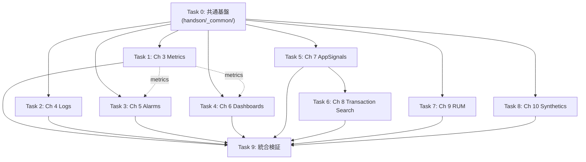

# Phase 3a: 中核+アプリ章のハンズオン実装計画

> **For Claude:** REQUIRED SUB-SKILL: Use superpowers:executing-plans to implement this plan task-by-task. For parallel dispatch, use superpowers:dispatching-parallel-agents. Each chapter task should run in its own git worktree (superpowers:using-git-worktrees) so work proceeds in parallel without conflicts.

**Goal:** Ch 3 Metrics 〜 Ch 10 Synthetics の 8 章に、CDK + Serverless（Lambda TypeScript / Python）構成のハンズオンを追加し、各章の「ハンズオン」「片付け」セクションを実機で再現可能な状態にする。

**Architecture:** `handson/chapter-NN/` をリポジトリ直下に作り、章ごとに独立した CDK (TypeScript) プロジェクトを置く。共通ヘルパ（Lambda 構築、Application Signals 有効化、命名規約）は `handson/_common/` に集約。各章のハンズオンは独立した git worktree で並列開発し、完了次第 `main` にマージ。マークダウン側（`src/partN/NN-*.md`）の「ハンズオン」「片付け」セクションを実コマンドに置き換え、Pages へ反映する。

**Tech Stack:** AWS CDK v2 (TypeScript) / Lambda Runtime: Node.js 22.x + Python 3.13 / API Gateway HTTP API / DynamoDB / S3 + CloudFront (RUM 用) / mdBook 0.5.x with mdbook-mermaid / GitHub Actions / cmux browser

---

## Context

aws-cw-study は CloudWatch コンソール左メニュー全 11 項目を網羅した学習帳で、Phase 1（MVP 中核機能 + Phase III アプリ）と Phase 2（Phase IV〜VI）の**座学**は完了済み（[公開 URL](https://rtam.xyz/aws-cw-study/)）。各章の「ハンズオン」セクションは現状ほとんどが `> TODO: 執筆予定` プレースホルダ（Ch 7 のみ手順テキスト記載済、ただし実 CDK コードはまだ）。

Phase 3a では**中核+アプリ系の 8 章**にハンズオンを実装する。Phase 3b（インフラ Insights）/ Phase 3c（ネットワーク+AI+セットアップ）は完了後に別途計画する。

ユーザー決定:
- **スコープ**: Phase 3a = Ch 3 Metrics 〜 Ch 10 Synthetics（8 章）
- **CDK 構造**: 章ごとに独立スタック（`handson/chapter-NN/`）
- **並列開発**: 章ごとに git worktree を切って並列に進める
- **言語**: Lambda は TypeScript + Python の併用（既存方針）
- **検証**: ローカル `cdk synth` 成功 → 実 AWS への `cdk deploy`（任意。読者は自分のアカウントでやる）→ markdown のハンズオン手順が実際にコピペで動く状態

### 章ごとのハンズオン題材（事前に決まっている）

| 章 | ハンズオン題材 |
|---|---|
| Ch 3 Metrics | Lambda から EMF でカスタムメトリクスを emit、Metrics Insights で集計 |
| Ch 4 Logs | Lambda の構造化ログ、Logs Insights クエリ、Live Tail、Pattern analysis |
| Ch 5 Alarms | Ch 3 のメトリクスに静的アラーム、Anomaly Detection、Composite Alarm |
| Ch 6 Dashboards | Ch 3-5 で作ったメトリクス・アラームを集約したダッシュボード（IaC 管理） |
| Ch 7 Application Signals & SLO | API GW → TS Lambda → Python Lambda → DynamoDB に AppSignals + SLO（既に章本文に手順あり、CDK コードを実装） |
| Ch 8 Transaction Search | Ch 7 のスタックで Transaction Search を有効化、Visual Editor + Logs Insights クエリ |
| Ch 9 RUM | S3+CloudFront に静的サイト、RUM SDK 組み込み、Cognito Identity Pool 経由でテレメトリ送信 |
| Ch 10 Synthetics | Heartbeat Canary + API Canary を Ch 7 の API に対して実行、SLO 連携 |

---

## ディレクトリ構成（最終形）

```
aws-cw-study/
├── handson/
│   ├── _common/
│   │   ├── package.json
│   │   ├── tsconfig.json
│   │   └── lib/
│   │       ├── enable-app-signals.ts   # ADOT layer + IAM 付与ヘルパ
│   │       ├── adot-layer-arns.ts      # リージョン × ランタイム別 ARN マップ
│   │       └── index.ts
│   ├── chapter-03/  # Metrics
│   ├── chapter-04/  # Logs
│   ├── chapter-05/  # Alarms
│   ├── chapter-06/  # Dashboards
│   ├── chapter-07/  # Application Signals & SLO
│   ├── chapter-08/  # Transaction Search
│   ├── chapter-09/  # RUM
│   └── chapter-10/  # Synthetics
└── src/partN/...    # 既存の章マークダウン（ハンズオン節を実コマンドに更新）
```

各 `chapter-NN/` の内部標準レイアウト:

```
chapter-NN/
├── README.md          # クイック起動手順 + 期待される結果
├── package.json
├── tsconfig.json
├── cdk.json
├── bin/app.ts         # CDK エントリポイント
├── lib/
│   └── stack.ts       # スタック定義
├── lambda-ts/         # TypeScript Lambda 群
│   └── <function>/index.ts
├── lambda-py/         # Python Lambda 群
│   └── <function>/handler.py
└── test/              # cdk-nag などの最低限の synth テスト
    └── stack.test.ts
```

---

## 並列実行戦略



**並列ルール:**
- **Task 0** が完了したら、**Task 1〜5, 7, 8** は **同時並列**で着手可（依存しない章ばかり）
- **Task 6（Ch 8 Transaction Search）は Task 5 に依存**（Ch 7 の CDK スタックを拡張する）
- **Task 9（統合検証）は全タスク完了後**

**並列の運用:**
- 各章タスクは `git worktree add ../aws-cw-study-chapter-NN handson/chapter-NN` で別ブランチに切る
- 同時実行数は最大 4〜5（subagent ディスパッチで管理）
- 各タスクの完了基準は「`main` ブランチへ merge され、push 後 CI 緑、Pages 200」

---

## Task 0: 共通基盤 (`handson/_common/`)

**Files:**
- Create: `handson/_common/package.json`
- Create: `handson/_common/tsconfig.json`
- Create: `handson/_common/lib/index.ts`
- Create: `handson/_common/lib/adot-layer-arns.ts`
- Create: `handson/_common/lib/enable-app-signals.ts`
- Create: `handson/.gitignore`

**Step 1:** worktree 作成

```bash
cd /Users/r-tamura/playground/aws/aws-cw-study
git checkout -b feat/handson-common
mkdir -p handson/_common/lib
```

**Step 2:** `handson/.gitignore` 作成

```bash
cat > handson/.gitignore <<'EOF'
node_modules/
cdk.out/
*.js
!**/lib/**/*.js
!jest.config.js
*.d.ts
.env
EOF
```

**Step 3:** `handson/_common/package.json` 作成

```json
{
  "name": "@aws-cw-study/common",
  "version": "0.1.0",
  "private": true,
  "main": "lib/index.js",
  "types": "lib/index.d.ts",
  "scripts": {
    "build": "tsc"
  },
  "dependencies": {
    "aws-cdk-lib": "^2.180.0",
    "constructs": "^10.4.0"
  },
  "devDependencies": {
    "typescript": "~5.6.0",
    "@types/node": "^22.0.0"
  }
}
```

**Step 4:** `handson/_common/tsconfig.json` 作成

```json
{
  "compilerOptions": {
    "target": "ES2022",
    "module": "commonjs",
    "lib": ["ES2022"],
    "declaration": true,
    "strict": true,
    "noImplicitAny": true,
    "esModuleInterop": true,
    "experimentalDecorators": true,
    "skipLibCheck": true,
    "outDir": "lib",
    "rootDir": "lib"
  },
  "include": ["lib/**/*"],
  "exclude": ["node_modules", "lib/**/*.d.ts", "lib/**/*.js"]
}
```

**Step 5:** `lib/adot-layer-arns.ts` 作成（[Ch 7 の ARN](../../src/part3/07-application-signals.md) を起点に最新化、本番では aws-otel.github.io を都度確認）

```typescript
// AWS Distro for OpenTelemetry Lambda layer ARNs
// Source: https://aws-otel.github.io/docs/getting-started/lambda
// Update version suffix when AWS publishes a new layer.
export const ADOT_LAYER_ARNS = {
  'ap-northeast-1': {
    python: 'arn:aws:lambda:ap-northeast-1:615299751070:layer:AWSOpenTelemetryDistroPython:13',
    nodejs: 'arn:aws:lambda:ap-northeast-1:615299751070:layer:AWSOpenTelemetryDistroJs:7',
  },
  'us-east-1': {
    python: 'arn:aws:lambda:us-east-1:615299751070:layer:AWSOpenTelemetryDistroPython:13',
    nodejs: 'arn:aws:lambda:us-east-1:615299751070:layer:AWSOpenTelemetryDistroJs:7',
  },
} as const;

export type SupportedRegion = keyof typeof ADOT_LAYER_ARNS;

export function getAdotLayerArn(region: SupportedRegion, runtime: 'python' | 'nodejs'): string {
  const entry = ADOT_LAYER_ARNS[region];
  if (!entry) throw new Error(`No ADOT layer ARN registered for region ${region}`);
  return entry[runtime];
}
```

**Step 6:** `lib/enable-app-signals.ts` 作成

```typescript
import { Stack } from 'aws-cdk-lib';
import { Function, LayerVersion } from 'aws-cdk-lib/aws-lambda';
import { ManagedPolicy } from 'aws-cdk-lib/aws-iam';
import { aws_applicationsignals as appsignals } from 'aws-cdk-lib';
import { getAdotLayerArn, SupportedRegion } from './adot-layer-arns';

let discoveryEnabled = false;

/**
 * Enable Application Signals on a Lambda function.
 * Idempotently adds the account-wide service discovery (CfnDiscovery) the first time it is called.
 */
export function enableAppSignals(
  fn: Function,
  runtime: 'python' | 'nodejs',
): void {
  const stack = Stack.of(fn);

  if (!discoveryEnabled) {
    new appsignals.CfnDiscovery(stack, 'ApplicationSignalsDiscovery', {});
    discoveryEnabled = true;
  }

  fn.role?.addManagedPolicy(
    ManagedPolicy.fromAwsManagedPolicyName('CloudWatchLambdaApplicationSignalsExecutionRolePolicy'),
  );

  const layerArn = getAdotLayerArn(stack.region as SupportedRegion, runtime);
  fn.addLayers(
    LayerVersion.fromLayerVersionArn(stack, `${fn.node.id}OtelLayer`, layerArn),
  );

  fn.addEnvironment('AWS_LAMBDA_EXEC_WRAPPER', '/opt/otel-instrument');
}
```

**Step 7:** `lib/index.ts`

```typescript
export * from './adot-layer-arns';
export * from './enable-app-signals';
```

**Step 8:** ローカルビルド検証

```bash
cd handson/_common
npm install
npm run build
ls lib/*.js lib/*.d.ts
```

Expected: `lib/index.js`、`lib/enable-app-signals.js`、`lib/adot-layer-arns.js` と対応する `.d.ts` が出ている。

**Step 9:** コミット

```bash
cd /Users/r-tamura/playground/aws/aws-cw-study
git add handson/_common handson/.gitignore
git commit -m "handson(common): scaffold shared helpers for Phase 3a CDK stacks"
git push -u origin feat/handson-common
```

**Step 10:** PR を main にマージ

```bash
gh pr create --base main --title "handson: shared helpers for Phase 3a" --body "..."
gh pr merge --squash --delete-branch
git checkout main
git pull
```

---

## Task 1: Ch 3 Metrics ハンズオン

**Worktree:**

```bash
cd /Users/r-tamura/playground/aws/aws-cw-study
git worktree add ../aws-cw-study-ch03 -b feat/handson-ch03
cd ../aws-cw-study-ch03
```

**Files:**
- Create: `handson/chapter-03/{package.json, tsconfig.json, cdk.json, bin/app.ts, lib/stack.ts, lambda-ts/order-metrics/index.ts, lambda-py/inventory-metrics/handler.py, test/stack.test.ts, README.md}`
- Modify: `src/part2/03-metrics.md` の「ハンズオン」「片付け」節

**Step 1:** プロジェクトひな型

```bash
mkdir -p handson/chapter-03/{bin,lib,lambda-ts/order-metrics,lambda-py/inventory-metrics,test}
cd handson/chapter-03
```

**Step 2:** `package.json`

```json
{
  "name": "chapter-03-metrics",
  "version": "0.1.0",
  "private": true,
  "bin": {"chapter-03": "bin/app.js"},
  "scripts": {
    "build": "tsc",
    "synth": "cdk synth",
    "deploy": "cdk deploy",
    "destroy": "cdk destroy",
    "test": "jest"
  },
  "dependencies": {
    "@aws-cw-study/common": "file:../_common",
    "aws-cdk-lib": "^2.180.0",
    "constructs": "^10.4.0"
  },
  "devDependencies": {
    "aws-cdk": "^2.180.0",
    "typescript": "~5.6.0",
    "@types/node": "^22.0.0",
    "jest": "^29.7.0",
    "ts-jest": "^29.2.0",
    "@types/jest": "^29.5.0"
  }
}
```

**Step 3:** `tsconfig.json`、`cdk.json`、`jest.config.js` も同様に置く（パターンは後続章でも同一なので、この章で確立する）

**Step 4:** Lambda 実装（EMF でカスタムメトリクス emit）

`lambda-ts/order-metrics/index.ts`:

```typescript
import { APIGatewayProxyHandlerV2 } from 'aws-lambda';

interface EmfDoc {
  _aws: {
    Timestamp: number;
    CloudWatchMetrics: Array<{
      Namespace: string;
      Dimensions: string[][];
      Metrics: Array<{Name: string; Unit: string}>;
    }>;
  };
  ServiceName: string;
  Operation: string;
  OrderCount: number;
  OrderValue: number;
}

export const handler: APIGatewayProxyHandlerV2 = async (event) => {
  const orderCount = 1;
  const orderValue = Math.random() * 1000;

  const emf: EmfDoc = {
    _aws: {
      Timestamp: Date.now(),
      CloudWatchMetrics: [{
        Namespace: 'AwsCwStudy/Ch03',
        Dimensions: [['ServiceName', 'Operation']],
        Metrics: [
          {Name: 'OrderCount', Unit: 'Count'},
          {Name: 'OrderValue', Unit: 'None'},
        ],
      }],
    },
    ServiceName: 'order-metrics',
    Operation: 'CreateOrder',
    OrderCount: orderCount,
    OrderValue: orderValue,
  };
  console.log(JSON.stringify(emf));

  return {statusCode: 200, body: JSON.stringify({ok: true, orderValue})};
};
```

`lambda-py/inventory-metrics/handler.py`:

```python
import json, time, random

def handler(event, context):
    emf = {
        "_aws": {
            "Timestamp": int(time.time() * 1000),
            "CloudWatchMetrics": [{
                "Namespace": "AwsCwStudy/Ch03",
                "Dimensions": [["ServiceName", "Operation"]],
                "Metrics": [
                    {"Name": "InventoryQueries", "Unit": "Count"},
                    {"Name": "InventoryLatency", "Unit": "Milliseconds"},
                ],
            }],
        },
        "ServiceName": "inventory-metrics",
        "Operation": "QueryInventory",
        "InventoryQueries": 1,
        "InventoryLatency": random.randint(10, 200),
    }
    print(json.dumps(emf))
    return {"statusCode": 200, "body": json.dumps({"ok": True})}
```

**Step 5:** スタック定義 `lib/stack.ts`

```typescript
import {Stack, StackProps, Duration, CfnOutput} from 'aws-cdk-lib';
import {Construct} from 'constructs';
import {Function, Runtime, Code} from 'aws-cdk-lib/aws-lambda';
import {HttpApi, HttpMethod} from 'aws-cdk-lib/aws-apigatewayv2';
import {HttpLambdaIntegration} from 'aws-cdk-lib/aws-apigatewayv2-integrations';

export class Ch03MetricsStack extends Stack {
  constructor(scope: Construct, id: string, props?: StackProps) {
    super(scope, id, props);

    const order = new Function(this, 'OrderMetrics', {
      runtime: Runtime.NODEJS_22_X,
      handler: 'index.handler',
      code: Code.fromAsset('lambda-ts/order-metrics'),
      timeout: Duration.seconds(10),
    });

    const inventory = new Function(this, 'InventoryMetrics', {
      runtime: Runtime.PYTHON_3_13,
      handler: 'handler.handler',
      code: Code.fromAsset('lambda-py/inventory-metrics'),
      timeout: Duration.seconds(10),
    });

    const api = new HttpApi(this, 'Ch03Api');
    api.addRoutes({
      path: '/order',
      methods: [HttpMethod.POST],
      integration: new HttpLambdaIntegration('OrderInt', order),
    });
    api.addRoutes({
      path: '/inventory',
      methods: [HttpMethod.GET],
      integration: new HttpLambdaIntegration('InvInt', inventory),
    });

    new CfnOutput(this, 'ApiUrl', {value: api.apiEndpoint});
  }
}
```

**Step 6:** エントリ `bin/app.ts`

```typescript
#!/usr/bin/env node
import {App} from 'aws-cdk-lib';
import {Ch03MetricsStack} from '../lib/stack';

const app = new App();
new Ch03MetricsStack(app, 'AwsCwStudyCh03Metrics', {
  env: {region: process.env.CDK_DEFAULT_REGION ?? 'ap-northeast-1'},
});
```

**Step 7:** synth テスト `test/stack.test.ts`

```typescript
import {App} from 'aws-cdk-lib';
import {Template} from 'aws-cdk-lib/assertions';
import {Ch03MetricsStack} from '../lib/stack';

test('synth produces 2 Lambda functions and 1 HTTP API', () => {
  const app = new App();
  const stack = new Ch03MetricsStack(app, 'TestCh03', {env: {region: 'ap-northeast-1'}});
  const t = Template.fromStack(stack);
  t.resourceCountIs('AWS::Lambda::Function', 2);
  t.resourceCountIs('AWS::ApiGatewayV2::Api', 1);
});
```

**Step 8:** ビルド & テスト

```bash
npm install
npm run build
npm test
npx cdk synth
```

Expected: `npm test` 1 PASS、`cdk synth` がエラーなく CloudFormation を出力。

**Step 9:** README.md に「クイック起動手順」を書く

```markdown
# Chapter 03: Metrics ハンズオン

## デプロイ

\`\`\`bash
cd handson/chapter-03
npm install
npx cdk bootstrap   # 初回のみ
npx cdk deploy
\`\`\`

## トラフィック投入

\`\`\`bash
API_URL=$(aws cloudformation describe-stacks --stack-name AwsCwStudyCh03Metrics \\
  --query "Stacks[0].Outputs[?OutputKey=='ApiUrl'].OutputValue" --output text)

while true; do
  curl -s -X POST "$API_URL/order" -d '{}' >/dev/null
  curl -s "$API_URL/inventory" >/dev/null
  sleep 1
done
\`\`\`

## 期待結果

- CloudWatch メトリクス → 名前空間 \`AwsCwStudy/Ch03\` に \`OrderCount\` / \`OrderValue\` / \`InventoryQueries\` / \`InventoryLatency\`
- Metrics Insights クエリ \`SELECT AVG(OrderValue) FROM SCHEMA(\"AwsCwStudy/Ch03\", ServiceName, Operation) GROUP BY ServiceName\`

## 片付け

\`\`\`bash
npx cdk destroy
\`\`\`
```

**Step 10:** マークダウン `src/part2/03-metrics.md` 更新

「ハンズオン」「片付け」の TODO 行を削除して以下に置換:

```markdown
## ハンズオン

[handson/chapter-03/](https://github.com/r-tamura/aws-cw-study/tree/main/handson/chapter-03) に CDK プロジェクトを置いた。要点は次の3 つ。

1. Lambda 関数（TypeScript / Python）から **Embedded Metric Format (EMF)** で構造化ログを出力すると、CloudWatch がパースして自動的にカスタムメトリクスを作る
2. ディメンション（`ServiceName` / `Operation`）を 1 つの EMF イベントに含めるだけで、メトリクスとして発火
3. **Metrics Insights** クエリで SQL ライクに集計できる

詳細は同ディレクトリの `README.md` を参照。

## 片付け

`npx cdk destroy` でスタックを削除すると、Lambda・API Gateway・関連 IAM ロールがまとめて消える。CloudWatch Logs のロググループは自動削除されないため、必要に応じて `aws logs delete-log-group --log-group-name /aws/lambda/...` で削除する。
```

**Step 11:** ビルドして markdown が壊れていないか確認

```bash
cd /Users/r-tamura/playground/aws/aws-cw-study
mdbook build 2>&1 | tail -3
```

**Step 12:** コミット & PR

```bash
git add handson/chapter-03 src/part2/03-metrics.md
git commit -m "handson(ch03): CDK Serverless EMF metrics hands-on"
git push -u origin feat/handson-ch03
gh pr create --base main --title "handson(ch03): Metrics hands-on" --body "..."
```

**Step 13:** CI 緑を確認、merge

```bash
gh pr checks
gh pr merge --squash --delete-branch
```

**Step 14:** worktree クリーンアップ

```bash
cd /Users/r-tamura/playground/aws/aws-cw-study
git worktree remove ../aws-cw-study-ch03
git pull
```

---

## Task 2: Ch 4 Logs ハンズオン

**Worktree branch:** `feat/handson-ch04`

**ハンズオン題材:**
- Lambda が JSON 構造化ログを emit
- Logs Insights でフィルタ・集計
- Live Tail を使ってリアルタイムにログを覗く
- Pattern analysis でクラスタリング
- メトリクスフィルタで「ERROR ログの数」を Metric 化

**Step 構成（簡略）:**

1. worktree 作成
2. `handson/chapter-04/` ひな型（Task 1 と同じレイアウト）
3. `lambda-ts/api-handler/index.ts`（INFO / WARN / ERROR を確率的に出すサンプル API）
4. `lambda-py/worker/handler.py`（ジョブ処理を構造化ログで出力）
5. `lib/stack.ts`（API GW + Lambda 2 つ + ロググループ + メトリクスフィルタ）
6. synth テスト
7. README.md に Logs Insights クエリ例を 4-5 個（時系列、Top patterns、ERROR グループ、Live Tail コマンド）
8. `src/part2/04-logs.md` 更新
9. PR → merge → worktree 削除

**重要なクエリ例（README に書くもの）:**

```text
fields @timestamp, level, msg, requestId
| filter level = "ERROR"
| stats count(*) by bin(5m)

fields @message
| pattern @message
| sort @count desc
| limit 5
```

---

## Task 3: Ch 5 Alarms ハンズオン

**Worktree branch:** `feat/handson-ch05`

**ハンズオン題材:**
- Ch 3 / Ch 4 のメトリクスを使う前提（独立スタックだが、CloudWatch には別途デプロイされた Ch 3 メトリクスがある想定）
- 静的しきい値アラーム
- Anomaly Detection アラーム
- Composite Alarm（ChildA AND ChildB）
- アラームアクション SNS Topic + Email サブスクリプション

**設計判断:** Ch 3 のメトリクスに依存させると章の独立性が弱まるので、Ch 5 のスタック内で Lambda を 1 つ動かして CloudWatch メトリクスを発行し、それに対するアラームを試す独立構成にする。

**Step 構成:**
1. worktree
2. CDK ひな型
3. Lambda（EMF でメトリクス emit、ランダムにスパイクを起こす）
4. `lib/stack.ts`
   - `Metric` で参照
   - `Alarm`（threshold）
   - `CfnAnomalyDetector` + `Alarm`（anomaly detection band）
   - `CompositeAlarm`
   - `Topic` + `EmailSubscription`（メール購読は CDK パラメタで受ける）
5. synth テスト
6. README.md
7. `src/part2/05-alarms.md` 更新
8. PR

---

## Task 4: Ch 6 Dashboards ハンズオン

**Worktree branch:** `feat/handson-ch06`

**ハンズオン題材:**
- 自動ダッシュボード（Lambda の自動 dashboard 確認）
- カスタムダッシュボード IaC（GraphWidget / SingleValueWidget / LogQueryWidget / AlarmWidget）
- ダッシュボード変数（地域・環境）
- メトリクス算術 (`SearchExpression`)

**Step 構成:**
1. worktree
2. CDK ひな型（Lambda + メトリクス + ダッシュボード）
3. `Dashboard` を CDK で定義し、各ウィジェットを書く
4. synth テスト（ダッシュボード資源数の確認）
5. README.md（デプロイ後にコンソールで開く URL）
6. `src/part2/06-dashboards.md` 更新
7. PR

---

## Task 5: Ch 7 Application Signals & SLO ハンズオン

**Worktree branch:** `feat/handson-ch07`

**ハンズオン題材:** 既に章本文に手順記載済（API GW → TS Lambda → Python Lambda → DynamoDB に AppSignals 有効化）。CDK コードを実装。

**Step 構成:**
1. worktree
2. CDK ひな型
3. `lib/stack.ts`
   - DynamoDB テーブル
   - Python Lambda（在庫 API、DDB 読み書き）
   - TS Lambda（注文 API、Python Lambda 呼び出し）
   - API Gateway HTTP API
   - **`enableAppSignals(fn, 'python')`** と **`enableAppSignals(fn, 'nodejs')`** を `@aws-cw-study/common` から呼ぶ
4. synth テスト（CfnDiscovery が 1 つだけ生成されること、Lambda 2 つに ADOT layer が付いていること）
5. README.md
   - デプロイ
   - トラフィック投入（curl ループ）
   - CloudWatch コンソールで Service Map / Service Detail / SLO Recommendations を確認
   - SLO 作成 → Burn Rate アラーム
6. `src/part3/07-application-signals.md` の既存ハンズオン節を README ベースで簡素化（重複削除、CDK コード例は最小に絞り、README に逃がす）
7. PR

---

## Task 6: Ch 8 Transaction Search ハンズオン

**依存:** Task 5 完了後。

**Worktree branch:** `feat/handson-ch08`

**ハンズオン題材:** Ch 7 のスタックを再利用 / 拡張して Transaction Search を有効化。

**設計選択:**
- Option A: Ch 7 スタックを copy して `chapter-08/` に置く（独立性最優先）
- **Option B: Ch 7 スタックに「Transaction Search を有効化するコメントアウト行」を入れ、Ch 8 ではそのコメントを外して再 deploy する手順を README に書く（Recommended）**

Option B を採る。`handson/chapter-08/` には Transaction Search 有効化に必要な追加 IAM / リソース定義のみを置き、Ch 7 と組み合わせて使う前提に。

**Step 構成:**
1. worktree
2. `handson/chapter-08/` に enable-transaction-search.ts と README.md
3. CLI 経由 Transaction Search 有効化のスクリプトを README に書く（`UpdateTraceSegmentDestination` API を gh / aws CLI で叩く）
4. Visual Editor の使い方を README に記載
5. `src/part3/08-transaction-search.md` のハンズオン節を更新
6. PR

---

## Task 7: Ch 9 RUM ハンズオン

**Worktree branch:** `feat/handson-ch09`

**ハンズオン題材:**
- S3 + CloudFront に静的サイト配信
- Cognito Identity Pool（unauthenticated role 含む）
- RUM App Monitor を CDK で作成
- HTML に RUM SDK スニペット注入

**Step 構成:**
1. worktree
2. CDK ひな型
3. `lib/stack.ts`
   - S3 Bucket（OAC 経由）
   - CloudFront Distribution
   - Cognito Identity Pool（unauth role）
   - RUM App Monitor (`CfnAppMonitor`)
4. `web/index.html`（RUM SDK + サンプル UI）
5. RUM スニペットの埋め込みを CDK のデプロイ時に置換するか、もしくは S3 にアップロードする CDK CustomResource で対応
6. synth テスト
7. README.md
8. `src/part3/09-rum.md` 更新
9. PR

---

## Task 8: Ch 10 Synthetics ハンズオン

**Worktree branch:** `feat/handson-ch10`

**ハンズオン題材:**
- Heartbeat Canary（公開 URL の死活）
- API Canary（POST → 200 を確認）
- Multi-checks Blueprint（HTTP/DNS/SSL チェック）
- X-Ray Tracing 有効化で Application Signals 連携

**Step 構成:**
1. worktree
2. CDK ひな型
3. `lib/stack.ts`
   - S3 Bucket（artifact 用）
   - `synthetics.Canary` × 3（Heartbeat / API / Multi-checks）
   - `ProvisionedResourceCleanup` プロパティ ON
4. canary スクリプト `canaries/heartbeat/index.js` ほか
5. synth テスト
6. README.md
7. `src/part3/10-synthetics.md` 更新
8. PR

---

## Task 9: 統合検証

**Files:** なし（読み取りのみ）

**Step 1:** 全 PR が main に取り込まれた状態を確認

```bash
cd /Users/r-tamura/playground/aws/aws-cw-study
git checkout main && git pull
ls handson/
# expected: _common chapter-03 chapter-04 chapter-05 chapter-06 chapter-07 chapter-08 chapter-09 chapter-10
```

**Step 2:** 各章で `cdk synth` がエラーなく動くか巡回

```bash
for d in handson/chapter-{03,04,05,06,07,09,10}; do
  echo "=== $d ==="
  (cd "$d" && npm install --silent && npx cdk synth >/dev/null && echo OK || echo FAIL)
done
```

Expected: 全章 OK。

**Step 3:** mdbook build で markdown 側の整合性確認

```bash
mdbook build 2>&1 | grep -iE "warn|error" || echo "OK"
```

**Step 4:** 各章のハンズオンノードにある link が有効か確認

```bash
# 例: handson/chapter-XX/README.md への相対リンク有無
grep -n "handson/chapter-" src/part2/*.md src/part3/*.md
```

**Step 5:** Pages 上の各章ハンズオン節を curl で確認

```bash
for ch in 03-metrics 04-logs 05-alarms 06-dashboards; do
  curl -s "https://rtam.xyz/aws-cw-study/part2/${ch}.html" | grep -c "handson/chapter-" || echo "no link in $ch"
done
for ch in 07-application-signals 08-transaction-search 09-rum 10-synthetics; do
  curl -s "https://rtam.xyz/aws-cw-study/part3/${ch}.html" | grep -c "handson/chapter-" || echo "no link in $ch"
done
```

**Step 6:** Phase 3a 完了の宣言コミット

```bash
# preface.md に「Phase 3a: 中核+アプリのハンズオン完了」を追記する微修正
# その後コミット & push
git commit -am "docs(preface): mark Phase 3a hands-on as complete"
git push
```

---

## Verification (全体)

### ローカル
- 各章 `handson/chapter-NN/`: `npm install && npx cdk synth` がエラーなく完了
- 各章のテスト: `npm test` が PASS
- ルート: `mdbook build` が警告なし

### AWS（読者が自分で実機検証する）
- `npx cdk deploy` 成功
- README.md のトラフィック投入手順を実行
- 期待される CloudWatch シグナルがコンソールに現れる
- `npx cdk destroy` で完全クリーンアップ

### 公開
- Pages の各章ハンズオン節が `handson/chapter-NN/README.md` への GitHub リンクを含む
- 全章 200 応答

---

## 並列実行のための補足

### 推奨ディスパッチ手順

1. **Task 0 を先に完了**（main にマージ後）
2. Task 1, 2, 3, 4, 5, 7, 8 を**同時並列で**ディスパッチ（Task 6 だけは Task 5 待ち）
3. Task 6 は Task 5 完了通知後にディスパッチ
4. 全タスク完了後、Task 9（統合検証）

### subagent への指示テンプレ

各章タスクは独立した subagent に渡す。プロンプトには以下を含める:
- 作業ブランチ名（`feat/handson-chXX`）
- worktree のパス（`../aws-cw-study-chXX`）
- 章ファイルパス（`src/partN/NN-name.md`）
- ハンズオン題材（このプランの該当 Task セクション）
- `handson/_common/` の使い方（既に main にある前提）
- 完了基準（synth OK、test PASS、PR 作成、CI 緑、merge、worktree 削除）

並列ディスパッチに関する skill: `superpowers:dispatching-parallel-agents` を参照。

### コンフリクト懸念

並列 PR の merge 競合は次の点で起こりうる:
- `src/SUMMARY.md`（Phase 3a では更新不要なので OK）
- `src/preface.md`（Task 9 でのみ更新）
- 各章マークダウンは別ファイルなので並列でも安全

`handson/_common/` は Task 0 で固定し、各章タスク中は読み取り専用。

---

## 関連ファイル / 再利用パターン

### テンプレート参照
- `src/part3/07-application-signals.md` — 章の構成テンプレ
- `.claude/skills/diagram/SKILL.md` — mermaid 規約
- `CLAUDE.md` — プロジェクト全体の方針

### 新規作成ディレクトリ
```
handson/_common/
handson/chapter-{03,04,05,06,07,08,09,10}/
docs/plans/                                  # この計画ファイル自体
```

### 修正するマークダウン
```
src/part2/03-metrics.md          (Task 1)
src/part2/04-logs.md             (Task 2)
src/part2/05-alarms.md           (Task 3)
src/part2/06-dashboards.md       (Task 4)
src/part3/07-application-signals.md (Task 5)
src/part3/08-transaction-search.md  (Task 6)
src/part3/09-rum.md              (Task 7)
src/part3/10-synthetics.md       (Task 8)
src/preface.md                   (Task 9)
```
