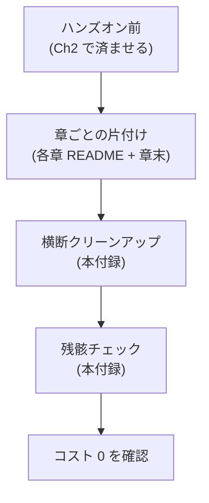

# 付録A: ハンズオン環境とクリーンアップ

[Ch2 環境準備](../part1/02-setup.md) は最初に読む手順書ですが、本付録は **「全章のハンズオンを通したあと、確実に課金を止め切るための実作業書」** です。各章で何が AWS 上に残りやすいか、それをどう一括で消すかを集約しています。

## 全体フロー



理想は「**章ごとの片付け**を逐一やる」ですが、現実には飛ばすことがあります。本付録は **後から一括で吸収**できる前提で構成しています。

## ハンズオン用アカウントのチェック

[Ch2](../part1/02-setup.md) で立てた検証用アカウントが次の状態にあるか確認します。

- [ ] **AWS Organizations の sandbox OU 配下** に置かれている
- [ ] **AWS Budgets** で月 USD 10 の上限を引き、80% / 100% でメール通知
- [ ] **Cost Anomaly Detection** をサービス別で有効化
- [ ] **CloudTrail** がデフォルトで有効
- [ ] 普段使いと別の **MFA 必須の管理者**で操作
- [ ] **`aws sts get-caller-identity`** で意図したアカウント ID が返る

ここが固まっていれば、何かやらかしても被害は検証用アカウントで止まります。

## 章で作られる主なリソース

| 章 | スタック名 / 主リソース | 自動削除されるもの | 残骸になりやすいもの |
|---|---|---|---|
| [Ch3](../part2/03-metrics.md) | `AwsCwStudyCh03Metrics` | Lambda × 2、HTTP API、IAM ロール | ロググループ `/aws/lambda/AwsCwStudyCh03Metrics-*`、カスタムメトリクス（自動失効） |
| [Ch4](../part2/04-logs.md) | `AwsCwStudyCh04Logs` | Lambda × 2、HTTP API、明示 LogGroup | Lambda 自動生成のロググループが残ることあり |
| [Ch5](../part2/05-alarms.md) | `AwsCwStudyCh05Alarms` | Lambda、EventBridge、SNS、3 アラーム、Anomaly Detector | SNS のメールサブスクリプション（解除リンク要） |
| [Ch6](../part2/06-dashboards.md) | `AwsCwStudyCh06Dashboards` | Lambda、EventBridge、Alarm、Dashboard | カスタムメトリクス |
| [Ch7](../part3/07-application-signals.md) | `AwsCwStudyCh07AppSignals` | Lambda × 2、DynamoDB、HTTP API、CfnDiscovery | 手動作成した SLO・Burn Rate アラーム、`/aws/application-signals/data` |
| [Ch8](../part3/08-transaction-search.md) | （Ch7 + 設定） | — | Transaction Search 設定が残る、`aws/spans` ロググループ |
| [Ch9](../part3/09-rum.md) | `AwsCwStudyCh09Rum` | S3、CloudFront、Cognito Identity Pool、AppMonitor | CloudFront 配信の無効化に時間 |
| [Ch10](../part3/10-synthetics.md) | `AwsCwStudyCh10Synthetics` | Canary × 3（ProvisionedResourceCleanup ON）、S3 アーティファクト | 無し |

Phase 3b / 3c のハンズオン（執筆予定）でも同様の表を増やす予定です。

## 一括削除スクリプト

```bash
#!/usr/bin/env bash
set -euo pipefail
REGION="${1:-ap-northeast-1}"

# 1. handson 配下の各章 CDK スタックを destroy
for ch in handson/chapter-*; do
  if [ -f "$ch/cdk.json" ]; then
    echo "=== Destroying $ch ==="
    (cd "$ch" && npx cdk destroy --force --region "$REGION" 2>&1 | tail -3) || true
  fi
done

# 2. Lambda が自動生成したロググループ（cdk destroy では消えない）
for grp in $(aws logs describe-log-groups \
  --log-group-name-prefix /aws/lambda/AwsCwStudy \
  --region "$REGION" \
  --query 'logGroups[].logGroupName' --output text); do
  aws logs delete-log-group --log-group-name "$grp" --region "$REGION"
done

# 3. Application Signals の作業データ
aws logs delete-log-group --log-group-name /aws/application-signals/data --region "$REGION" 2>/dev/null || true

# 4. Transaction Search を有効化していた場合は無効化
if [ -f handson/chapter-08/disable-transaction-search.sh ]; then
  bash handson/chapter-08/disable-transaction-search.sh "$REGION" || true
fi

# 5. aws/spans ロググループ（残ストレージ課金停止）
aws logs delete-log-group --log-group-name aws/spans --region "$REGION" 2>/dev/null || true

# 6. CDK Toolkit スタック（再ハンズオンの予定がなければ）
read -p "Delete CDKToolkit stack? [y/N]: " yn
[ "$yn" = "y" ] && aws cloudformation delete-stack --stack-name CDKToolkit --region "$REGION"

echo "Cleanup done. See Verify section in this appendix to confirm."
```

スクリプト自体はリポジトリにコミットしていません（コピペで使えるように本付録に直接置く方針）。必要であれば `handson/cleanup-all.sh` として保存してください。

## Verify: 残骸チェック

`cdk destroy` だけでは消えないリソースがあるため、最後に次の確認を回します。すべて空ならコスト発生源は止まっています。

### CloudFormation スタック残骸

```bash
aws cloudformation list-stacks \
  --stack-status-filter CREATE_COMPLETE UPDATE_COMPLETE ROLLBACK_COMPLETE \
  --query 'StackSummaries[?starts_with(StackName,`AwsCwStudy`)].StackName'
# 期待: []
```

### CloudWatch Logs

```bash
aws logs describe-log-groups \
  --log-group-name-prefix / \
  --query 'logGroups[?contains(logGroupName,`AwsCwStudy`) || contains(logGroupName,`application-signals`) || contains(logGroupName,`aws/spans`)].logGroupName'
# 期待: []
```

### Lambda 関数

```bash
aws lambda list-functions \
  --query 'Functions[?starts_with(FunctionName,`AwsCwStudy`)].FunctionName'
```

### CloudWatch カスタムメトリクス（参考）

```bash
aws cloudwatch list-metrics --namespace AwsCwStudy/Ch03 \
  --query 'Metrics[].MetricName' | head
# 表示はされるが、データポイントは 15 か月で自動失効
```

### Application Signals サービス

```bash
aws application-signals list-services \
  --start-time $(($(date +%s) - 86400)) \
  --end-time   $(date +%s) \
  --query 'ServiceSummaries[].KeyAttributes.Name'
# 期待: 空、または学習用以外のサービスのみ
```

### IAM ロール / ポリシー

```bash
aws iam list-roles \
  --query 'Roles[?contains(RoleName,`AwsCwStudy`) || contains(RoleName,`Ch0`)].RoleName'
```

### S3 バケット（Synthetics アーティファクト等）

```bash
aws s3api list-buckets \
  --query 'Buckets[?contains(Name,`awscwstudy`) || contains(Name,`aws-cw-study`)].Name'
```

### Synthetics Canary

```bash
aws synthetics describe-canaries \
  --query 'Canaries[].Name'
```

### CloudFront ディストリビューション（Ch9 用）

```bash
aws cloudfront list-distributions \
  --query 'DistributionList.Items[?contains(Comment,`aws-cw-study`)].Id'
```

### CDK Toolkit のアセットバケット

```bash
aws s3api list-buckets --query 'Buckets[?starts_with(Name,`cdk-hnb659fds-assets-`)].Name'
# 学習が完全に終わっていれば中身を空にしてからバケット削除可
```

## トラブルシュート

### `cdk destroy` が失敗する

主因と対処:

| 症状 | 原因 | 対処 |
|---|---|---|
| `DELETE_FAILED` on S3 bucket | バケット内にオブジェクトが残っている | `aws s3 rm s3://<bucket> --recursive` してから再 destroy |
| `DELETE_FAILED` on CloudFront | 無効化に最大 30 分 | `aws cloudfront update-distribution` で `Enabled=false` → `wait distribution-deployed` → 再 destroy |
| `DELETE_FAILED` on Lambda | LogGroup が手動編集された | LogGroup を `aws logs delete-log-group` で消してから再 destroy |
| `DELETE_FAILED` on Cognito IdentityPool | 添付されたロールがそのプールを参照 | Identity Pool 直接削除 → スタックを `delete-stack --retain-resources` |

### スタックが孤立した

`cdk destroy` が落ちた状態でリポジトリを消してしまった場合、CloudFormation コンソールから手動で削除します。リソースの `RemovalPolicy=DESTROY` を設定済みなので、コンソールの Delete ボタン 1 回で消えるのが大半です。

### 課金が止まらない

最終手段として **アカウントごと閉鎖**します。Organizations 配下なら親アカウントから「Close account」できます。閉鎖後 90 日はアカウントが復活可能で、その間も EC2 等の起動課金は止まります（CloudWatch Logs の保管課金はサブ秒で止まります）。

## 参考資料

**AWS 公式ドキュメント**
- [AWS CDK bootstrapping](https://docs.aws.amazon.com/cdk/v2/guide/bootstrapping.md) — `CDKToolkit` スタックが管理する S3 / ECR / IAM
- [Best practices for developing and deploying with the AWS CDK](https://docs.aws.amazon.com/cdk/v2/guide/best-practices.md) — Stateful / Stateless 分離と destroy 安全性の指針
- [Configuring CDK Toolkit programmatic actions (destroy)](https://docs.aws.amazon.com/cdk/v2/guide/toolkit-library-actions.md) — `cdk destroy` の挙動と注意点
- [Managing your costs with AWS Budgets](https://docs.aws.amazon.com/cost-management/latest/userguide/budgets-managing-costs.html) — 予算アラートで「走らせ放し」を検知

**AWS ブログ / アナウンス**
- [Automating Amazon CloudWatch Alarm Cleanup at Scale](https://aws.amazon.com/blogs/mt/automating-amazon-cloudwatch-alarm-cleanup-at-scale/) — 残骸アラームの定期掃除パイプライン

## 締めのチェックリスト

ハンズオンが終わったら、最後に以下を順に実行して帰ります。

- [ ] 一括削除スクリプトを実行
- [ ] CloudFormation `AwsCwStudy` 接頭辞のスタックが 0
- [ ] CloudWatch Logs ロググループ `AwsCwStudy` 接頭辞 / `application-signals` / `aws/spans` が 0
- [ ] Synthetics Canary が 0
- [ ] CloudFront ディストリビューションが 0（Ch9 を試した場合）
- [ ] Cost Explorer の翌日値が下がっていることを確認（反映に 24h かかる）
- [ ] Budget アラートが過去最大値より下に戻ることを確認

ここまで通っていれば、検証用アカウントを残しても課金はゼロに収束します。
