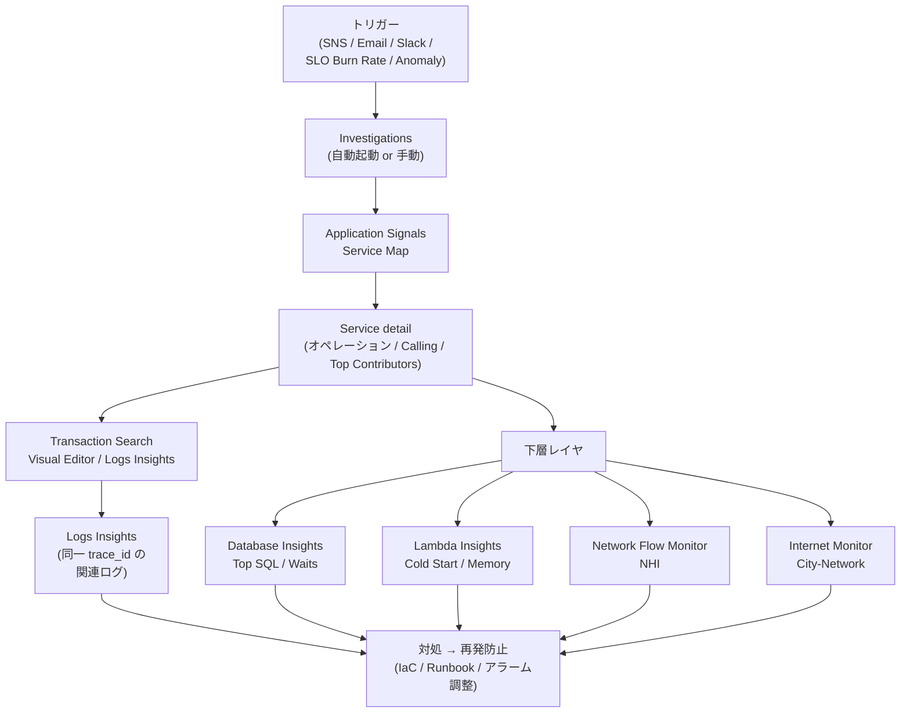

# 付録D: インシデント対応ワークフロー

各章で扱った機能を、**実際のインシデント発生時にどの順で開いて何を見るか**で縦断します。本付録は「**画面遷移の地図**」です。3 つの代表ケースをステップ単位で追います。

## 縦断地図



ポイントは 3 つ:

1. **入口は通知の種類で変わる**が、出口は常に「Application Signals Service Map」
2. **Service detail から下層**（DB / Lambda / Network）への分岐点が最も重要
3. **同じ trace_id で Logs / X-Ray を辿る**動線がインシデント解析の核

## ケース 1: 「ユーザーから注文 API が遅い」と問い合わせ

ユーザー報告ベース。アラームが鳴っていない or アラーム閾値以下のグレーゾーン。

### Step 1 — まず Service Map で全体把握

CloudWatch コンソール → **Application Signals → Services**

- フリート俯瞰ページで `OrderApi` の **Latency / Faults / Errors** を確認
- 数値が悪化していなければアラームが鳴っていない理由が分かる
- 数値が悪化していれば次のステップへ

### Step 2 — Service detail で SLO バーン状況

`OrderApi` をクリック → **Service detail**

- Overview タブで **SLO Attainment**（達成率）と残りエラーバジェットを確認
- Service operations タブで **POST /checkout** など特定オペレーションのみ悪化していないか
- **Top Contributors** タブで「ノード別 / Pod 別 / コンテナ別」の寄与を確認

### Step 3 — 特定の顧客のリクエストを Transaction Search で探す

**Application Signals → Transaction Search**

問い合わせには通常「いつ頃 / どのアカウント」の情報がある。Visual Editor で:

```text
List モード
attribute.enduser.id = "cust-12345"
時刻範囲: 過去 1 時間
```

該当スパンが見つかったら **traceId** を控える。

### Step 4 — Trace timeline で詰まり箇所を特定

スパンから X-Ray Trace Map に飛ぶ → **タイムラインビュー**

- どのスパンが長いか（`db.query` / `http.request` / `lambda.coldstart` 等）
- 親子関係から「checkoutApi → inventoryApi → DynamoDB」のどこで詰まっているか

### Step 5 — 下層に降りる

詰まり箇所に応じて分岐:

| 詰まり箇所 | 次に開く画面 |
|---|---|
| `db.query` スパンが長い | **Database Insights → Top SQL**（[Ch 14](../part4/14-database-insights.md)） |
| `lambda.coldstart` 系 | **Lambda Insights**（[Ch 15](../part4/15-lambda-insights.md)） |
| `http.request` の P99 が高い（外向き） | **Network Flow Monitor** または **Internet Monitor**（[Ch 16](../part5/16-network-monitoring.md)） |
| エラー応答 | **Logs Insights** で同じ trace_id を検索 |

### Step 6 — 同じ trace_id でログを縦断

**CloudWatch Logs → Logs Insights**

```text
fields @timestamp, level, msg, durationMs
| filter trace_id = "1-5faae118-..."
| sort @timestamp asc
```

複数サービスのログが時系列で並ぶ。エラー文や具体値（`stock=0` など）が見える。

### Step 7 — 対処と再発防止

- ボトルネック解消（インデックス追加、メモリ増量、リトライ追加）
- **SLO Burn Rate アラーム**を作る（次回は通知で気づける）
- 場合によって **Investigations の Investigation Group** を後付けでこのアラームに紐付け、自動初動を仕込む

---

## ケース 2: 「P99 レイテンシ急上昇」アラームが鳴った

アラームベース。Investigation 自動起動を仕込んでいる前提。

### Step 1 — 通知から Investigation を直接開く

SNS / Email / Slack の通知本文に **Investigation Group のリンク**が入っている（アラームの `alarm-actions` に Investigation Group ARN を指定済み前提）。

通知をクリック → **Investigation の Feed** へ。

### Step 2 — AI が出した観測 / 仮説 / 提案を読む

Investigation Feed には:

- **観測 (Observation)**: 「`OrderApi` の P99 が直近 10 分で 250ms → 1200ms に上昇」など事実
- **仮説 (Hypothesis)**: 「DynamoDB ProvisionedThroughputExceededException が原因の可能性 (信頼度 75%)」など因果
- **提案 (Suggestion)**: 「Read Capacity を一時増量、または On-Demand に切替」

仮説を **accept / discard** で評価。

### Step 3 — 5 Whys で深掘り

Feed → **Five Whys**

AI が「なぜそれが起きたか？」を最大 5 段繰り返す。各段でユーザーが介入可能:

- なぜ P99 が上がったか → DynamoDB スロットル
- なぜスロットル → 急なトラフィック増 (5 倍)
- なぜトラフィック増 → 新キャンペーンのメール配信
- なぜ事前増設しなかったか → キャパシティプランニングが手動で漏れた
- なぜ自動でないか → DAU 予測連動の Auto Scaling 未実装

### Step 4 — Incident report を生成

Feed → **Generate report**

タイムライン・影響範囲・RCA・対処・再発防止が AI 提案で埋まる。レビューして調整、Slack / Confluence にエクスポート。

### Step 5 — 並行してダッシュボードと Logs

Investigation だけで足りないときの常套手段:

- **CloudWatch Dashboards** で関連メトリクスを並べる（[Ch 6](../part2/06-dashboards.md)）
- **Logs Insights** の `pattern @message` で新出パターン抽出（[Ch 4](../part2/04-logs.md)）
- **Network Flow Monitor NHI** で AWS 起因か自分起因か一次切り分け（[Ch 16](../part5/16-network-monitoring.md)）

### Step 6 — 対処と再発防止

- 一次対応（Read Capacity 増、On-Demand 切替）
- Composite Alarm を組んで「DynamoDB スロットル + Latency P99」の同時発火だけ通知（多発抑制、[Ch 5](../part2/05-alarms.md)）
- Investigation 機能で**ポストモーテムの初稿が自動生成済み**なので、レビューして共有

---

## ケース 3: 「特定地域からアクセスできない」と苦情

エンドユーザーのインターネット品質起因。サーバ側の SLO は健康なので普通の APM では見えない。

### Step 1 — Internet Monitor のヘルスイベント

CloudWatch コンソール → **Internet Monitor → Health events**

- 過去 24 時間のグローバル Health events を時系列で表示
- 苦情のあった地域・ISP（City-Network）でイベントが立っていないか

### Step 2 — トラフィック寄与で影響を定量化

該当 City-Network をクリック → **Traffic affected**

- 自分の対象リソース（VPC / NLB / CloudFront）への影響トラフィック量
- 全体の何 % のユーザが影響を受けているか
- Performance score / Availability score の悪化を確認

### Step 3 — Network Path Visualization で原因切り分け

Internet Monitor は **AWS 側 / ASN 側 のどちらに原因があるかの推定**を出します。

- **AWS 側**: AWS Health Dashboard で関連リージョンの障害を確認
- **ASN 側**: ISP の障害なので AWS 側でできることは限定的（ただし CloudFront / Global Accelerator で迂回経路を作れる場合がある）

### Step 4 — RUM で実ユーザの体感確認

Web / モバイルアプリで RUM を有効化していれば、**Application Signals → RUM** で:

- セッション単位での Core Web Vitals 悪化
- 同じ City-Network の複数ユーザの一致した症状

CloudFront / API Gateway の HTTP レイヤと突き合わせて「**ネットワーク起因 vs アプリ起因**」を切り分ける。

### Step 5 — 対処

- **AWS 側起因**: AWS Health の自動回復を待つ + Status ページで顧客にアナウンス
- **ASN 側起因**: CloudFront 経由に切り替え（同じ ISP 内のキャッシュで迂回）、Global Accelerator で AWS バックボーンを長く使う構成へ
- 再発防止: Internet Monitor の通知を Slack に流す、 ヘルスイベント発火を SLO の一部として組み込む

---

## ケース 4: 「エラーログ急増」Log Anomaly Detector が発火

ログのパターン変化起因。アプリは動いているが新規例外が出始めた。

### Step 1 — 通知から該当 LogGroup を開く

Log Anomaly Detector の通知 → CloudWatch Logs → 該当 LogGroup

### Step 2 — Pattern analysis で新出パターン特定

Logs Insights で:

```text
fields @message
| pattern @message
| sort @count desc
| limit 10
```

- どのパターンが急増しているか
- 既出パターンの増加か、**新規パターン**か
- 新規ならスタックトレース・エラー文の詳細を確認

### Step 3 — Application Signals 側に影響が出ているか

新規例外が出ても、SLO や Service Map に影響が出ていないなら **Warning** 扱い、影響が出ているなら **Incident** 扱い。後者なら ケース 2 のフローに合流。

### Step 4 — Investigations で因果を整理

Investigations を起動して、ログの新出パターンを観測として AI に渡し、「直近のデプロイ・設定変更との相関」を提示してもらう。

### Step 5 — 対処

- バグなら hotfix デプロイ
- 仕様内ならログレベルを WARN に下げる、もしくは無視リストに
- 再発防止: Metric Filter で新パターンを Metric 化 → Alarm 化

---

## 縦断するときの 5 つのコツ

1. **trace_id を最初にコピーする** — Service detail からスパンに飛んだら、まず trace_id を控える。Logs Insights / Database Insights / X-Ray Trace Map でこの ID をキーに使い回せる
2. **Service Map と Logs Insights の 2 タブ運用** — 上のレイヤと下のレイヤを行き来するので、ブラウザタブを 2 つ並べておく
3. **時間範囲を狭く保つ** — Logs Insights のスキャンコストは時間範囲に比例。「直近 30 分」「直近 1 時間」に絞る
4. **Composite Alarm の親子をたどる** — 親 Alarm が ALARM の場合、子 Alarm の状態を全部見て切り分ける（[Ch 5](../part2/05-alarms.md)）
5. **Investigation Report を初稿として活用** — 復旧後にゼロからポストモーテムを書くより、AI 生成の初稿を編集する方が圧倒的に速い

## 関連章

- [Ch 5 Alarms](../part2/05-alarms.md): 通知レイヤの設計
- [Ch 7 Application Signals](../part3/07-application-signals.md): RED / SLO / Service Map / Burn Rate
- [Ch 8 Transaction Search](../part3/08-transaction-search.md): 全スパンの後追い検索
- [Ch 14 Database Insights](../part4/14-database-insights.md): DB のトリアージ動線
- [Ch 15 Lambda Insights](../part4/15-lambda-insights.md): サンドボックス内のリソース
- [Ch 16 Network Monitoring](../part5/16-network-monitoring.md): L3-4 の責任分界
- [Ch 17 Investigations](../part5/17-investigations.md): AI 駆動 RCA / 5 Whys / Incident Report
