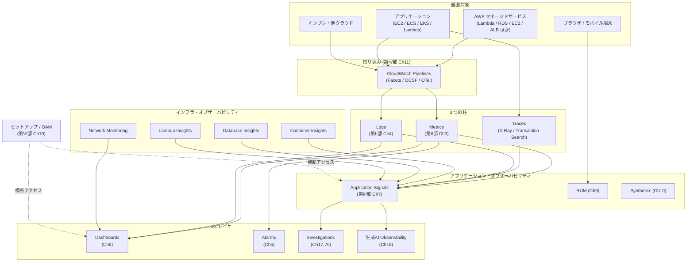

# CloudWatch 全体像

Amazon CloudWatch は AWS の**統合オブザーバビリティサービス**です。本書は読者がコンソール左メニューに並ぶ全項目について「それは何か」「何を解決するのか」を説明できるようになることを目標に書かれており、本章はその地図を最初に提示します。

## CloudWatch が解決する問題

クラウドネイティブなシステムは構成要素が多く、それぞれが別々のテレメトリを発します。CloudWatch がない世界では次の摩擦が起きます。

1. **テレメトリの取り込み口がバラバラ** — メトリクスは Prometheus、ログは Fluent Bit + ELK、トレースは Jaeger…と窓口が分かれ、認証・課金・運用も別建てになる
2. **3 つの柱（Metrics / Logs / Traces）の相関が手作業** — 「あの時間帯に CPU が跳ね、同じ時間帯にこのログが出ていて、その裏でこのトレースが詰まっていた」を結ぶには独自パイプラインが要る
3. **アラートとダッシュボードを別 SaaS に握られる** — IAM の境界外にあり、組織のアカウント運用と整合させづらい
4. **マルチアカウントで観測点が増えるたびに連携設定が爆発する** — 開発・ステージング・本番、サービス単位で AWS アカウントを切ると、観測も同じだけ増殖する
5. **観測コストが青天井** — 取り込み・保存・検索の単価が見えづらく、「気づいたら年間で SaaS と同じくらい払っていた」となる

CloudWatch は、このすべてを **AWS アカウント / IAM / 課金 / コンソール**という共通レイヤの上に集約することで解決します。AWS 上で動くワークロードを観測するうえでの最初の選択肢、というのが立ち位置です。

## 全体像

ポイントは 3 つです。第一に、**観測対象から CloudWatch までは「取り込み」一本に集約**されつつあり、Pipelines / Facets / OCSF / OTel ノーマライゼーションがその接合点を担います。第二に、データは Metrics / Logs / Traces の **3 つの柱**として保存され、その上に Application Signals / Insights 群といったキュレートビューが重なっています。第三に、**AI 機能（Investigations / 生成 AI 観測）は最上位レイヤ**で、すべての下層シグナルを横断します。

## 本書の章立てと CloudWatch メニューの対応

| CloudWatch コンソール左メニュー | 本書 | 立ち位置 |
|---|---|---|
| 取り込み (Ingestion / Pipelines) | [Ch11](../part4/11-ingestion.md) | データの入口 |
| メトリクス | [Ch3](../part2/03-metrics.md) | 3 つの柱・数値時系列 |
| ログ | [Ch4](../part2/04-logs.md) | 3 つの柱・構造化イベント |
| アラーム | [Ch5](../part2/05-alarms.md) | 通知レイヤ |
| ダッシュボード | [Ch6](../part2/06-dashboards.md) | 可視化レイヤ |
| Application Signals (APM) | [Ch7-10](../part3/07-application-signals.md) | アプリ視点 |
| インフラストラクチャモニタリング | [Ch13-15](../part4/13-container-insights.md) | インフラ視点 |
| ネットワークモニタリング | [Ch16](../part5/16-network-monitoring.md) | レイヤ 3-4 視点 |
| AI オペレーション | [Ch17](../part5/17-investigations.md) | AI 駆動 RCA |
| 生成 AI オブザーバビリティ | [Ch18](../part5/18-genai-observability.md) | LLM / Agent 観測 |
| セットアップ | [Ch19](../part6/19-setup.md) | OAM / Cross-account |

加えて、メニュー横断で必要となる **OpenTelemetry（[Ch12](../part4/12-opentelemetry.md)）** を独立章として扱っています。

## 主要仕様の押さえどころ

### オブザーバビリティの 3 つの柱

| 柱 | 何を表すか | CloudWatch の格納先 |
|---|---|---|
| **Metrics** | 時系列の数値（CPU 使用率、リクエスト数、レイテンシ） | CloudWatch Metrics |
| **Logs** | 時刻付きのイベント（アプリログ、AWS vended logs、構造化 JSON） | CloudWatch Logs |
| **Traces** | 分散リクエストの親子関係（スパン） | X-Ray / Transaction Search 経由で `aws/spans` |

3 つの柱は **OpenTelemetry のセマンティック規約**で属性が揃っており、`service.name` や `trace_id` をキーに相互参照できます。本書の Application Signals 章以降はこの相互参照を前提に話が進みます。

### 課金軸の整理

| 軸 | 主な単価指標 | コストが効く場面 |
|---|---|---|
| Metrics | カスタムメトリクス数、API リクエスト | 高カーディナリティのディメンション |
| Logs Ingestion | GB / 月 | 詳細ログを長期保存 |
| Logs Storage | GB-month | 保持期間を伸ばす |
| Logs Insights | スキャンした GB | 横断検索の頻度 |
| Application Signals | サービス × 月 + リクエスト数 | サービス分解能を上げる |
| Synthetics | Canary 実行回数 | 1 分間隔の死活監視 |
| RUM | イベント数 | 100% サンプリング |
| X-Ray / Transaction Search | スパンのインデックス + Logs Ingestion | 100% トレース |

「**ログ取り込みと保管が CloudWatch コストの大半**」と覚えておくと最適化の入口を見失いません。詳細な料金最適化レバーは [Ch5 Alarms](../part2/05-alarms.md)・[Ch11 取り込み](../part4/11-ingestion.md)・[Ch19 セットアップ](../part6/19-setup.md)で繰り返し触れます。

## 2025〜2026 年の主要アップデート

本書執筆時点（2026 年 4 月）で押さえておくべき近年のリリースは以下です。

| 年月 | 機能 | 章 |
|---|---|---|
| 2024 re:Invent | Application Signals 一般提供 | [Ch7](../part3/07-application-signals.md) |
| 2024 re:Invent | Transaction Search GA | [Ch8](../part3/08-transaction-search.md) |
| 2024 re:Invent | CloudWatch Database Insights | [Ch14](../part4/14-database-insights.md) |
| 2024 re:Invent | Container Insights with Enhanced Observability for ECS | [Ch13](../part4/13-container-insights.md) |
| 2025 / 11 | RUM iOS / Android 対応 | [Ch9](../part3/09-rum.md) |
| 2025 / 11 | 5 Whys / Investigations GA | [Ch17](../part5/17-investigations.md) |
| 2025 / 11 | 未計装サービスの Application Signals 自動検出 | [Ch7](../part3/07-application-signals.md) |
| 2025 re:Invent | Cross-account / Cross-region Log Centralization GA | [Ch19](../part6/19-setup.md) |
| 2025 re:Invent | 生成 AI オブザーバビリティ GA | [Ch18](../part5/18-genai-observability.md) |
| 2025 re:Invent | Network Flow Monitor / Internet Monitor 拡張 | [Ch16](../part5/16-network-monitoring.md) |
| 2025 re:Invent | Pipelines / Facets / S3 Tables 統合 | [Ch11](../part4/11-ingestion.md) |
| 2026 / 03 | SLO Recommendations / Performance Report | [Ch7](../part3/07-application-signals.md) |
| 2026 / 04 | Pipelines コンプライアンス機能 / Conditional Processing | [Ch11](../part4/11-ingestion.md) |
| 2026 / 04 | OpenTelemetry Metrics Public Preview / Query Studio | [Ch12](../part4/12-opentelemetry.md) |

トレンドとしては (1) **AI 統合**（[Investigations](../part5/17-investigations.md) と [生成 AI オブザーバビリティ](../part5/18-genai-observability.md)、Amazon Q Developer のチャット起点での Investigation 起動含む）、(2) **OTel 一級化**（OTLP エンドポイント、PromQL — [Ch12](../part4/12-opentelemetry.md)）、(3) **クロスアカウント運用の自動化**（Centralization / Telemetry config — [Ch19](../part6/19-setup.md)）の 3 軸で機能拡張が進んでいます。

## 設計判断のポイント

### CloudWatch だけで完結するか、他 SaaS と併用するか

CloudWatch は AWS との統合性が最大の強みですが、AWS 外（オンプレ・他クラウド）の観測力は追いついていない領域もあります。

| シナリオ | おすすめ |
|---|---|
| AWS が観測対象の 80% 以上 | CloudWatch 単体で押し通す |
| マルチクラウド・大量のオンプレ機器 | CloudWatch + Datadog / New Relic 等の併用 |
| 高度な APM 機能（Continuous Profiling 等） | CloudWatch + 他社 SaaS |
| 規制が厳しく外部送信不可 | CloudWatch + Iceberg 経由で内部分析基盤へ |

OpenTelemetry を介することで、AWS 上のワークロードからは CloudWatch と他 SaaS の **両方に同時送信**するパターンも普通に組めるようになっています（Collector の Exporter を分岐）。

### 取り込みパスの統一

新規ワークロードでは、取り込みを **CloudWatch Pipelines / OTel** に寄せることを推奨します。これは将来的なベンダーロックインを和らげ、Facets や Logs Insights、自然言語クエリといった上位機能を最大限活用する前提条件になります。

### マルチアカウントの設計

「監視アカウント 1 つ + ソースアカウント多数」という **OAM (Observability Access Manager) モデル**が標準です。Organizations と組み合わせ、新規アカウントが自動的に取り込み対象になる **Telemetry config** を初期から仕込んでおくと、後付けで困りません（[Ch19](../part6/19-setup.md)）。

## ハンズオン

> TODO: 本章は地図的な位置付けのため、独自のハンズオンは設けません。`handson/` 配下の各章ハンズオンを進めながら、コンソールの左メニューを実際に開き、本章のメニュー対応表と照合してください。

## 片付け

> 本章はリソースを作成しません。

## 参考資料

**AWS 公式ドキュメント**
- [What is Amazon CloudWatch?](https://docs.aws.amazon.com/AmazonCloudWatch/latest/monitoring/WhatIsCloudWatch.html) — CloudWatch のサービス概要と全機能の入口
- [Amazon CloudWatch Features](https://aws.amazon.com/cloudwatch/features/) — Metrics / Logs / Alarms / Dashboards / APM の機能一覧
- [OpenTelemetry on Amazon CloudWatch](https://docs.aws.amazon.com/AmazonCloudWatch/latest/monitoring/CloudWatch-OpenTelemetry-Sections.html) — 3 シグナル（Metrics / Logs / Traces）の OTel 統合の総覧

**AWS ブログ / アナウンス**
- [Generative AI observability now generally available for Amazon CloudWatch](https://aws.amazon.com/about-aws/whats-new/2025/10/generative-ai-observability-amazon-cloudwatch/) — 生成 AI ワークロード観測の GA（2025/10）
- [Amazon CloudWatch now supports OpenTelemetry metrics in public preview](https://aws.amazon.com/about-aws/whats-new/2026/04/amazon-cloudwatch-opentelemetry-metrics/) — OTLP メトリクス + PromQL のネイティブサポート（2026/04）
- [AWS Observability now available as a Kiro power](https://aws.amazon.com/about-aws/whats-new/2026/02/aws-observability-kiro-power/) — MCP 経由で CloudWatch を AI 開発フローへ統合（2026/02）

**OSS / 標準仕様**
- [OpenTelemetry Specification](https://opentelemetry.io/docs/specs/otel/) — 本書を貫く Metrics / Logs / Traces の標準仕様（CNCF）

## まとめ

- CloudWatch は AWS 上のオブザーバビリティを **アカウント / IAM / 課金 / コンソール**で統合する選択肢
- データは「**取り込み → 3 つの柱 → 上位キュレートビュー → AI 駆動の RCA**」という縦のパイプを流れる
- メニュー左の 11 項目はそれぞれ本書の章に対応しており、本書を通読すると全項目を語れる
- 2025〜2026 の機能拡張は **AI 統合 / OTel 一級化 / クロスアカウント自動化**の 3 軸で進む

次章では、本書で扱うハンズオンを動かすための [環境準備](./02-setup.md) を行います。
