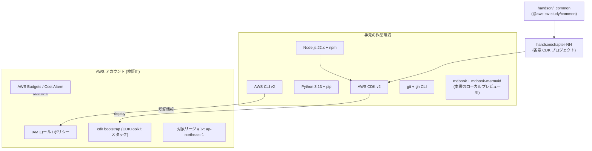

# 環境準備

本書のハンズオンを動かすための **手元の作業環境** と **AWS アカウント側のセットアップ** を一気通貫で整えます。各章のハンズオンは独立した CDK プロジェクトとして配布していますが、共通する初回セットアップは本章で 1 度だけ済ませます。

## 解決する問題

CloudWatch のハンズオンを始めようとすると、毎回次の摩擦に当たります。

1. **アカウント混在の事故** — 普段使いの AWS アカウントで実験すると、消し忘れたリソースが本番系の請求に影響する
2. **権限が広すぎ・狭すぎ** — `AdministratorAccess` で押し通すと教育的でなく、最小権限を都度書き起こすと進まない
3. **CLI / Agent / SDK のバージョン差** — 古い AWS CLI や古い CloudWatch Agent では新機能（OTLP / Application Signals / Pipelines）が動かない
4. **CDK Bootstrap の落とし穴** — 初回だけ必要な `cdk bootstrap` を忘れて Lambda アセットの S3 アップロードで詰まる
5. **コスト爆発の不安** — 走らせ放しで深夜に課金が積み上がるリスクが怖くてハンズオンに踏み切れない

本章はこれらを一通り潰し、**「ハンズオンに入って迷わない」状態**を作ることが目的です。

## 全体像



要点は 3 つ:

1. **手元** には Node.js 22.x、Python 3.13、AWS CLI v2、CDK v2、`gh`、`mdbook` を揃える
2. **AWS アカウント** は検証用を別途用意し、対象リージョンに対して `cdk bootstrap` を 1 回だけ実行
3. **コストの天井** を AWS Budgets / 課金アラームで先に張っておく

## 主要仕様

### AWS アカウント

専用の検証用アカウントを推奨します。Organizations 配下に「sandbox」OU を切り、実験用アカウントを 1 つ用意するのが定石です。

| 項目 | 値 |
|---|---|
| アカウント | 普段使いと別、できれば Organizations の sandbox OU 配下 |
| ルートユーザー | MFA 必須、普段は使わない |
| IAM ユーザー / SSO | ハンズオン作業者専用、AdministratorAccess を当てる（学習用なので妥協） |
| リージョン | `ap-northeast-1`（本書のデフォルト）。他リージョンを使う場合は `~/.aws/config` の `region` を上書き |
| 課金通知 | AWS Budgets で月 USD 10 の上限を引き、超過時はメール通知 |
| Cost Anomaly Detection | サービス別の異常検知を有効化（無料） |

学習用に「最小権限」を厳密に追わないのは、各章の手順が IAM の差で動いたり動かなかったりすると本筋から外れるためです。本番アカウントへの適用時は各機能章で挙げた **最小権限ポリシー名**を参照してください。

### 手元のツール

| ツール | 推奨バージョン | 用途 |
|---|---|---|
| **AWS CLI v2** | 2.20+ | 認証、Transaction Search 有効化、CloudWatch ログ操作 |
| **Node.js** | 22.x LTS | CDK / TypeScript Lambda |
| **Python** | 3.13 | Python Lambda |
| **AWS CDK** | v2 (2.180+) | `npx cdk` で都度実行（グローバルインストール不要） |
| **git** | 2.40+ | 本書リポジトリのクローン |
| **gh** (GitHub CLI) | 2.50+ | PR 操作・GitHub Actions 監視 |
| **mdbook + mdbook-mermaid** | mdbook 0.5+ / mermaid 0.17+ | 本書のローカルプレビュー（`mdbook serve`） |

macOS なら Homebrew で一括インストールできます:

```bash
brew install awscli node python@3.13 git gh mdbook
cargo install mdbook-mermaid
```

Linux / WSL は各ディストリの公式手順に従い、特に AWS CLI は **必ず v2** を入れてください（v1 は古い API で OTLP 等が叩けません）。

### IAM の認証情報

3 通りのうちどれかで CLI 認証を通します。

| 方式 | 手順 | 推奨度 |
|---|---|---|
| **AWS IAM Identity Center (旧 SSO)** | `aws configure sso` → `aws sso login` | ◎（推奨） |
| **IAM ユーザーのアクセスキー** | `aws configure` でキー登録 | △（漏洩リスク） |
| **EC2 / CloudShell の Instance Profile** | 自動 | ○（CloudShell から学習する場合） |

確認:

```bash
aws sts get-caller-identity
# 期待: {"UserId":"...", "Account":"123456789012", "Arn":"arn:aws:iam::..."}
```

ここで意図したアカウント ID が出なければ、以降のハンズオンは絶対に開始しないでください。

### CDK Bootstrap

CDK は初回だけ、対象リージョンに `CDKToolkit` という管理用スタックを作る必要があります。

```bash
npx cdk bootstrap aws://$(aws sts get-caller-identity --query Account --output text)/ap-northeast-1
```

これで S3 アセットバケット（`cdk-hnb659fds-assets-...`）と関連 IAM ロールが作られます。ハンズオン中はこのバケットを通じて Lambda の zip がアップロードされます。

### CloudWatch Agent / ADOT / Observability Operator

ハンズオンの大半は **Lambda + ADOT Lambda Layer** で完結するため、以下のエージェントは「該当章でだけ」インストールします。

| エージェント | 必要な章 | 配布形式 |
|---|---|---|
| **CloudWatch Agent** | EC2 / オンプレでメトリクス・ログ収集する章 | RPM / DEB / msi、SSM 経由で配布も可 |
| **AWS Distro for OpenTelemetry (ADOT)** | Lambda 自動計装、EC2 / ECS の OTel | Lambda Layer ARN / コンテナイメージ / RPM |
| **Amazon CloudWatch Observability EKS Add-on** | Container Insights / Application Signals on EKS の章 | EKS Add-on（コンソール / `eksctl` / `aws eks` から有効化） |

本書のハンズオンでは Phase 3a が Lambda + ADOT Layer に閉じているため、まずは ADOT Lambda Layer の ARN（`handson/_common/lib/adot-layer-arns.ts` で管理）が最新かを確認するだけで十分です。

### コストガードレール

**最初に必ず**仕掛けてください。本書のハンズオンは Serverless 中心なので軽負荷では月 USD 数で済みますが、走らせっぱなしは課金が積み上がります。

```bash
# 月 USD 10 の予算を作成（80% でメール、100% で再通知）
aws budgets create-budget \
  --account-id $(aws sts get-caller-identity --query Account --output text) \
  --budget '{
    "BudgetName": "aws-cw-study-monthly",
    "BudgetLimit": {"Amount": "10", "Unit": "USD"},
    "TimeUnit": "MONTHLY",
    "BudgetType": "COST"
  }' \
  --notifications-with-subscribers file://budget-notification.json
```

加えて、課金メトリクス `EstimatedCharges` を **us-east-1** 専用ロギング枠で監視するアラームも有効です（CloudWatch コンソールから 5 分で組めます）。

## 設計判断のポイント

### 学習用とプロダクション用で姿勢を変える

学習中は AdministratorAccess・RemovalPolicy.DESTROY・Budget USD 10 のような「壊しやすく直しやすい」設計が最適です。本番では各章末の「最小権限ポリシー名」と RemovalPolicy.RETAIN を逆向きに張る必要があります。両者を混同しないでください。

### リージョン選択

本書は `ap-northeast-1` をデフォルトとしますが、新機能（OpenTelemetry Metrics の Public Preview など）は **us-east-1 が先行**することが多々あります。新機能を最速で試したいときは `--region us-east-1` で別途 deploy するのが手軽です。CDK スタックは `bin/app.ts` で region を環境変数から取れる作りにしています。

### CloudShell のススメ

手元の OS 設定をいじらず始めたい場合は、AWS CloudShell（マネジメントコンソールの右上アイコン）から本書のリポジトリをクローンして実行できます。CLI / git / Node.js / Python が揃っており、認証もログインユーザーで自動的に通っているため、`aws configure` 不要で `npx cdk deploy` まで進めます。

### 本書リポジトリの取得

```bash
git clone https://github.com/r-tamura/aws-cw-study
cd aws-cw-study
mdbook serve     # http://localhost:3000 でローカルプレビュー
```

ハンズオンは `handson/chapter-NN/` 配下に独立した CDK プロジェクトとして並んでおり、各章の README に従って `npm install && npx cdk deploy` で動きます。共通モジュールは `handson/_common/` 一度だけ `npm install && npm run build` しておきます。

```bash
cd handson/_common && npm install && npm run build
```

これで `@aws-cw-study/common` が `file:../_common` 経由で各章から参照可能になります。

## ハンズオン

> TODO: 本章はセットアップ手順そのものなので、独自の CDK プロジェクトは設けません。本章の手順を 1 度通したうえで、[Ch3 Metrics](../part2/03-metrics.md) のハンズオンが動くことを確認してください。

## 片付け

検証用アカウントを **削除可能な形で**用意していれば、最終的にアカウントごと閉鎖するのが一番きれいです。アカウントを残す場合は次のものを順に消します。

```bash
# 各章の CDK スタックを destroy
for ch in handson/chapter-*; do
  (cd "$ch" && npx cdk destroy --force 2>/dev/null)
done

# CDKToolkit スタックの削除（再ハンズオンの予定がなければ）
aws cloudformation delete-stack --stack-name CDKToolkit

# Application Signals のサービス検出を停止する場合
aws application-signals stop-discovery
```

CloudWatch Logs のロググループは Lambda 削除後も残るので、不要なら以下で一括削除します。

```bash
for grp in $(aws logs describe-log-groups \
  --log-group-name-prefix /aws/lambda/AwsCwStudy \
  --query 'logGroups[].logGroupName' --output text); do
  aws logs delete-log-group --log-group-name "$grp"
done
```

最後に AWS Budgets のメール通知が来ない月になることを確認します（前月分の集計に 1〜2 日かかります）。

## まとめ

- 本書のハンズオンは **検証用アカウント / `ap-northeast-1` / Node.js 22 + Python 3.13 + CDK v2** が前提
- 学習中は AdministratorAccess + RemovalPolicy.DESTROY + Budget USD 10 で「壊しやすく直しやすい」環境を作る
- CDK Bootstrap は対象リージョンに 1 回だけ。`handson/_common/` は最初に `npm run build`
- 課金ガードレール（Budget / Cost Anomaly Detection / Billing Alarm）は**必ず**最初に仕込む
- エージェント類は各章で必要になったタイミングで入れる（Phase 3a は Lambda + ADOT Layer のみ）

次章は [第II部 Metrics](../part2/03-metrics.md)。CloudWatch の最も基本的な柱の使い方を見ていきます。
