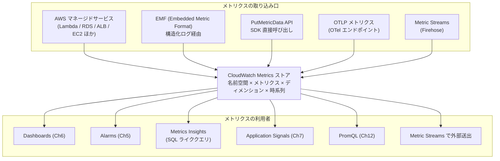

# Metrics

CloudWatch Metrics は **時系列の数値テレメトリ**を保存・集計・検索する基盤です。CPU 使用率や HTTP レスポンスタイム、ビジネス指標である注文数まで、「あるタイミングにある数値が出た」というデータをすべて同じモデルで扱います。Application Signals / Container Insights / Database Insights といった上位機能はすべて、最終的にここに値を書き出します。

## 解決する問題

メトリクス基盤を自前で持とうとすると、次の摩擦に当たります。

1. **時系列ストレージの運用** — Prometheus / InfluxDB を運用すると、ストレージとレプリケーションの面倒が AWS とは別建てで発生する
2. **AWS マネージドサービスの観測** — Lambda・RDS・ALB などからメトリクスを取り出すには、各サービスに API が用意されているがフォーマットがバラバラ
3. **ディメンションの爆発** — `userId` のような高カーディナリティのラベルを切ると、すぐにストレージとクエリが破綻する
4. **単位とスケールの揃えにくさ** — ミリ秒・バイト・パーセントなど単位がメトリクスごとに違い、グラフを並べると軸合わせが面倒
5. **アラーム・ダッシュボードまでの距離** — メトリクスを取れたとしても、それを「閾値超えで通知」「ダッシュボードに並べる」までの導線を別途作らねばならない

CloudWatch Metrics は **AWS マネージドサービスから自動収集 + アプリ側からカスタム取り込み + アラーム / ダッシュボードと密結合**で、この摩擦を取り除きます。

## 全体像



ポイントは 3 つ。第一に、**取り込み口は 5 系統**あり、用途に応じて使い分ける。第二に、ストアは「**名前空間 × メトリクス名 × ディメンション × 時刻 × 値**」という単純なモデルで、後段のアラーム / ダッシュボード / Application Signals / PromQL すべてが同じデータを参照する。第三に、Metric Streams で **Firehose 経由で外部に投げ出せる**ため、Datadog / S3 / Snowflake 等への二次配信もマネージドで組める。

## 主要仕様

### 名前空間 / メトリクス / ディメンション

CloudWatch Metrics は次の階層を持ちます。

| 階層 | 役割 | 例 |
|---|---|---|
| **Namespace** | メトリクスを束ねるバケット | `AWS/Lambda`、`AWS/EC2`、自分のアプリは `AwsCwStudy/Ch03` |
| **Metric Name** | 同じ意味の値を集める名前 | `Invocations`、`Latency`、`OrderCount` |
| **Dimension** | スライスのキー | `FunctionName=CheckoutApi`、`ServiceName=order-api` |
| **Statistic** | 集計関数 | `Sum` / `Average` / `Minimum` / `Maximum` / `SampleCount` / `p99` 等 |

ディメンションは **キー × 値の組み合わせごとに別系列**として保存されます。同じメトリクス名でも `FunctionName=A` と `FunctionName=B` では完全に別の時系列です。

> **重要**: 1 つのメトリクスにつけられるディメンションの**組み合わせの数 = カーディナリティ**が CloudWatch のコストと検索性能を左右します。`userId` のように値の数が膨大なものをディメンションにすると、メトリクス数が爆発します。

### 標準メトリクスとカスタムメトリクス

| 種別 | 出所 | コスト |
|---|---|---|
| **標準メトリクス** | AWS マネージドサービスが自動発行（`AWS/*` 名前空間） | 無料（多くの場合） |
| **Detailed monitoring** | EC2 等の 1 分粒度オプション | EC2 1 インスタンスあたり月額 |
| **カスタムメトリクス** | アプリ / エージェントが書き込む（任意の名前空間） | メトリクス × 月で課金 |

> 標準メトリクスは API 呼び出し（`GetMetricData` 等）には課金されますが、メトリクス × 月の保持料金は不要です。一方、カスタムメトリクスは「**ディメンション値の組み合わせごと**」に課金されるため、設計次第で大きく変わります。

### 解像度（Resolution）

| 解像度 | 粒度 | 保持期間 |
|---|---|---|
| **Standard resolution** | 1 分 | 過去 15 か月（粒度は時間とともに粗く） |
| **High resolution** | 1 秒 〜 1 分（任意） | 短期: 1秒〜30秒粒度は 3 時間、1 分粒度は 15 日、その後 5 分 / 1 時間に丸められる |

保持と粒度の関係はざっくり次のとおりです。

| 経過時間 | 保持される粒度 |
|---|---|
| 〜 3 時間 | 1 秒（高解像度のみ） |
| 〜 15 日 | 1 分 |
| 〜 63 日 | 5 分 |
| 〜 15 か月 | 1 時間 |
| それ以降 | 自動失効 |

長期トレンドを見たいなら 1 時間粒度で十分、リアルタイム監視は 1 分粒度、というように使い分けます。

### 取り込み方法 1: AWS マネージドサービス

EC2 / Lambda / RDS 等は何もしなくても `AWS/*` 名前空間にメトリクスが流れます。`AWS/Lambda` の `Invocations` / `Errors` / `Duration` / `Throttles` などはコードを書かずに見られる代表例です。

### 取り込み方法 2: PutMetricData API

`aws cloudwatch put-metric-data` または各 SDK の `PutMetricData` で直接書き込みます。

```bash
aws cloudwatch put-metric-data \
  --namespace AwsCwStudy/Ch03 \
  --metric-name OrderCount \
  --dimensions ServiceName=order-api,Operation=CreateOrder \
  --value 1 \
  --unit Count
```

API リクエスト数で課金される点と、リクエストごとに 1 つずつ送ると非効率なので、**1 リクエストに最大 1000 メトリクス**まで束ねられる仕様を活用します。

### 取り込み方法 3: Embedded Metric Format (EMF) ★推奨

**EMF** は「メトリクス定義と実値を 1 行の JSON ログに同居させる」フォーマットです。CloudWatch Logs にログとして送信すれば、CloudWatch が自動でパースしてメトリクスを生成します。

```json
{
  "_aws": {
    "Timestamp": 1714512000000,
    "CloudWatchMetrics": [{
      "Namespace": "AwsCwStudy/Ch03",
      "Dimensions": [["ServiceName", "Operation"]],
      "Metrics": [
        {"Name": "OrderCount", "Unit": "Count"},
        {"Name": "OrderValue", "Unit": "None"}
      ]
    }]
  },
  "ServiceName": "order-api",
  "Operation": "CreateOrder",
  "OrderCount": 1,
  "OrderValue": 850.0
}
```

EMF の利点:

1. **`PutMetricData` の API 呼び出しコストが要らない**（ログ取り込みコストに集約）
2. ログとメトリクスが同じイベントに紐付くため、**Logs Insights で検索可能**
3. SDK ではなく `console.log` / `print` で済むので Lambda の cold start に影響しない
4. ディメンション以外の追加フィールド（`requestId` 等）も同じイベントに残せる

実例は [`handson/chapter-03/`](https://github.com/r-tamura/aws-cw-study/tree/main/handson/chapter-03) を参照。

### 取り込み方法 4: OpenTelemetry メトリクス

OTel SDK / Collector から OTLP HTTP エンドポイントへ送ります。詳しくは [Ch12 OpenTelemetry](../part4/12-opentelemetry.md)。

```text
POST https://monitoring.{region}.amazonaws.com/v1/metrics
Content-Type: application/x-protobuf
Authorization: AWS4-HMAC-SHA256 ...
```

OTel メトリクスは **Counter / UpDownCounter / Gauge / Histogram** という型を持ち、CloudWatch がそれを通常のメトリクスにマッピングします。Histogram から自動で `p50/p90/p99` が出るのが大きな利点です。

### 取り込み方法 5: Metric Streams

リアルタイムで全メトリクスを Firehose 経由で外部に送出する仕組みです。Datadog や Snowflake へ同期したい場合に使います。逆向き（外部 → CloudWatch）はサポートされません。

## クエリ機能

### Search expressions

ダッシュボード / アラームのメトリクス算術で **動的に系列を増やす**仕組みです。

```text
SEARCH('{AWS/Lambda,FunctionName} MetricName="Errors"', 'Sum', 60)
```

新しい Lambda 関数が増えると、ダッシュボードを書き換えなくても自動で系列が増えます。

### Metrics Insights

メトリクスに対する **SQL ライク**なクエリ言語。ディメンションでグループ化したり、フィルタリングしたりが直感的に書けます。

```sql
SELECT AVG(OrderValue)
FROM SCHEMA("AwsCwStudy/Ch03", ServiceName, Operation)
WHERE ServiceName = 'order-api'
GROUP BY Operation
ORDER BY AVG() DESC
```

最大 **数千メトリクスを横断**できるため、ディメンション値が多いシナリオで威力を発揮します。

### PromQL

OTel 経由で取り込んだメトリクスに対しては **PromQL** が使えます（[Ch12](../part4/12-opentelemetry.md) 参照）。Prometheus エコシステムとの互換性を保ちたい場合に有効です。

## 設計判断のポイント

### EMF か PutMetricData か OTel か

| 場面 | おすすめ |
|---|---|
| Lambda / コンテナで素早くカスタムメトリクスを出したい | **EMF**（Logs 経由、ゼロ依存） |
| バッチ処理で大量のメトリクスをまとめ送り | `PutMetricData` の bulk（最大 1000 件 / リクエスト） |
| 多言語対応 / OSS 互換性 / Histogram の型がほしい | **OTel メトリクス**（OTLP） |
| 既存の Prometheus 計装を流用したい | OTel + PromQL |

迷ったら EMF を選ぶのが現代の定番です。コードがシンプル、コストも控えめ、Logs Insights から検索可能、という三拍子が揃います。

### ディメンションの設計

カーディナリティを意識した設計が必須です。

| ディメンションの値 | 適性 |
|---|---|
| `ServiceName`、`Operation`、`Region`（数十） | ◎ 適切 |
| `StatusCode`（数十） | ◎ 適切 |
| `CustomerId`（数千〜） | △ コスト爆発、Logs 側で持つ |
| `RequestId`（数百万） | × 絶対に駄目、Logs / Traces で持つ |
| `Path`（URL）| △ パスパラメータを `:id` に正規化してから |

「**100 値以下を目安**」と覚えておけば多くのケースで困りません。100 を超えるなら、メトリクスではなく Logs Insights のクエリで集計する設計に倒します。

### 標準メトリクスをまず使う

カスタムメトリクスを書く前に、対象 AWS サービスが既に発行している標準メトリクスを必ず確認します。Lambda の `Invocations` / `Errors` / `Duration`、ALB の `RequestCount` / `TargetResponseTime` など、既にあるものを再発明しても無料枠を消費しないだけで利点はゼロです。

### 高解像度のコスト

1 秒粒度の高解像度メトリクスは標準解像度より高い単価が課されます。本当にリアルタイム性が必要な API レイテンシなどに限定し、それ以外は 1 分粒度で十分です。

## ハンズオン

CDK プロジェクトを [`handson/chapter-03/`](https://github.com/r-tamura/aws-cw-study/tree/main/handson/chapter-03) に置いた。詳細な手順は同ディレクトリの `README.md` を参照。

要点は次の 3 つ。

1. Lambda 関数（TypeScript / Python）から **Embedded Metric Format (EMF)** で構造化ログを出力すると、CloudWatch がパースして自動的にカスタムメトリクスを作る。EMF イベントは `_aws.CloudWatchMetrics` キーで Namespace / Dimensions / Metric 定義を、ルートのプロパティで実値を持つ JSON ドキュメントである。
2. ディメンション（`ServiceName` / `Operation`）を 1 つの EMF イベントに含めるだけで、`AwsCwStudy/Ch03` 名前空間のカスタムメトリクスとして発火する。SDK や `PutMetricData` API を呼ぶ必要はなく、`console.log` / `print` だけで完結するのが EMF の利点。
3. **Metrics Insights** で SQL ライクに集計する。`SELECT AVG(OrderValue) FROM SCHEMA("AwsCwStudy/Ch03", ServiceName, Operation) GROUP BY ServiceName` のように、ディメンションスキーマを `SCHEMA()` 関数で指定して、最大数千メトリクスを横断検索できる。

API Gateway HTTP API で `POST /order`（TS Lambda）と `GET /inventory`（Python Lambda）を公開し、curl ループでトラフィックを投げ込んだ後、コンソールでメトリクスとクエリ結果を確認する流れ。

## 片付け

```bash
cd handson/chapter-03
npx cdk destroy
```

スタックを削除すると、Lambda・API Gateway・関連 IAM ロールがまとめて消える。CloudWatch Logs のロググループは Lambda 削除後も残るため、必要に応じて `aws logs delete-log-group --log-group-name /aws/lambda/AwsCwStudyCh03Metrics-...` で個別に削除する。カスタムメトリクスは保持期間（最大 15 ヶ月）を過ぎれば自動失効する。

## まとめ

- CloudWatch Metrics は **名前空間 × メトリクス × ディメンション × 時系列**のシンプルなモデル
- 取り込み口は 5 系統（標準 / `PutMetricData` / **EMF** / OTel / Metric Streams）。アプリは EMF を第一候補に
- ディメンションのカーディナリティはコストと検索性能を直結で決めるので 100 値以下が目安
- Metrics Insights / Search expression / PromQL を使うと、ディメンションが増えても動的に集計できる
- 高解像度（1 秒粒度）は本当に必要な箇所だけ、それ以外は 1 分で十分

次章は [Ch4 Logs](./04-logs.md)。Metrics と並ぶ「3 つの柱」のもう 1 本を見ていきます。
