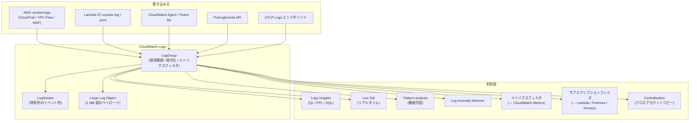

# Logs

CloudWatch Logs は **時刻付きの構造化イベント**を保管・検索・配信する基盤です。アプリケーションログ・AWS マネージドサービスの vended logs・エージェントが集めた OS / コンテナログまで、すべて同じ `LogGroup` 単位で管理されます。本書の Application Signals / Transaction Search / Container Insights など多くの上位機能が、最終的にここへ書き出します。

## 解決する問題

ログ基盤を自前で持とうとすると次の摩擦に当たります。

1. **書き込みの頑健性** — アプリ → 集中ログ基盤への直送はネットワーク断で消失しがち
2. **保管コストの天井がない** — Elastic / Splunk 系は使い慣れているが、ホットノードが太り続ける
3. **検索エンジンの運用** — Lucene 系インデックスを健全に保つには専任人員が要る
4. **リアルタイム性と長期保管の二兎** — 直近 1 時間を Live Tail でリアルタイムに見つつ、過去 1 年を SQL で検索したい
5. **メトリクス・アラーム・トレースとの結合** — ログだけでは「閾値超えで通知」「同じ trace_id で関連スパンへジャンプ」が出来ない

CloudWatch Logs は **Lambda Extension / CloudWatch Agent / vended logs / OTLP / SDK** といった広範な書き込み口を AWS に集約し、保管・検索・パターン抽出・他機能との連携を 1 サービスでまかないます。

## 全体像



ポイントは 3 つ。第一に、**書き込み口は多様だが LogGroup に集約**される。第二に、ログは `LogGroup → LogStream → LogEvent` の 3 階層で持たれ、**LogGroup が運用単位**（保持期間・KMS・メトリクスフィルタを設定）。第三に、**利用面が 7 種類**（Insights / Live Tail / Pattern / Anomaly / Metric Filter / Subscription / Centralization）あり、用途で使い分ける。

## 主要仕様

### LogGroup / LogStream / LogEvent の 3 階層

| 階層 | 役割 |
|---|---|
| **LogGroup** | 運用の単位。保持期間（1 日 〜 永続）、暗号化、メトリクスフィルタを設定 |
| **LogStream** | ログイベントの時系列の流れ。Lambda の場合は実行環境ごと |
| **LogEvent** | 個々のログ行。タイムスタンプ + メッセージ |

LogGroup 名は AWS マネージドサービスごとに慣例があります。

| サービス | LogGroup 名 |
|---|---|
| Lambda | `/aws/lambda/<function-name>` |
| API Gateway | `API-Gateway-Execution-Logs_<api-id>/<stage>` |
| ECS（awslogs ドライバ） | アプリ側で指定 |
| EKS Container Insights | `/aws/containerinsights/<cluster>/...` |
| RDS（DB ログ書き出し有効化時） | `/aws/rds/instance/<id>/<log-type>` |
| CloudTrail（CloudWatch 連携時） | 任意 |
| Application Signals 内部 | `/aws/application-signals/data` |
| Transaction Search | `aws/spans` |

### Standard と Infrequent Access (IA)

LogGroup は 2 つのクラスに分けられます（2024 末追加）。

| クラス | 取り込み単価 | 機能制限 |
|---|---|---|
| **Standard** | 高め（既定） | 全機能利用可 |
| **Infrequent Access (IA)** | 安め（約 50%） | Live Tail 不可、保管・クエリは利用可 |

**監査ログ・コンプライアンス用途**で頻繁に検索しないログは IA に倒すとコストが大きく下がります。

### 取り込み方法

| 方法 | 用途 | 特徴 |
|---|---|---|
| **`console.log` / `print`（Lambda）** | アプリ内ログ | サンドボックスが自動で LogGroup に転送 |
| **CloudWatch Agent** | EC2 / オンプレ | OS ログ・カスタムファイル |
| **Fluent Bit / Fluentd** | コンテナ | EKS / ECS の標準 |
| **vended logs delivery** | CloudTrail / VPC Flow / WAF など | コンソールから 1 クリック有効化 |
| **`PutLogEvents` API** | カスタム | 多くの SDK でラップされている |
| **OTLP Logs** | OpenTelemetry 経由 | [Ch12](../part4/12-opentelemetry.md) 参照 |
| **CloudWatch Pipelines** | 統合データ管理 | OCSF / OTel への正規化込み（[Ch11](../part4/11-ingestion.md)） |

### 構造化ログ（JSON ログ）

CloudWatch Logs は単なる文字列ストリームに見えますが、**メッセージが JSON ならフィールド単位で扱える**仕組みです。

```json
{"level":"ERROR","msg":"order failed","customerId":"cust-12345","durationMs":420}
```

Logs Insights から `fields level, customerId, durationMs` のように直接参照できます。CloudWatch Logs における**第一級の書き方は構造化ログ**で、レガシーな改行区切りの自由形式は脱出のしにくさを生みます。

### 大きなペイロード: Large Log Objects (LLO)

1 イベント 1 MB 超のログ（リクエストボディの完全キャプチャ等）は **LLO** という別ストアに格納され、LogGroup から参照されます。コンソールのプレビュー / Logs Insights からも透過的に読めます。これが入る前は 1 MB 超は単純に切られて消えていました。

### 保持期間

LogGroup ごとに「1 日、3 日、…、1 年、5 年、永続」から選べます。**既定は永続**になっているため、何もしないとログが永遠に残り、ストレージ課金が積み上がります。新規 LogGroup を作る際は CDK で必ず指定するのが安全です。

```typescript
new LogGroup(this, 'ApiLogs', {
  retention: RetentionDays.ONE_WEEK,
  removalPolicy: RemovalPolicy.DESTROY,
});
```

## 検索・分析機能

### Logs Insights

CloudWatch コンソール → Logs → Insights からアクセスする SQL ライクなクエリ言語です。3 つの方言が選べます。

| 方言 | 特徴 |
|---|---|
| **CloudWatch Logs Query Language (QL)** | パイプ `\|` で繋ぐ手前の独自言語、既定 |
| **OpenSearch PPL (Piped Processing Language)** | OpenSearch 互換、2025 追加 |
| **OpenSearch SQL** | SQL に近い記法、2025 追加 |

代表的な QL クエリ:

```text
fields @timestamp, level, msg, customerId
| filter level = "ERROR"
| stats count(*) as errors by bin(5m)
| sort @timestamp desc
```

Logs Insights は **スキャンした GB に応じて課金**されます。クエリ範囲（時間幅 + 対象ロググループ）で気軽に料金が伸びるので、 **必要最低限の時間幅で検索**するのが運用上の鉄則です。

### Live Tail

リアルタイムにログを流し見します。`tail -f` と同じ感覚で、Standard クラスの LogGroup に対してのみ実行可能。

```bash
aws logs start-live-tail \
  --log-group-identifiers arn:aws:logs:ap-northeast-1:123456789012:log-group:/aws/lambda/checkout
```

Live Tail は **セッション × 分**で課金されるため、デバッグが終わったらすぐ閉じます。

### Pattern analysis

機械学習でログメッセージをクラスタリングし、「**だいたい同じ形をしたログ**」を 1 行のパターンに圧縮して見せる機能です。Logs Insights のクエリに `pattern @message` を含めるか、Patterns タブから自動で実行されます。

```text
fields @message
| pattern @message
| sort @count desc
| limit 5
```

数百万行のログから「最も多く出ているメッセージの形」が一目で分かるため、新規障害の初動と異常パターンの抽出に強力です。

### Log Anomaly Detector

LogGroup に対して有効化すると、**新規パターンの出現や既存パターンの突発的増減**を AI が検出して通知します。RUM や Application Signals とは独立に動き、運用上の「いつもと違う」を捉えるレイヤです。

### メトリクスフィルタ

LogGroup にフィルタパターンを設定すると、マッチしたイベントを **CloudWatch Metrics に変換**できます。これにより「ERROR ログの数」のようなメトリクスが作れ、後段でアラームが組めます。

```bash
aws logs put-metric-filter \
  --log-group-name /aws/lambda/order \
  --filter-name ErrorCount \
  --filter-pattern '{ $.level = "ERROR" }' \
  --metric-transformations \
    metricName=Ch04ErrorCount,metricNamespace=AwsCwStudy/Ch04,metricValue=1,defaultValue=0
```

### サブスクリプションフィルタ

LogGroup の取り込みを **Lambda / Kinesis / Firehose** に転送する仕組みです。OpenSearch や S3 への二次配信、リアルタイム ETL に使います。1 LogGroup につき最大 2 サブスクリプション。

## 設計判断のポイント

### LogGroup を CDK で明示作成する

Lambda は LogGroup を「自動生成」しますが、これには次の問題があります。

- 保持期間が **永続**になる（自動生成される LogGroup はデフォルトの「Never expire」）
- `cdk destroy` で消えない（CDK が知らないリソースのため）

CDK でスタック定義時に **明示的に LogGroup を作成**し、Lambda の `logGroup` プロパティに渡す方式が推奨です。

```typescript
const logGroup = new LogGroup(this, 'ApiLogs', {
  retention: RetentionDays.ONE_WEEK,
  removalPolicy: RemovalPolicy.DESTROY,
});
const fn = new Function(this, 'Api', { logGroup, ... });
```

### Standard か IA か

| 用途 | おすすめ |
|---|---|
| アプリの活発なエラー追跡 / Live Tail を使う | Standard |
| 監査ログ・コンプライアンス（ほぼ検索しない） | IA |
| 取り込み量が極端に多いがデバッグ頻度が低い | IA |

IA への切替は LogGroup 単位で可能。後から戻せないので、最初の選択を慎重に。

### 構造化ログの徹底

新規アプリでは **JSON 構造化ログを最初から徹底**します。

- `{"level": "...", "msg": "...", "requestId": "...", ...}` のように常に JSON 1 行 1 イベント
- レガシー Java の `slf4j + logback-json` などのライブラリで自動 JSON 化
- 機密情報（メール / トークン / カード番号）は[データ保護ポリシー](https://docs.aws.amazon.com/AmazonCloudWatch/latest/logs/cloudwatch-logs-data-protection-policies.html)で自動マスク

### Pattern analysis の活用

新規障害発生時、まずやるのは **Logs Insights のクエリ→ Patterns タブを開く**ことです。「いつもと違うメッセージの形」が並ぶので、調査の入口がほぼ確定します。手作業で grep する前にこれを開く癖をつけると、初動が速くなります。

### コスト最適化

Logs はコスト最大の発生源です。次の順で見直します。

1. **保持期間を短く** — 既定の永続を 30 日 / 90 日に
2. **DEBUG ログを本番で出さない** — 本番の log level を WARN 以上に
3. **JSON 内の重複文字列を排除** — 1 行 1 KB → 200 バイトに半減できる
4. **Pipelines の Drop Events プロセッサ** — 不要イベントを取り込み前に破棄
5. **Vended logs を IA クラスへ** — 監査系を Standard で保持しない

詳細は [付録 B コスト設計チェックリスト](../appendix/b-cost.md)。

## ハンズオン

[handson/chapter-04/](https://github.com/r-tamura/aws-cw-study/tree/main/handson/chapter-04) に CDK プロジェクトを置いた。要点は次の 4 つ。

1. TypeScript / Python の Lambda が **1 行 1 JSON** で構造化ログを出すと、CloudWatch Logs はそのまま JSON フィールドとして取り込み、Logs Insights から `fields level, requestId, durationMs` のように参照できる
2. ロググループは **CDK 側で明示的に作って 1 週間の保持期間**を付けると、`cdk destroy` で一緒に消える（Lambda 自動生成の LogGroup は残る点に注意）
3. **Logs Insights** で `pattern @message` / `stats count(*) by bin(1m), level` / ERROR 率時系列など 4〜5 個のクエリを試す
4. **メトリクスフィルタ** で `{ $.level = "ERROR" }` をネームスペース `AwsCwStudy/Ch04` のメトリクス `Ch04ErrorCount` に変換し、Ch 5 アラーム演習の素材にする

詳細手順とクエリ例、Live Tail コマンドは同ディレクトリの `README.md` を参照。

## 片付け

`npx cdk destroy` でスタックを削除すると、Lambda・API Gateway・関連 IAM ロール、そしてこのスタックで明示的に作ったロググループ（`removalPolicy=DESTROY` を指定）もまとめて消える。メトリクスフィルタはロググループに紐付くため、ロググループ削除と同時に消滅する。残ったログがあれば `aws logs delete-log-group --log-group-name /aws/lambda/aws-cw-study-ch04-...` で手動削除する。

## 参考資料

**AWS 公式ドキュメント**
- [Supported query languages (Logs Insights)](https://docs.aws.amazon.com/AmazonCloudWatch/latest/logs/CWL_AnalyzeLogData_Languages.html) — Logs Insights QL / OpenSearch PPL / OpenSearch SQL の対応
- [CloudWatch Logs Insights query language (Logs Insights QL)](https://docs.aws.amazon.com/AmazonCloudWatch/latest/logs/CWL_AnalyzeLogData_LogsInsights.html) — コマンド・関数・サンプルクエリ
- [Troubleshoot with CloudWatch Logs Live Tail](https://docs.aws.amazon.com/AmazonCloudWatch/latest/logs/CloudWatchLogs_LiveTail.html) — Live Tail のセッション仕様（最長 3 時間 / 500 events/s）
- [Log anomaly detection](https://docs.aws.amazon.com/AmazonCloudWatch/latest/logs/LogsAnomalyDetection.html) — 2 週間ベースラインからの異常検出ロジック
- [Log classes (Standard / Infrequent Access)](https://docs.aws.amazon.com/AmazonCloudWatch/latest/logs/CloudWatch_Logs_Log_Classes.html) — 2 クラスの料金差と機能制限の比較
- [Filter pattern syntax for metric filters](https://docs.aws.amazon.com/AmazonCloudWatch/latest/logs/FilterAndPatternSyntaxForMetricFilters.html) — `{ $.level = "ERROR" }` 等のフィルタパターン文法

**AWS ブログ / アナウンス**
- [CloudWatch Logs IA now supports data protection, OpenSearch PPL, and SQL](https://aws.amazon.com/about-aws/whats-new/2026/03/amazon-cloudwatch-infrequent-access-log-class/) — IA クラスの機能拡張（2026/03）

## まとめ

- CloudWatch Logs は **LogGroup → LogStream → LogEvent** の 3 階層、運用は LogGroup 単位
- Standard と IA の 2 クラスがあり、監査用途は IA でコスト削減
- 検索は **Logs Insights**（QL / PPL / SQL）、リアルタイムは **Live Tail**、要約は **Pattern analysis**、異常検知は **Log Anomaly Detector**
- メトリクスフィルタで Logs → Metrics、サブスクリプションフィルタで Logs → 外部、Centralization で Logs → 中央集約
- アプリは最初から **JSON 構造化ログ**で書き、CDK で LogGroup を明示作成し、保持期間を必ず指定する

次章は [Ch5 Alarms](./05-alarms.md)。Metrics と Logs の上に立つ通知レイヤです。
