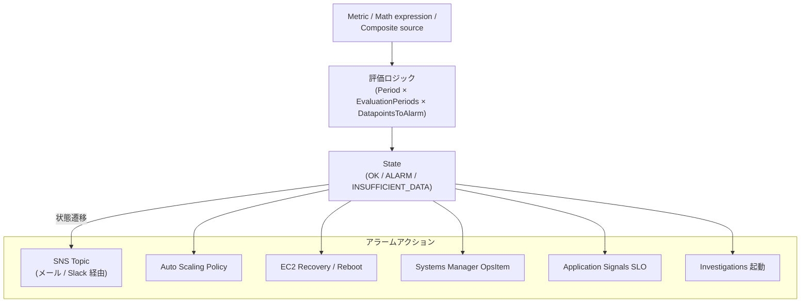
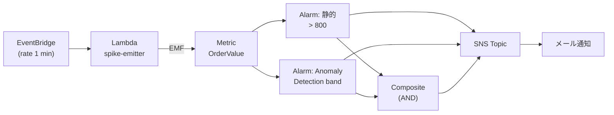

# Alarms

CloudWatch Alarms は **メトリクスや他のアラームの状態を判定し、アクションを発火する**仕組みです。CloudWatch における通知レイヤの中核で、 Application Signals の SLO Burn Rate も最終的にはこの Alarm 機構に乗ります。

## 解決する問題

監視を組むときに、メトリクスを取るだけでは次の摩擦が残ります。

1. **「いつ気づくか」の自動化** — メトリクスをダッシュボードで人が見続けるのは現実的でない
2. **静的しきい値の脆さ** — トラフィックの曜日・時間帯・季節変動に追従できず、誤検知 / 検知漏れが交互に起きる
3. **アラーム多発による疲労** — 単一しきい値で関連アラームが同時に鳴ると、本当に重要なものが埋もれる
4. **検出から対処までの距離** — 「検出した → 誰かに知らせた」だけでは止まらず、Auto Scaling や Lambda 復旧スクリプトに直結したい
5. **欠損データの扱い** — メトリクスが流れていない時間帯を「異常」と取るか「データなし」と取るかで挙動が変わり、誤発火の温床になる

CloudWatch Alarms はこれら全てを **ALARM / OK / INSUFFICIENT_DATA の 3 状態モデル + 評価期間 + アクション**という単純な設計で吸収します。

## 全体像



ポイントは 3 つ。第一に、**評価ロジックは Period × EvaluationPeriods × DatapointsToAlarm の 3 つで決まる**。第二に、**状態は 3 つだけ**で、`INSUFFICIENT_DATA` の扱いが運用品質を左右する。第三に、**アクションは多彩**で、通知だけでなく自動修復やインシデント起動まで張り付けられる。

## 主要仕様

### 3 種類のアラーム

| 種類 | 発火条件 | 用途 |
|---|---|---|
| **静的しきい値アラーム (Threshold)** | `Metric > 閾値` のような単純比較 | トラフィックが安定している、SLA 値が決まっている |
| **Anomaly Detection アラーム** | 機械学習が描く「期待バンド」を外れる | 季節変動・週次変動があり静的閾値が決められない |
| **Composite Alarm** | 複数子アラームの論理式 (`AND` / `OR` / `NOT`) | 関連アラーム多発の抑制、複合条件 |

### 評価ロジック

アラームは「**Period（観測期間）× EvaluationPeriods（連続何期間か）× DatapointsToAlarm（そのうち何点が違反したら）**」の 3 軸で発火します。

| パラメタ | 例 | 意味 |
|---|---|---|
| **Period** | 60s | メトリクスを集計する単位（1 分・5 分等） |
| **EvaluationPeriods** | 5 | 直近 5 期間を見る |
| **DatapointsToAlarm** | 3 | そのうち 3 期間で違反したら ALARM |

これは "**M out of N**" 評価と呼ばれ、`3 out of 5` のような表現で議論されます。1 期間だけのスパイクで発火させたい場合は `1/1`、安定性を重視するなら `5/5` 等で調整します。

### 状態の 3 つ

| 状態 | 意味 |
|---|---|
| **OK** | しきい値を満たしている |
| **ALARM** | しきい値を違反している |
| **INSUFFICIENT_DATA** | データポイントが足りず判定不能 |

`INSUFFICIENT_DATA` の扱いを `treatMissingData: notBreaching` にするか `breaching` にするかで、欠損時の挙動が反転します。本番では「メトリクスが来ない = 観測対象が止まっている可能性」を考え、**`breaching` 寄り**で判定するのが安全です。

### Anomaly Detection の仕組み

CloudWatch が **過去 14 日分のデータポイント**を学習し、各時点で「期待される値の範囲（band）」を予測します。アラームは「実値が band の外に出たら ALARM」で発火します。

- band の幅は **しきい値（標準偏差倍数）**で調整。`2` で約 95% 信頼区間、`3` で 99.7%
- 学習が安定するまで **最低 1 時間**、本番運用では **14 日以上**のベースラインを持たせるのが推奨
- band を「上だけ」「下だけ」「両方」で見るかも選べる
- メトリクスが間欠的（バースト）だと精度が下がる

### Composite Alarm

「複数の独立指標が同時に異常」「片方が ALARM のとき他方の状態を抑制」のような論理式を組みます。

```text
ALARM(child1) AND ALARM(child2)
ALARM(parent) AND NOT ALARM(suppressor)
```

`alarmActions: [...]` を Composite 側だけにつけ、子アラームには通知を付けないことで **アラーム多発の抑制**が成立します。同じ親システム障害で 10 個の子が一斉に ALARM になっても、Composite 1 つだけ通知が飛ぶ形にできます。

### アラームアクション

| アクション | 用途 |
|---|---|
| **SNS Topic** | Email / Slack（Webhook） / Lambda へ転送 |
| **Auto Scaling Policy** | EC2 / ECS のスケールアウト・イン |
| **EC2 Actions** | インスタンスの停止 / 終了 / 再起動 / リカバリ |
| **Systems Manager OpsItem** | OpsCenter へインシデント登録 |
| **Application Signals SLO** | Burn Rate アラームの内部実装に使われる |
| **Investigations 起動** | アラームの ALARM 遷移で自動的に Investigation Group を作成（[Ch17](../part5/17-investigations.md)） |

1 アラームに **5 アクションまで**設定可。`OK` 遷移時にもアクションを設定できます（インシデント収束通知）。

### Metric Math と Search Expression

しきい値の対象を「単純なメトリクス」ではなく「**メトリクス算術の結果**」にできます。

```text
m1 = Errors
m2 = Invocations
e1 = m1 / m2 * 100   # エラー率（%）
ALARM if e1 > 5
```

Search Expression と組み合わせると「**全 Lambda のエラー率の平均**」のような動的アラームも組めます。

## 設計判断のポイント

### 静的しきい値か Anomaly Detection か

| 場面 | 選択 |
|---|---|
| 24/365 で安定したトラフィック | 静的しきい値 |
| 営業時間帯のみ稼働、夜間は呼ばれない | Anomaly Detection（時間帯パターン学習） |
| SLA で具体値（P99 < 300ms）が決まっている | 静的しきい値 |
| 「いつもと違う」を検知したい | Anomaly Detection |
| 新規サービスでまだ正常値が分からない | まず Anomaly Detection、安定したら静的に切替 |

### "M out of N" の決め方

- **`1/1`** — 1 期間でも違反したら即発火。テストや重要度高で使う
- **`3/5`** — 直近 5 期間中 3 期間で違反。一般用途の標準
- **`5/5`** — 5 期間連続で違反。確実性最優先（誤検知許容できない）

`1/3` は「3 期間の中で 1 回でも違反すれば」という形で、フラッキーなメトリクスに対しては逆効果（誤検知が増える）。

### `INSUFFICIENT_DATA` の扱い

| 場面 | 推奨 |
|---|---|
| Lambda の `Errors` メトリクス | `notBreaching`（呼ばれていないだけかも） |
| ヘルスチェック / 死活メトリクス | `breaching`（来ないこと自体が異常） |
| Application Signals 系 | `notBreaching`（収集遅延を許容） |

迷ったら **`missing`**（無視）が AWS 推奨です。

### アラーム数の管理

「全部にアラームを張る」は管理不能になります。次の優先度で張ります。

1. **SLO 違反 / Burn Rate 高速** — ユーザー影響に直結
2. **死活チェック失敗** — Synthetics / ヘルスエンドポイント
3. **クラウドサービス制限到達** — クォータの 80% など
4. **重要 KPI** — 売上関連の指標
5. **インフラ詳細** — CPU 90% 等は Composite 側で抑制してから

3 つ以上の重なる indication（例: `CPU>80% AND Memory>80% AND Latency>1s`）は **Composite で 1 本に**して、子側は通知無しにするとノイズが激減します。

### コスト

アラームは **アラーム × 月**で課金されます（Composite も同様）。Anomaly Detection は内部で扱う band メトリクスが追加課金対象。

- 標準アラーム / Composite Alarm: 1 アラーム × 月で約 USD 0.10
- Anomaly Detection: 上記 + Detector × 月（数倍）

数百個まで広げるとコストが効いてきます。`1 サービス 5〜10 アラーム`を目安に、それ以上は Composite で集約します。

### IaC で管理する

CDK / CloudFormation / Terraform でアラームを管理すると、レビュアブル / 差分監視 / 復元可能になります。コンソール手作業で増殖したアラームは半年後には誰も触れなくなります。

```typescript
new Alarm(this, 'HighLatency', {
  metric: errorRate,
  threshold: 5,
  evaluationPeriods: 3,
  datapointsToAlarm: 2,
  treatMissingData: TreatMissingData.NOT_BREACHING,
  alarmAction: new SnsAction(opsTopic),
});
```

## ハンズオン

[handson/chapter-05/](https://github.com/r-tamura/aws-cw-study/tree/main/handson/chapter-05) に CDK プロジェクトを置いた。**同じメトリクス（`AwsCwStudy/Ch05.OrderValue`）に 3 種のアラームを同時に張り付ける** 構成で、検出方式の違いを実機で比較できる。



要点:

1. **静的しきい値**は実装が単純だが、トラフィックや季節変動に追従できない
2. **Anomaly Detection** は機械学習で「期待バンド」を描き、外れたら発火する。ただしベースライン学習に最低 1 時間、本番運用では **14 日以上** の baseline 期間が推奨
3. **Composite Alarm** で「複数の独立した指標が同時に異常」を要求すると、片方の擬陽性をフィルタできる

CDK 上の実装ポイント:

- `Alarm` (L2) はアンカーが「定数しきい値」または「メトリクス計算式の単一値」だけを扱える
- Anomaly Detection は **`CfnAnomalyDetector`** + **`CfnAlarm`** の L1 で `ANOMALY_DETECTION_BAND(m1, 2)` を `Metrics` 配列に書き、`ThresholdMetricId` でバンドを指定
- 既存の `Alarm` を `Alarm.fromAlarmArn` で wrap してから `CompositeAlarm` の `alarmRule: AlarmRule.allOf(...)` に渡せる

詳細とデプロイ・確認手順は同ディレクトリの `README.md` を参照。手動スパイクで全アラームを ALARM 状態へ遷移させ、SNS 経由でメールが届くまで体験する。

## 片付け

```bash
cd handson/chapter-05
npx cdk destroy
```

スタック削除で Lambda・EventBridge ルール・SNS Topic・3 つのアラーム・Anomaly Detector がまとめて消える。Lambda のロググループはスタックに紐づけ済み (`RemovalPolicy.DESTROY`) なので残骸は残らないが、CloudWatch のカスタムメトリクスデータ自体は AWS 側で自動失効（15 か月）するまで参照可能。

## 参考資料

**AWS 公式ドキュメント**
- [Configuring how CloudWatch alarms treat missing data](https://docs.aws.amazon.com/AmazonCloudWatch/latest/monitoring/alarms-and-missing-data.html) — `notBreaching` / `breaching` / `ignore` / `missing` の 4 オプションの使い分け
- [Create a composite alarm](https://docs.aws.amazon.com/AmazonCloudWatch/latest/monitoring/Create_Composite_Alarm.html) — `AND` / `OR` / `NOT` を使うルール式の組み立て
- [Service level objectives (SLOs) — Application Signals](https://docs.aws.amazon.com/AmazonCloudWatch/latest/monitoring/CloudWatch-ServiceLevelObjectives.html) — Burn Rate アラームを SLI から作る公式ガイド
- [Anomaly detection alarm (CDK construct)](https://docs.aws.amazon.com/cdk/api/v2/docs/aws-cdk-lib.aws_cloudwatch.AnomalyDetectionAlarm.html) — `stdDevs` と band 比較演算子の指定方法

**AWS ブログ / アナウンス**
- [Operationalizing CloudWatch Anomaly Detection](https://aws.amazon.com/blogs/mt/operationalizing-cloudwatch-anomaly-detection/) — 学習期間・感度調整のチューニング手順
- [Alarming on SLOs in Amazon Search with CloudWatch Application Signals](https://aws.amazon.com/blogs/mt/alarming-on-slos-in-amazon-search-with-cloudwatch-application-signals-part-1/) — 静的しきい値から Burn Rate へ移行した実例

**OSS / 標準仕様**
- [Google SRE Workbook: Alerting on SLOs](https://sre.google/workbook/alerting-on-slos/) — Burn Rate アラーム設計の標準的な参照（マルチウィンドウ・マルチバーンレート）

## まとめ

- アラームは **メトリクス / 算術 / Composite を入力に、3 状態 + アクション**で動く
- 評価ロジックは **Period × EvaluationPeriods × DatapointsToAlarm**（M out of N）
- 静的しきい値・Anomaly Detection・Composite を**用途で使い分け**、Composite で多発を抑制
- `INSUFFICIENT_DATA` の扱いは運用品質を直結に左右する。死活系は `breaching`、それ以外は `missing` か `notBreaching`
- アラームは IaC で管理、増えすぎたら Composite で集約

次章は [Ch6 Dashboards](./06-dashboards.md)。アラームと並ぶ「**人がメトリクスに触れる UI**」のもう 1 本です。
