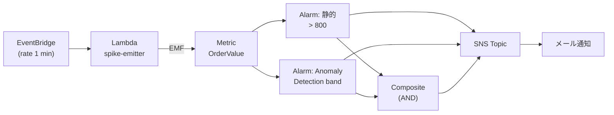

# Alarms

> TODO: 執筆予定

## この章で扱う内容

- 静的しきい値アラーム
- Anomaly Detection アラーム
- Composite Alarms（合成アラーム）
- アラームアクション（SNS / Auto Scaling / Systems Manager）
- アラーム設計のアンチパターン

## ハンズオン

[handson/chapter-05/](https://github.com/r-tamura/aws-cw-study/tree/main/handson/chapter-05) に CDK プロジェクトを置いた。**同じメトリクス（`AwsCwStudy/Ch05.OrderValue`）に 3 種のアラームを同時に張り付ける** 構成で、検出方式の違いを実機で比較できる。



要点:

1. **静的しきい値**は実装が単純だが、トラフィックや季節変動に追従できない
2. **Anomaly Detection** は機械学習で「期待バンド」を描き、外れたら発火する。ただしベースライン学習に最低 1 時間、本番運用では **14 日以上** の baseline 期間が推奨
3. **Composite Alarm** で「複数の独立した指標が同時に異常」を要求すると、片方の擬陽性をフィルタできる

CDK 上の実装ポイント:

- `Alarm` (L2) はアンカーが「定数しきい値」または「メトリクス計算式の単一値」だけを扱える
- Anomaly Detection は **`CfnAnomalyDetector`** + **`CfnAlarm`** の L1 で `ANOMALY_DETECTION_BAND(m1, 2)` を `Metrics` 配列に書き、`ThresholdMetricId` でバンドを指定
- 既存の `Alarm` を `Alarm.fromAlarmArn` で wrap してから `CompositeAlarm` の `alarmRule: AlarmRule.allOf(...)` に渡せる

詳細とデプロイ・確認手順は同ディレクトリの `README.md` を参照。手動スパイクで全アラームを ALARM 状態へ遷移させ、SNS 経由でメールが届くまで体験する。

## 片付け

```bash
cd handson/chapter-05
npx cdk destroy
```

スタック削除で Lambda・EventBridge ルール・SNS Topic・3 つのアラーム・Anomaly Detector がまとめて消える。Lambda のロググループはスタックに紐づけ済み (`RemovalPolicy.DESTROY`) なので残骸は残らないが、CloudWatch のカスタムメトリクスデータ自体は AWS 側で自動失効（15 か月）するまで参照可能。
