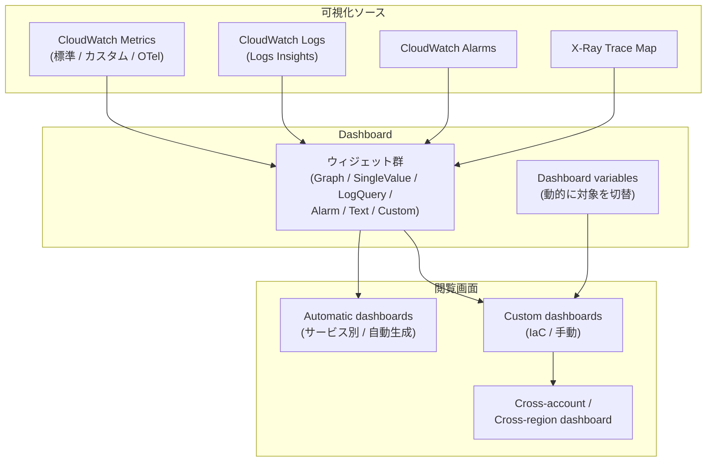

# Dashboards

CloudWatch Dashboards は **メトリクス・ログ・アラームを横断的に並べた可視化画面**です。アラームが「いつ気づくか」を担うのに対し、ダッシュボードは「**普段の様子を観察する場**」と「**インシデント中の作戦盤**」の 2 つの役割を持ちます。

## 解決する問題

可視化を自前で組もうとすると次の摩擦が出ます。

1. **複数ソースの同居が難しい** — メトリクス・ログ・アラームを 1 画面で並べるには、それぞれ別ダッシュボードソフトを持ち寄る運用になる
2. **アカウント / リージョン横断ができない** — 開発・本番で別アカウント、または東京・バージニアの両方で動くサービスを 1 画面で見られない
3. **動的なダッシュボードが書きにくい** — 「サービスが増えたら自動で系列も増える」を Grafana 等で組むのは慣れが要る
4. **ダッシュボード自体の運用** — JSON でレビュアブルにしたいが、コンソール手作業で増殖する
5. **権限管理** — ダッシュボードの公開 / 共有 / 編集権限を IAM の境界と合わせて管理したい

CloudWatch Dashboards は、これらを **CloudWatch コンソールに統合された可視化機能 + ダッシュボード定義の JSON / IaC**で吸収します。Grafana のようなフル機能 BI には及ばないものの、AWS との統合性とランニングコストの低さで圧倒的に楽です。

## 全体像



ポイントは 3 つ。第一に、**入力は 4 種類**（Metrics / Logs / Alarms / X-Ray）で、それぞれを表示するウィジェットが用意されている。第二に、ダッシュボードは **Automatic（AWS が自動生成） / Custom（自前定義）**の 2 系統。第三に、Dashboard variables を使うと **アカウント / リージョン / 環境を 1 画面で切り替え**られる。

## 主要仕様

### Automatic dashboards

CloudWatch コンソールには、**サービス別の自動ダッシュボード**が組み込まれています。Lambda / RDS / ALB / ECS など主要なマネージドサービスを開くと、そのサービスの主要メトリクスが事前構築されたレイアウトで並んでいます。

特徴:

- **無料**（カスタムダッシュボードと別枠）
- 編集不可
- 新しい AWS サービスが増えると AWS 側で追加される
- 「とりあえず現状を見たい」用途には十分

カスタムダッシュボードを作る前に、まず Automatic で見える範囲を確認するのが効率的です。

### Custom dashboards

自由レイアウトでウィジェットを並べたダッシュボードです。料金は **ダッシュボード × 月**で、最初の 3 枚は無料、4 枚目以降は USD 3 / 月です。

ダッシュボードの実体は **JSON 定義**で、コンソールから「Actions → View/edit source」で見られます。CDK / CloudFormation / Terraform で IaC 化すべき対象です。

### ウィジェットの種類

| ウィジェット | 用途 | 入力 |
|---|---|---|
| **GraphWidget** | 折れ線・棒グラフ | Metric / Math Expression / Search Expression |
| **SingleValueWidget** | KPI 風の 1 つの数値 + sparkline | Metric / Math |
| **GaugeWidget** | しきい値帯付きのゲージ | Metric |
| **LogQueryWidget** | Logs Insights クエリの結果 | LogGroup + クエリ |
| **AlarmWidget** | アラーム状態としきい値帯 | Alarm ARN |
| **AlarmStatusWidget** | 複数アラームの状態をリスト表示 | Alarm 群 |
| **TextWidget** | 説明テキスト（Markdown） | テキスト |
| **CustomWidget** | Lambda が返した HTML を埋め込み | Lambda + parameters |

CustomWidget は Lambda の戻り値を HTML として表示するため、AWS API を呼んだ結果（コスト集計等）を埋め込んだり、外部 API の結果を出したりできます。

### Metric Math と Search Expression

GraphWidget の中で **メトリクス算術**を書けます。

```text
m1 = AWS/Lambda Errors  FunctionName=order
m2 = AWS/Lambda Invocations FunctionName=order
e1 = m1 / m2 * 100
```

`e1` がエラー率（%）として系列に並びます。

**Search Expression** はディメンションから動的に系列を増やします。

```text
SEARCH('{AWS/Lambda,FunctionName} MetricName="Errors"', 'Sum', 60)
```

新しい Lambda 関数が増えるたびに、ダッシュボードを書き換えなくても系列が増えます。

### Dashboard variables

ダッシュボード上部にドロップダウン / テキスト入力を置き、ウィジェットの対象を**動的に切替**できます。

| 変数の種類 | 用途 |
|---|---|
| **Property variable** | ウィジェットのプロパティ（リージョン、メトリクス名等）を切替 |
| **Pattern variable** | テンプレート文字列の `${var}` 部分を置換 |

例: `Environment = production / staging / dev` を切り替えると、ウィジェット内の `Stage` ディメンションが書き換わって、3 環境を 1 画面で見比べられます。

### Cross-account / Cross-region

Dashboards は 1 ダッシュボードに **複数のアカウント・複数のリージョンのウィジェット**を並べられます。

- ウィジェットごとに `accountId` と `region` を指定
- 監視アカウント側に **OAM Sink** が設定されている前提（[Ch19](../part6/19-setup.md)）
- 追加課金なし（メトリクス参照は無料）

これにより「東京のアプリ + バージニアのレプリケーションサービス」のような構成を 1 画面で運用できます。

### 共有と権限

ダッシュボードは IAM で `cloudwatch:GetDashboard` 権限を持つユーザーが閲覧できます。ダッシュボード単位の細かい IAM 制御も可能。

外部公開（読み取り専用 URL）は標準ではサポートされていません。Grafana や CloudWatch Dashboard Sharing の機能を組み合わせる必要があります。

### IaC 化

CDK での例:

```typescript
new Dashboard(this, 'OpsDashboard', {
  dashboardName: 'aws-cw-study-ch06',
  widgets: [
    [
      new GraphWidget({
        title: 'Order metrics',
        left: [orderCountMetric, orderLatencyMetric],
        right: [new MathExpression({
          expression: 'm2 / m1',
          usingMetrics: { m1: orderCountMetric, m2: orderLatencyMetric },
          label: 'Latency per order (ms)',
        })],
      }),
      new SingleValueWidget({ metrics: [orderLatencyMetric], sparkline: true }),
    ],
    [
      new LogQueryWidget({
        logGroupNames: [logGroup.logGroupName],
        queryString: 'fields @timestamp, level, msg | sort @timestamp desc | limit 20',
      }),
      new AlarmWidget({ alarm: latencyAlarm }),
    ],
  ],
});
```

レイアウトは **行 × 列の入れ子配列**で表現。各行は左から並び、行が縦に積まれます。

## 設計判断のポイント

### Automatic と Custom を併用する

新規環境では:

1. **Automatic を見て**現状把握
2. **不足する観点**（カスタムメトリクス・複数サービス横断）を Custom で補完
3. Custom は IaC で管理

すべて自分で組むのは無駄なので、Automatic の存在を忘れないでください。

### 「観察用」と「インシデント用」を分ける

| 用途 | 設計 |
|---|---|
| **観察用ダッシュボード** | 普段眺める。全体像 + 異常の早期発見 |
| **インシデント用ダッシュボード** | 障害時に開く。複数のアラーム状態 + 関連メトリクス + Logs Insights を 1 画面で |

両者をひとつに混ぜると、平時に情報過多、有事に必要なものが見つからないというジレンマに陥ります。

### TextWidget で文脈を残す

ダッシュボードは半年後に他の人が見ます。「**なぜこの指標を見ているか**」「**正常値は何か**」「**異常時の対処手順は**」を TextWidget の Markdown で残しておくと、属人化を防げます。

```markdown
## 注文 API ダッシュボード

- SLO: P99 < 500ms / Availability > 99.5%
- エスカレーション: #ops-alerts チャンネル
- 関連 Runbook: https://wiki/runbooks/order-api
```

### Dashboard variables を使う

「環境ごとに同じレイアウトのダッシュボードを 3 枚作る」は典型的なアンチパターン。**1 枚 + Environment 変数**で済ませると、変更時の同期も楽です。

### Cross-account / Cross-region は OAM 前提

監視アカウント側に OAM Sink があり、ソースアカウントから Link が張られている必要があります（[Ch19](../part6/19-setup.md)）。これがないとウィジェット作成時にエラーになります。

### Grafana / Datadog との比較

| 観点 | CloudWatch Dashboards | Grafana / Datadog |
|---|---|---|
| AWS 統合 | ◎ | ○ |
| 可視化の柔軟性 | △ | ◎ |
| ダッシュボード機能の深さ | △ | ◎ |
| 運用コスト | ◎（マネージド） | △ |
| ベンダーロックイン | △ | ◎ |
| IaC | ○ | ○ |

「**シンプルで AWS と密結合**」を求めるなら CloudWatch、「**プレゼン品質の可視化**」を求めるなら Grafana / Datadog 併用が定石です。

## ハンズオン

[handson/chapter-06/](https://github.com/r-tamura/aws-cw-study/tree/main/handson/chapter-06) に CDK プロジェクトを置いた。要点は次の通り。

1. **EMF を emit する Lambda** を 1 分ごとに EventBridge で起動し、`AwsCwStudy/Ch06` 名前空間の `OrderCount` / `OrderLatency` を継続的に流し込む
2. CDK の `Dashboard` で **4 種類のウィジェット**を一度に定義する:
   - **GraphWidget** … 2 メトリクス + `MathExpression`（`m2/m1` で「1 注文あたりレイテンシ」を派生）
   - **SingleValueWidget** … 直近 `OrderLatency` を sparkline 付きで KPI 表示
   - **LogQueryWidget** … Lambda のロググループに対する Logs Insights クエリ結果（直近 20 件）
   - **AlarmWidget** … `OrderLatency > 1000ms` のアラーム状態としきい値帯
3. **`SearchExpression`** を使った GraphWidget も追加し、新しいディメンション値が増えると**ダッシュボードを書き換えずに**系列が増える挙動を確認する
4. **Dashboard 変数**（`Environment`）でウィジェット全体の表示環境を切り替える

デプロイ後、約 5 分でダッシュボードに値が乗る。直接 URL は `https://<region>.console.aws.amazon.com/cloudwatch/home?region=<region>#dashboards:name=AwsCwStudy-Ch06`。

コンソール側で **Actions → View/edit source** を開くと CDK が生成したダッシュボード JSON が見られる。`lib/stack.ts` のウィジェット定義と JSON フィールドを 1:1 で見比べることで、IaC 化のメリット（再現性・差分管理・コードレビュー可能性）が体感できる。詳しくは同ディレクトリの `README.md` を参照。

## 片付け

```bash
cd handson/chapter-06
npx cdk destroy
```

`cdk destroy` で Lambda / EventBridge Rule / OrderLatency Alarm / Dashboard / LogGroup がまとめて削除される。

## 参考資料

**AWS 公式ドキュメント**
- [Using Amazon CloudWatch dashboards](https://docs.aws.amazon.com/AmazonCloudWatch/latest/monitoring/CloudWatch_Dashboards.html) — ダッシュボード作成・IAM 権限・クロスアカウント概要
- [Creating flexible CloudWatch dashboards with dashboard variables](https://docs.aws.amazon.com/AmazonCloudWatch/latest/monitoring/cloudwatch_dashboard_variables.html) — Property variable / Pattern variable の違いと使い方
- [Using a custom widget on a CloudWatch dashboard](https://docs.aws.amazon.com/AmazonCloudWatch/latest/monitoring/add_custom_widget_dashboard.html) — Lambda が返す HTML をウィジェット化する仕組み
- [Creating a custom widget for a CloudWatch dashboard](https://docs.aws.amazon.com/AmazonCloudWatch/latest/monitoring/add_custom_widget_dashboard_create.html) — サンプル Lambda + パラメタ設計
- [Getting started with CloudWatch automatic dashboards](https://docs.aws.amazon.com/AmazonCloudWatch/latest/monitoring/GettingStarted.html) — サービス別 / `CloudWatch-Default` の自動ダッシュボード

**AWS ブログ / アナウンス**
- [Cross-Account Cross-Region Dashboards with Amazon CloudWatch](https://aws.amazon.com/blogs/aws/cross-account-cross-region-dashboards-with-amazon-cloudwatch/) — 監視アカウントから複数アカウントを横断する設定手順
- [Analyze logs usage with CloudWatch enhanced automatic dashboard](https://aws.amazon.com/blogs/mt/analyze-logs-usage-with-the-enhanced-amazon-cloudwatch-automatic-dashboard/) — Logs 利用状況用の組み込み自動ダッシュボード

## まとめ

- Dashboards は **観察用 / インシデント用**の作戦盤。Automatic と Custom を併用する
- ウィジェットは **8 種類**（Graph / SingleValue / Gauge / LogQuery / Alarm / AlarmStatus / Text / Custom）
- **Metric Math / Search Expression / Dashboard variables**で動的なダッシュボードを組む
- **Cross-account / Cross-region** は OAM 前提で 1 ダッシュボードに混在可
- 必ず **IaC** で管理。コンソール手作業は半年で属人化する

これで第II部「中核機能」の座学は完了です。次章 [第III部 Application Signals](../part3/07-application-signals.md) からは「アプリケーション・オブザーバビリティ」の領域に入ります。
