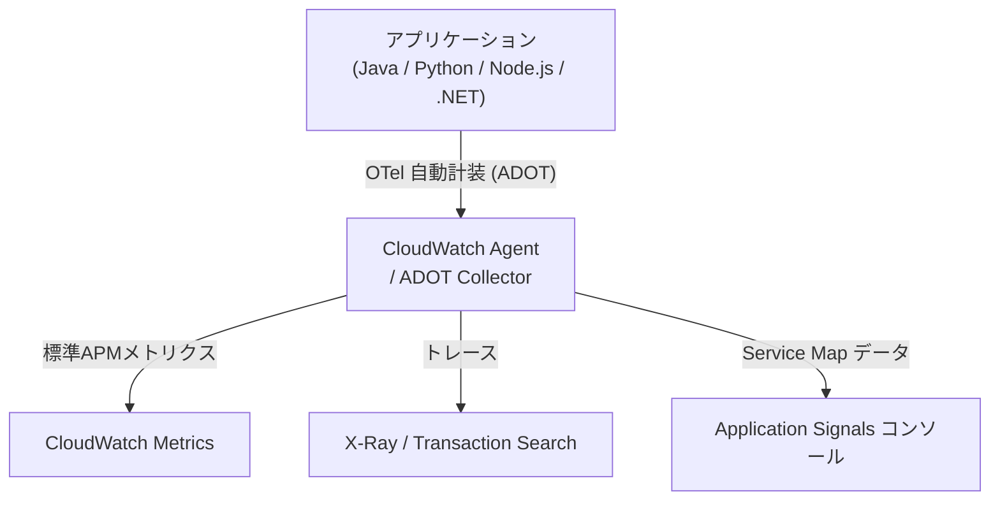

# Application Signals & SLO

CloudWatch Application Signals は、CloudWatch に組み込まれた **APM（Application Performance Monitoring）** 機能です。アプリケーションのリクエスト数・エラー率・レイテンシを自動収集し、サービス間の依存関係を地図として可視化、さらに **SLO（Service Level Objective）** で「健全性の目標」を継続的に評価します。

## なぜ Application Signals が必要か

従来の CloudWatch では、メトリクスとログ・トレースが別々に存在し、「どのサービスがどのサービスを呼び、どこでレイテンシが発生しているか」をエンジニアが手作業でつなぎ合わせる必要がありました。Application Signals は次の3つの問題を一度に解決します。

1. **計装コストが高い** — 各言語ごとに [OTel](../part4/12-opentelemetry.md) SDK を組み込み、トレースの伝播を実装するのは手間がかかる
2. **アプリ視点のダッシュボードがない** — CPU/メモリのような「リソース視点」のメトリクスは出るが、「サービスX のリクエスト成功率」のような「アプリ視点」は自分で組み立てる必要があった
3. **SLO 運用の道具がなかった** — エラーバジェットや Burn Rate を CloudWatch メトリクス算術で組むのは煩雑

Application Signals を有効化すると、この3つが「ボタンをいくつか押すだけ」で揃います。

## 全体像



ポイントは、**アプリ側のコードを書き換えずに**、エージェント設定だけで上記が成立することです。

## 対応言語と環境

| 項目 | 対応 |
|------|------|
| 言語 | Java、Python、Node.js、.NET |
| 環境 | Amazon EKS、Amazon ECS、Amazon EC2、AWS Lambda、Kubernetes（セルフホスト）、カスタム |
| リージョン | Canada West (Calgary) を除く全商用リージョン |

EKS では **サービス名・クラスタ名が自動検出**されますが、それ以外の環境では有効化時に手動で名前を指定します。

## RED 指標

Application Signals が標準で収集するアプリケーション指標は、SRE で定番の **RED** に揃えられています。

| 指標 | 意味 | CloudWatch メトリクス名 |
|------|------|------------------------|
| **R**ate | 1分あたりのリクエスト数 | `Latency`（呼び出し回数として） |
| **E**rrors | エラー率（4xx/5xx、フォルト率） | `Error`、`Fault` |
| **D**uration | レイテンシ（P50/P90/P99） | `Latency` |

これらは `ApplicationSignals` 名前空間に格納され、ダッシュボードや通常のアラームの対象としても使えます。

## Service Map（アプリケーショントポロジー）

Application Signals を有効化すると、サービス間の呼び出し関係から **トポロジー図**が自動生成されます。

- ノード = サービス（自動検出された名前）／クライアントページ／Synthetics canary
- エッジ = サービス間の呼び出し（呼び出し量・フォルト率・レイテンシが線の太さ・色で表現）
- SLI（Service Level Indicator）の健全性アイコンが各ノードに表示される

> **2025/11 追加**: 未計装のサービス（OTel が入っていない AWS サービス）も、X-Ray のトレースデータから推定して自動的にトポロジー上に表示されるようになりました。

## SLO（Service Level Objective）

SLO は「このサービスの信頼性目標値」を宣言する仕組みです。Application Signals では2種類のSLOが選べます。

### Period-based SLO（期間ベース）

- **考え方**: 評価期間（例: 5分）を多数のスライスに区切り、「スライスのうち基準を満たしたものの割合」を測る
- **例**: 「直近30日間のうち、5分間隔で見て P99 レイテンシが 300ms 以下のスライスが 99% 以上」
- **適している場面**: トラフィックが少ないサービス、バースト的に呼ばれるサービス

### Request-based SLO（リクエストベース）

- **考え方**: 「成功したリクエスト数 / 全リクエスト数」をそのまま測る
- **例**: 「直近30日間で、成功（HTTP 2xx かつ 1秒以内）したリクエストが 99.9% 以上」
- **適している場面**: 安定的にトラフィックがあるサービス、ユーザー体験に直結する API

### エラーバジェットと Burn Rate

SLO の核心は **エラーバジェット（誤差予算）** という考え方です。

- **エラーバジェット** = 「100% - SLO目標値」 の余裕枠
  - 例: SLO 99.9% なら、30日間で 0.1% = 約 43.2分 のダウンタイムが「使える」
- **Burn Rate** = エラーバジェットを消費している速度
  - Burn Rate = 1.0 だと、ちょうど予算ぴったりで30日後に使い切る速度
  - Burn Rate = 14.4 だと、2日で1ヶ月分の予算を使い切ってしまう速度

Application Signals は Burn Rate を自動計算し、`BurnRateConfigurations` を設定することで「ある閾値を超えたら即アラーム」のような **fast-burn alert** を組めます。

### 新機能（2026/03）

- **SLO Recommendations**: 過去30日のサービス指標（P99 レイテンシ・エラー率）から、適切なSLO目標値を AWS が提案してくれる
- **Service-Level SLOs**: オペレーション単位ではなく、サービス全体としての SLO を作成可能
- **SLO Performance Report**: 日次・週次・月次で SLO の達成状況をレポート出力

## ハンズオン: CDK Serverless アプリで Application Signals を試す

API Gateway → TypeScript Lambda（Checkout API）→ Python Lambda（Inventory API）→ DynamoDB という典型的なサーバレス構成を CDK で組み、Application Signals が**多言語のサービス連携**をどう可視化するかを確認します。

> **コスト注意**: Lambda・DynamoDB はリクエスト課金のため、軽い負荷であればハンズオン全体で $1 未満に収まります。終了後は必ず `cdk destroy` を実施してください。

### アーキテクチャ

```text
[curl(負荷ジェネレータ)]
        │ HTTP POST /checkout
        ▼
[API Gateway HTTP API]
        │
        ▼
[Lambda: CheckoutApi (TypeScript / Node.js 22.x)] ──┐
        │ Lambda invoke                              │
        ▼                                            │ Application Signals
[Lambda: InventoryApi (Python 3.13)]                 │ ADOT Lambda Layer
        │ DynamoDB                                   │ で自動計装
        ▼                                            │
[DynamoDB: Inventory テーブル] ──────────────────────┘
```

両 Lambda は共通モジュール `@aws-cw-study/common` の `enableAppSignals(fn, runtime)` ヘルパで Application Signals を有効化しています。このヘルパは (1) スタックに `CfnDiscovery` を 1 個だけ追加し、(2) `CloudWatchLambdaApplicationSignalsExecutionRolePolicy` を Lambda ロールへ付与し、(3) ランタイム別の **AWS Distro for OpenTelemetry (ADOT) Lambda Layer** を装着し、(4) `AWS_LAMBDA_EXEC_WRAPPER=/opt/otel-instrument` を設定する 4 つの作業を 1 行に集約します。これによりアプリ側のコード変更なしで自動計装が成立します。

### CDK コードと手順

完全なコードと詳細な手順は [`handson/chapter-07/`](https://github.com/r-tamura/aws-cw-study/tree/main/handson/chapter-07) を参照してください。サマリ:

- `lib/stack.ts`: DynamoDB テーブル `Inventory`、Python Lambda `InventoryApi`、TypeScript Lambda `CheckoutApi`、HTTP API（`POST /checkout`）を作成。`enableAppSignals(inventory, 'python')` と `enableAppSignals(checkout, 'nodejs')` を呼ぶだけで両 Lambda が Application Signals 対応になる
- `lambda-ts/checkout/index.ts`: HTTP リクエストを受け、`@aws-sdk/client-lambda` で `InventoryApi` を invoke。在庫があれば 200、無ければ 409 を返す
- `lambda-py/inventory/handler.py`: DynamoDB に対して `get` / `set` / `decrement` を実行（条件付き更新で在庫切れを検出）

デプロイ手順は次のとおりです。

```bash
cd handson/chapter-07
npm install && npm run build
npx cdk bootstrap   # 初回のみ
npx cdk deploy
# 出力された ApiUrl を控える

API_URL=<ApiUrl>
while true; do
  curl -s -X POST "$API_URL/checkout" -d '{"sku":"ABC-123","qty":1}'
  sleep 1
done
```

5〜10 分後、CloudWatch コンソールの **Application Signals → Services / Service Map / Service detail** で 2 サービスと依存エッジが描画されていることを確認します。

### SLO を作成

1. Application Signals → **Service Level Objectives → Create SLO**
2. 対象: `CheckoutApi`、SLI Type: **Request-based**、Metric: Availability
3. Target: **99.5%**、Window: rolling **30 days**
4. SLO Recommendations ボタンを押すと AWS が過去 30 日のメトリクスから推奨値を提示する

### Burn Rate アラーム

SLO 詳細画面の Burn Rate 設定から、CloudWatch アラームを作成します。代表的な閾値の組み合わせは以下のとおりです。

| 用途 | Window | Burn Rate 閾値 | 推奨アクション |
|------|--------|----------------|----------------|
| Fast burn | 1h | > 14.4 | ページャー / オンコール起床 |
| Slow burn | 6h | > 6 | チケット起票 / 翌営業日対応 |

通知先の SNS トピックを紐付けると、Slack / Email へ通知が飛びます。

### 期待する結果

- `ApplicationSignals` 名前空間に `Latency` / `Error` / `Fault` メトリクスが現れる
- Service Map にノード 3 つ（`CheckoutApi` / `InventoryApi` / `DynamoDB::Inventory`）と依存エッジが描画される
- SLO 詳細ページで Attainment（達成率）と残りエラーバジェットが確認できる
- 在庫切れにすると HTTP 409 が増え、Errors メトリクスが上昇する

### 片付け

```bash
cd handson/chapter-07
npx cdk destroy
```

加えてコンソールから以下を手動で削除します。

1. 作成した SLO（Application Signals → Service Level Objectives）
2. 作成した Burn Rate アラーム
3. ロググループ `/aws/lambda/CheckoutApi` / `/aws/lambda/InventoryApi` / `/aws/application-signals/data`

## まとめ

- Application Signals は「アプリ視点の APM」を CloudWatch 上で完結させる機能
- ADOT 自動計装によりコード変更ほぼなしで RED 指標と Service Map が手に入る
- SLO はエラーバジェット運用の道具で、Burn Rate アラームと組み合わせて「壊れる前に気づく」
- 2026/03 の SLO Recommendations により、目標値設定の暗黙知が要らなくなった
