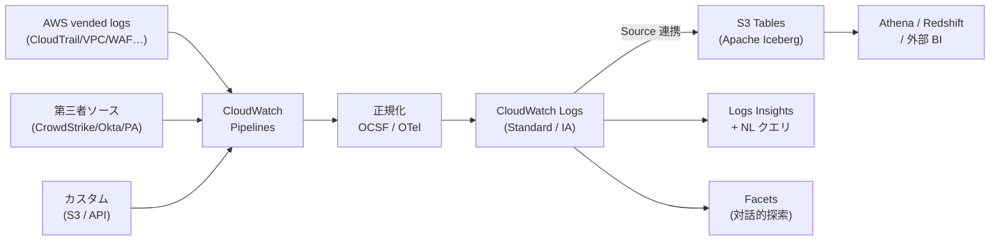

# 取り込み (Ingestion / Pipelines)

CloudWatch コンソール左メニューの「取り込み（Ingestion）」は、運用・セキュリティ・コンプライアンスの各種ログを、AWS および第三者ソースから **正規化された形で一箇所に集める** ための統合データ管理機能です。本章では、その中核となる **CloudWatch Pipelines**、データを意味づけする **Data Source / Facets**、保存形式の標準化（**OCSF / OTel**）、そして外部解析エンジンへの橋渡しとなる **S3 Tables (Apache Iceberg) 連携** までを通して見ていきます。

## 解決する問題

従来の CloudWatch では、ログを取り込むパスが用途ごとにバラバラでした。AWS 各サービスの vended logs は CloudWatch Logs に直接、セキュリティログは Security Lake / Athena 経由、サードパーティ製品は Kinesis Firehose や OpenSearch Ingestion 経由 ── というように、**「同じ運用課題」のログが別々の倉庫に分散**してしまうケースが多く見られました。

具体的には次のような問題があります。

1. **データストアが多重化する** — 運用・セキュリティ・コンプライアンス向けに、CloudWatch Logs / Security Lake / 独自 S3 / OpenSearch などが並立し、コストとガバナンスが二重三重に発生する
2. **スキーマが揃わない** — VPC Flow / CloudTrail / WAF などサービスごとにログ形式が違い、フィールド名（`srcAddr` / `sourceIPAddress` 等）の差異を正規化する ETL を自分で書く必要があった
3. **クロスアカウント集約が手作業** — Organizations 配下の数十〜数百アカウントから vended logs を集める処理は、各アカウントでの destination 設定 / Subscription Filter / S3 Replication など、組み合わせが複雑
4. **解析ツールの選択肢が狭い** — CloudWatch Logs Insights だけでは複雑な SQL / 結合 / 機械学習に向かず、結局別の S3 + Athena 環境にコピーする手間がかかる
5. **取り込み時の前処理が貧弱** — Logs Transformer はあったものの、20 段のプロセッサや条件付きルーティング、OCSF への変換など本格的な ETL 機能が不足していた

「取り込み」メニューは、これらを **CloudWatch 内のひとつのページ** に統合することを狙った機能です。2025/12 の AWS re:Invent で発表された "unified data management and analytics" がベースになっており、2026/04 にはコンプライアンス・ガバナンス機能（raw コピー保持、Drop Events、IAM 条件キー）が追加されています。

設計思想として注目すべきは、CloudWatch がこれまで「Metrics と Logs の収集器」だったのに対し、本機能で **「マネージド ETL + マネージド Iceberg ストア + マネージド SIEM 前処理」** という三役を兼ねるようになった点です。Security Lake、Glue、OpenSearch Ingestion など、これまで別サービスを組み合わせて構築していたパイプラインの少なくない部分が、CloudWatch コンソール内で完結します。

## 全体像



ポイントは、すべての取り込みが **Pipelines という単一のエントリ** を通り、**Data Source（名前と種別）というメタデータが付与された状態** で CloudWatch Logs に着地することです。下流の Facets / NL クエリ / S3 Tables はその Data Source を起点に動きます。

逆に言えば、Pipelines を経由しない既存の取り込み（直接 PutLogEvents するアプリログ等）は、Data Source 情報が空のまま CloudWatch Logs に入るため、Facets での絞り込みや S3 Tables 連携の対象になりません。新規ログは可能な限り Pipelines を通すか、既存のロググループにも Pipelines を後付けする運用が推奨です。

## 主要仕様

### CloudWatch Pipelines

CloudWatch Pipelines は、ログデータを取り込み・変換・配送するフルマネージドのデータコレクタです。インフラ管理や第三者 ETL ツールなしで、エンリッチ・フィルタ・標準化を実行できます。

パイプラインは次の 4 要素で構成されます。

| 要素 | 役割 | 個数 |
|------|------|------|
| Source | データの発生源（CloudWatch Logs / S3 / 第三者 API） | パイプラインに 1 つ |
| Processors | 変換・パース・エンリッチ。シーケンシャルに適用 | 任意（最大 20） |
| Sink | 配送先（CloudWatch Logs ロググループ） | パイプラインに 1 つ |
| Extensions | 補助機能（Secrets Manager 連携など） | 任意 |

クォータと運用上の留意点は次のとおりです。

- 1 アカウントあたり最大 **330 パイプライン**（CloudWatch Logs ソース 300 + その他 30）
- パイプライン定義自体は暗号化されない。**API キーやパスワードを直接書かない**（Extensions で Secrets Manager 参照）
- プロセッサを通すと **元ログは保持されない** のがデフォルト。監査用途には 2026/04 追加の **Keep original toggle**（コピーを raw のまま別保管）を有効化する
- 料金は CloudWatch Logs 取り込み課金に含まれ、追加料金なし。ただし第三者・S3 ソースは Custom logs として **処理後に課金** される
- 監視は `AWS/Observability Admin` 名前空間の `PipelineBytesIn/Out`、`PipelineRecordsIn/Out`、`PipelineErrors`、`PipelineWarnings` などのメトリクスで行う

#### プロセッサの分類

プロセッサは **20 種類以上** が用意されており、用途別に次の 3 系統に分類できます。

- **パーサ系**: `parseToOCSF`、`parseJSON`、`parseCSV`、`parseVPC`、`parseRoute53`、`parseKeyValue`、`Grok` — 必ず **パイプラインの先頭** に置く必要があり、1 パイプラインに 1 つ
- **変換系**: `add_entries`、`copy_values`、`rename_key`、`delete_entries`、`move_key` — フィールドの追加・改名・削除でスキーマを揃える
- **文字列系・条件系**: 大文字小文字変換 / トリム / 正規表現置換、および 2026/04 追加の **Conditional Processing**（21 プロセッサで `when` 条件指定）と **Drop Events** プロセッサ（不要ログを破棄してコスト削減）

設定ミスを防ぐため、デプロイ前に `ValidateTelemetryPipelineConfiguration` API、サンプル投入時に `TestTelemetryPipeline` API を活用するのが推奨フローです。

#### クロスアカウント集約との関係

Pipelines は単一アカウント・単一リージョン内のデータ加工器ですが、Organizations 配下の集約には **Cross-account cross-Region log centralization** という別機能と組み合わせます。Centralization Rule で各メンバーアカウントから集めた中央アカウントの CloudWatch Logs に対して、Pipelines を後段に置く構成にすると、「全アカウントの CloudTrail を OCSF V1.5 に揃え、S3 Tables で公開する」といった運用が一本のフローで成立します。なお、Centralization は新規イベントのみが対象で、追加のコピー分には `$0.05/GB` の料金がかかる点に注意します。

### Facets

Facets は、CloudWatch Logs Insights 上で **クエリを書かずに** ログをドリルダウンするための仕組みです。`ServiceName`、`StatusCode`、`@aws.region` といったフィールドを「ファセット」として扱い、コンソール左ペインで値の分布と件数を見ながらクリックで絞り込めます。

主要な仕様を整理します。

| 項目 | 内容 |
|------|------|
| デフォルトファセット | `@aws.region`、`@data_source_name`、`@data_source_type`、`@data_format` |
| カスタムファセット | Field Index Policy で「Set as facet」を ON にしたフィールド |
| 推奨 | **Low cardinality**（1 日あたりユニーク値 100 未満） |
| ユニーク値上限 | 1 ファセットあたり 100 値（超えるとカウントが「-」表示） |
| 保持期間 | 30 日 |
| 制約 | クロスアカウントオブザーバビリティの監視アカウントから、ソースアカウントのファセットは見えない |

Pipelines で付与される `@data_source_name` / `@data_source_type` がファセットの基本軸となるため、**取り込み段階で Data Source を正しく命名すること** が、後段の探索性能を大きく左右します。

### OCSF / OTel ノーマライゼーション

統合データ管理の鍵は **スキーマの正規化** です。CloudWatch は次の 2 つの標準スキーマをファーストクラスでサポートしています。

- **OCSF (Open Cybersecurity Schema Framework)**: セキュリティログの業界標準。CloudTrail / Route 53 Resolver / VPC Flow / EKS Audit / AWS WAF を **事前定義のマッピング** で OCSF V1.1 / V1.5 に変換できる
- **OTel (OpenTelemetry)**: 観測可能性データの標準フォーマット。アプリ系のメトリクス・トレース・ログを共通スキーマで取り扱える

`parseToOCSF` プロセッサの設定例は次のとおりです。

```json
{
  "parseToOCSF": {
    "eventSource": "VPCFlow",
    "ocsfVersion": "V1.1"
  }
}
```

`eventSource` には `CloudTrail` / `Route53Resolver` / `VPCFlow` / `EKSAudit` / `AWSWAF` のいずれかを指定します。`mappingVersion`（既定: 最新の `v1.5.0`）で変換ロジックのバージョンを固定でき、AWS 側でマッピングが更新されても挙動を保てます。

注意点として、OCSF プロセッサは **CloudTrail のみ** 他のプロセッサと組み合わせ可能で、それ以外は単独利用が必要です。また、1 パイプラインにパーサ系プロセッサは 1 つしか置けない点も覚えておきます。

### S3 Tables (Iceberg) との連携

S3 Tables Integration は、CloudWatch Logs に取り込まれたログを **Apache Iceberg 形式の S3 テーブル** として外部に開放する機能です。AWS は専用の `aws-cloudwatch` table bucket を裏でマネージし、Data Source 単位で「どのソースを Iceberg として公開するか」を関連付けます。

データフローと制約を表で整理します。

| 観点 | 仕様 |
|------|------|
| 関連付け単位 | Data Source name + type |
| バックフィル | 関連付け **以降** のイベントのみ。過去ログはコピーされない |
| 保持期間 | 元のロググループの保持期間に追従（ロググループ削除で S3 Table も削除） |
| 解析エンジン | Athena、Redshift、Spark、Trino など Iceberg 互換ツール |
| 権限管理 | AWS Lake Formation 経由で行う |
| 追加料金 | なし（CloudWatch Logs の取り込み・保管料金のみ） |

この仕組みにより、**「ログは CloudWatch に置いたまま、SQL で外部解析」** という運用が成立します。Security Lake のように専用倉庫を別途構築しなくても、Athena から `aws-cloudwatch` ネームスペースのテーブルを直接クエリできます。

### 自然言語クエリ

CloudWatch Logs Insights には、自然言語からクエリを生成する **Query Assist** が組み込まれています。プロンプトに「直近 1 時間でエラー数が最も多い Lambda 関数 Top 10」のように書くと、Logs Insights QL / OpenSearch PPL / OpenSearch SQL のいずれかでクエリと解説が返ります。

押さえるべきポイントは次のとおりです。

- 生成されるクエリ言語は **Logs Insights QL / PPL / SQL** から選べる（2025/08 GA で PPL/SQL が追加）
- リージョナルサービスで、利用には専用 IAM 権限が必要
- データを学習に使われたくない場合は CloudWatch Logs のオプトアウトポリシーを設定可能
- Pipelines + Facets で **Data Source の命名と field discovery** が整っているほど、生成精度が高まる

「正規化された取り込み」「ファセットの整備」「自然言語クエリ」は連鎖して効くため、上流（Pipelines）の設計が下流の探索体験を決めます。Data Source の命名が雑だと、自然言語クエリは「対象ログをどう絞り込むか」をプロンプトで毎回明示しなくてはならず、生成精度も再現性も下がります。逆に Data Source とフィールドが整っていれば、`@data_source_type='CloudTrail'` を暗黙の前提として AI が SQL を組み立てられるため、運用者の認知負荷が大きく下がります。

## 設計判断のポイント

### いつ Pipelines を使うか

「Logs Transformer で十分」「Subscription Filter + Lambda の方が安い」など、似た目的の機能が複数あります。Pipelines を選ぶべき典型的な状況は次のとおりです。

| 状況 | 推奨 |
|------|------|
| AWS vended logs を OCSF に揃えたい（CloudTrail / VPC Flow など） | **Pipelines + parseToOCSF** |
| サードパーティ SaaS（CrowdStrike / Okta / PA Networks）を取り込みたい | **Pipelines（Managed Collector）** |
| 単一ロググループに対する軽い JSON パースと既存フィールドのリネーム | Logs Transformer でも可 |
| ログを Lambda で個別加工し別 AWS サービスに送りたい | Subscription Filter + Lambda |
| ログを大幅に減量・条件分岐したい | **Pipelines（Drop Events + Conditional Processing）** |

「複数のロググループに **同じ変換ルールを再利用** したい」「**OCSF / Iceberg 互換** を活かしたい」という要件があるなら Pipelines が筋の良い選択です。

### OCSF と OTel をどう使い分けるか

両者はカバー領域が違うので「どちらか」ではなく「両方」を場面で使い分けます。

- **OCSF**: 認証イベント、ネットワークアクティビティ、API コール、構成変更など **セキュリティ系**。SIEM・脅威検知・監査レポートで「Activity Type」「Severity」など共通の軸でクエリしたい場合
- **OTel**: アプリケーションのメトリクス・トレース・構造化ログ。Application Signals や ADOT 経由で集めた **観測可能性系**。サービス・オペレーション・スパン名などの共通軸が欲しい場合

セキュリティ用途なら CloudTrail / VPC Flow / WAF を OCSF に正規化して S3 Tables 化、可観測性用途ならアプリログを OTel 形式に揃えて Application Signals と相互参照する、という二段構えが基本になります。

OCSF を選ぶ実務上のメリットは、**Activity Type / Severity / Actor / Src Endpoint** といった共通フィールドで CloudTrail と VPC Flow を横断的にクエリできる点です。たとえば「特定 IAM プリンシパルが直近 24 時間に発生させた API コール」と「同じ時間帯にその IP から出た VPC 通信」を、ログ形式の差を意識せず単一の SQL で結合できます。OTel 側も `service.name` / `span.kind` / `http.status_code` のような共通属性で、Java と Python のサービスを同じダッシュボードで扱えるという同等の効果があります。

### S3 Tables 連携の使いどころ

CloudWatch Logs Insights だけで足りる範囲では S3 Tables 連携は不要です。次のような要件が出てきたら検討します。

- **クロスソース結合**: ログと売上 / 顧客マスタなど **CloudWatch 外のデータ** を JOIN したい
- **長期分析**: 数か月〜数年の傾向を SQL で分析したい（Insights の保持と異なる視点）
- **ML パイプライン**: Glue / EMR / SageMaker 経由で Iceberg を直接読みたい
- **ツール選択の自由**: Trino / Spark / Snowflake など Iceberg 互換エンジンを使うチームが既にある

逆に、**過去ログのバックフィルは行われない** ため、後から「あの日のログを Iceberg で見たい」と言っても遡れない点には注意が必要です。導入は早めに、関連付けは保守的に広めにしておくのが安全です。

権限設計の面では、関連付けを行うロールに `observabilityadmin:CreateS3TableIntegration` と `logs:AssociateSourceToS3TableIntegration`、CloudWatch Logs が引き受ける書き込みロールに `logs:integrateWithS3Table` を与え、さらにクエリ実行ユーザに対して **Lake Formation** で対象テーブルへの SELECT を付与します。Lake Formation を使うため、既存の S3 / Athena 中心の権限体系を持っている組織はそのまま流用しやすい一方、Lake Formation を導入していないチームでは初回セットアップに学習コストが発生します。

### Pipelines の設計でよくある落とし穴

- **Keep original を有効化しないまま破壊的変換**: 監査要件のあるログは必ず raw コピーを残す（2026/04 追加の toggle を活用）
- **高カーディナリティをファセットにする**: `requestId` のようなフィールドはファセットに向かない。100 ユニーク値以下を目安に
- **パーサ系プロセッサの順序ミス**: パーサは必ず先頭。`ValidateTelemetryPipelineConfiguration` でデプロイ前に検証
- **第三者ソース利用時のリージョン制約**: OpenSearch Ingestion API エンドポイントがあるリージョンに限られる
- **GovCloud / 中国リージョン未対応**: 統合データ管理機能群そのものが、`AWS GovCloud (US)` および中国リージョンでは未提供（2026/04 時点）

### コスト最適化のレバー

Pipelines を導入する際にコスト面で効くレバーは次の 3 つです。

| レバー | 効き方 | 備考 |
|--------|--------|------|
| Drop Events プロセッサ | 不要ログを取り込み前に破棄 | 第三者ソースで特に有効 |
| Infrequent Access ログクラス | 取り込み単価が安価 | 検索頻度の低い監査ログ向け |
| S3 Tables 連携 | 重い分析を Athena 側にオフロード | Logs Insights のスキャン量を削減 |

特に Drop Events と Conditional Processing は 2026/04 に追加された比較的新しい機能で、CrowdStrike や Okta から大量に届く認証イベントのうち成功ログを除外する、といった用途で取り込みコストを大きく下げられます。

### 既存の CloudWatch Logs と Pipelines をどう移行するか

すでに CloudWatch Logs を運用している組織が、Pipelines に乗り換える場合のステップは次のとおりです。

1. **インベントリ化**: 既存ロググループを `data_source_name` / `data_source_type` の観点で分類する。AWS vended、アプリ、第三者の 3 系統を明確に分ける
2. **Data Source 命名規約の策定**: 例として `aws.cloudtrail`、`app.checkout-api`、`vendor.crowdstrike-fdr` のように、所有者と種別を含む規約を決める
3. **Pilot パイプライン**: 1 つのロググループを対象に、`Keep original` を有効化したまま OCSF / 正規化を試す。ファセット化と Logs Insights クエリで十分な情報が出ることを確認
4. **段階展開と S3 Tables 関連付け**: Pilot 成功後、関連グループに展開し、必要なものに S3 Tables 連携を関連付ける
5. **モニタリング**: `PipelineErrors` / `PipelineWarnings` をアラーム化し、`PipelineBytesOut/PipelineBytesIn` 比でフィルタ削減効果を継続的に確認する

## ハンズオン

> TODO: 執筆予定（CDK Serverless 構成の Lambda → CloudWatch Logs → Pipelines → S3 Tables ルートを試す）

## 片付け

> TODO: 執筆予定

## まとめ

- 「取り込み」メニューは、AWS / 第三者 / カスタムの全ソースを **CloudWatch Pipelines** という単一の入口に集約する統合機能
- Pipelines は最大 20 段のプロセッサで、**OCSF / OTel への正規化** と Conditional / Drop Events によるコスト削減を両立
- Data Source の命名が **Facets** とフィールドディスカバリの起点となり、自然言語クエリの精度にも効いてくる
- **S3 Tables (Apache Iceberg) 連携** により、ログを CloudWatch に置いたまま Athena / Redshift / Spark など外部エンジンから SQL で扱える
- セキュリティ用途は OCSF + S3 Tables、可観測性用途は OTel + Application Signals という二段構えが、2026 時点での標準的な設計
