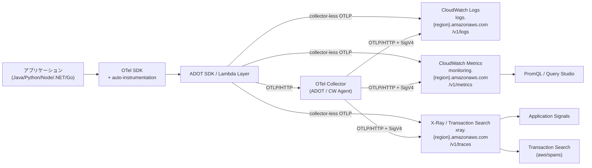

# OpenTelemetry

OpenTelemetry（OTel）は、メトリクス・ログ・トレースという 3 種類の **テレメトリ信号** をベンダー中立な形式で収集・配送するための、CNCF ホストのオープンソース仕様と SDK 群です。本章では OTel の核心概念を整理したうえで、CloudWatch がどのように OTLP を受け入れ、AWS Distro for OpenTelemetry (ADOT) や CloudWatch Agent と組み合わさるのかを通して見ていきます。

## 解決する問題

CloudWatch を中心に観測可能性を組み立てる際、OTel が無いと以下の問題が積み重なります。

1. **ベンダーごとに違う計装** — 各 APM ベンダー（Datadog / NewRelic / X-Ray など）独自の SDK を導入すると、ベンダーを乗り換える際にアプリ側の計装コードを書き直すことになる
2. **Metrics / Logs / Traces の分断** — それぞれ別の SDK・別のフォーマットで送ると、`service.name` のような共通ラベルが揃わず、3-pillar をまたいだ相関分析が手作業になる
3. **言語ごとに自前で SDK を書く負担** — Java は OpenTracing、Python は X-Ray SDK、Node.js は別…と多様な SDK を運用すると、メンテと知見の分散が発生する
4. **AWS 固有の属性が乗らない** — リソース ARN、リージョン、アカウント ID などの AWS メタデータを各サービスに揃って付与する仕組みが必要
5. **CloudWatch カスタムメトリクスの制約** — 従来の CloudWatch カスタムメトリクスは 1 メトリクスあたり最大 30 ディメンションかつ高カーディナリティに弱く、OTel メトリクスのような **ラベル豊富なモデル** を素直に表現できなかった

OTel は「**仕様（OTLP プロトコル / Resource / Context Propagation）と SDK / Collector を共通化し、ベンダー固有部分は exporter プラグインに閉じ込める**」というアーキテクチャでこれらを一掃します。CloudWatch は 2024〜2026 年にかけて OTLP エンドポイントと PromQL クエリのファーストクラスサポートを追加し、OTel を「外付けの選択肢」から「CloudWatch の標準入口の 1 つ」に格上げしました。

## 全体像

ポイントは 3 つあります。第一に、CloudWatch の OTLP エンドポイントは Logs・Metrics・Traces の **3 系統に分かれている** こと。それぞれ受け口のホスト名と URL パスが異なります。第二に、間に Collector を挟むパスと、ADOT SDK から直接 OTLP エンドポイントを叩く **collector-less** の 2 通りがあること。第三に、Traces は Application Signals / Transaction Search の入力としてそのまま再利用される（同じ OTLP データに別の機能が乗る）ことです。

逆に言えば、**OTel データを CloudWatch に送りさえすれば、Application Signals の Service Map も Transaction Search の `aws/spans` も自動で動き出す**設計になっています。OTel が CloudWatch アプリ系機能の「共通入力フォーマット」になっているため、後段の機能を選ぶたびに別の計装をやり直す必要がありません。

## OpenTelemetry の核心概念

### Signals（Metrics / Logs / Traces）

OTel が扱うテレメトリは **3 種類の Signal** に分類されます。

| Signal | 内容 | 代表的な型 |
|--------|------|----------|
| **Metrics** | 数値の時系列。リクエスト数、レイテンシ、エラー率、CPU 使用率など | Counter / UpDownCounter / Gauge / Histogram |
| **Logs** | 構造化ログ。タイムスタンプと自由なフィールドを持つイベント | LogRecord（Resource + Attributes 付き） |
| **Traces** | 分散トレース。1 リクエストが複数サービスをまたぐ際の親子関係 | Span（trace_id / span_id / parent_span_id） |

3 つの Signal は **共通の Resource と Context** を共有するため、`service.name` や `trace_id` をキーに 3-pillar を相互参照できます。これが OTel の最大の利点で、「あるトレースで遅延した時間帯の同じサービスのログとメトリクス」をスムーズに行き来できます。

### SDK と auto-instrumentation

OTel SDK は以下の 2 つを担います。

- **API**: アプリケーションコードから呼び出すインターフェース（`tracer.startSpan()` など）。ベンダー非依存
- **SDK 実装**: API の具体実装。サンプリング、バッチング、エクスポートを行う

計装のスタイルには 3 段階があります。

1. **auto-instrumentation**: Java agent / Python `opentelemetry-instrument` / Node.js loader などで **コード変更ゼロ**。HTTP クライアント・サーバ、DB ドライバ、AWS SDK 呼び出しが自動的にスパン化される
2. **library instrumentation**: 自分のコードに `@WithSpan` のようなアノテーションや、特定のフレームワーク向けプラグインを差し込む（部分的な手動）
3. **manual instrumentation**: 完全に手書きで `tracer.startSpan()` してビジネスロジック上のスパンを作る

実務では「auto を基本、ビジネス指標が必要な箇所だけ manual で補強」が王道です。

### Collector

**OpenTelemetry Collector** はテレメトリのプロキシ役を果たすスタンドアロンのデーモンです。アーキテクチャは 3 段で固定されています。

| 段 | 役割 | 例 |
|----|------|-----|
| **Receivers** | 入力。OTLP / Prometheus / fluentforward などを受信 | `otlp`, `prometheus`, `awsxray` |
| **Processors** | 加工。バッチング、属性追加、サンプリング、フィルタ | `batch`, `attributes`, `tail_sampling` |
| **Exporters** | 出力。OTLP / AWS / Datadog などへ送信 | `otlphttp`, `awsemf`, `awscloudwatchlogs` |

Collector を入れる利点は次のとおり。

- **集約**: 複数アプリが多重接続するのを 1 拠点で受け止め、CloudWatch への接続数を減らす
- **加工**: PII 除去、属性のリネーム、サンプリング、リトライをアプリ外で実行
- **設定の一元化**: 同じ Collector 設定を Dev / Staging / Prod に流用できる
- **ベンダー切替**: アプリは OTLP で送るだけ。送り先を変えたいときは Collector の Exporter を差し替えるだけ

CloudWatch に送る場合、Collector の `otlphttp` Exporter に `sigv4authextension` を組み合わせて SigV4 認証を付ける構成が標準です。

### OTLP プロトコル

**OTLP (OpenTelemetry Protocol)** は OTel のために設計された汎用テレメトリ配送プロトコルです。仕様の要点は次のとおり。

- **トランスポート**: gRPC または HTTP/1.1
- **エンコーディング**: Protobuf または JSON
- **CloudWatch のサポート**: **HTTP/1.1 のみ**（gRPC は非対応）。Protobuf と JSON 両方が使える
- **圧縮**: gzip
- **認証**: SigV4（AWS 標準）

OTLP は Signal ごとに別エンドポイントに POST する設計です。1 リクエストに ResourceMetrics / ResourceLogs / ResourceSpans のいずれかを入れ、内側に共通の Resource とスコープごとの計装データを格納します。

### Resource と Context propagation

OTel が「3-pillar の相互参照」を成立させているのは、Resource と Context という 2 つの仕組みです。

- **Resource**: テレメトリを発生させた **エンティティの属性**。`service.name`、`service.version`、`deployment.environment`、`cloud.provider`、`cloud.region`、`host.id` などを **すべての Signal に共通で付与** する。Resource は SDK 起動時に確定し、その後は変わらない
- **Context propagation**: HTTP リクエストや gRPC コール越しに **trace_id と span_id をヘッダ伝播** させる仕組み。W3C Trace Context (`traceparent` ヘッダ) が標準で、これで「サービス A のスパン → サービス B のスパン」の親子関係が成立する

実装上の落とし穴は、**Resource が揃っていないと PromQL や Application Signals の集計が崩れる**ことです。`service.name` のスペル違い・大文字小文字違いだけで別サービス扱いになってしまうため、ADOT の自動検出に任せられない環境（自前 EC2 など）では Resource Detector の設定を慎重に行います。

## CloudWatch の OTel サポート

### OTLP エンドポイント

CloudWatch は Logs / Metrics / Traces の各 Signal に対し、独立した HTTP/1.1 エンドポイントを提供します。すべて SigV4 認証必須です。

| Signal | エンドポイントパターン | 補足 |
|--------|--------------------|------|
| **Logs** | `https://logs.{region}.amazonaws.com/v1/logs` | `x-aws-log-group` / `x-aws-log-stream` ヘッダで宛先指定。1 イベント 1 MB 超は LLO（Large Log Objects）に格納 |
| **Metrics** | `https://monitoring.{region}.amazonaws.com/v1/metrics` | Counter / Histogram / Gauge / UpDownCounter をネイティブ受信。Public preview（2026/04 時点） |
| **Traces** | `https://xray.{region}.amazonaws.com/v1/traces` | **Transaction Search 有効化が前提**。受信スパンは `aws/spans` ロググループに着地 |
| **RUM** | `https://dataplane.rum.{region}.amazonaws.com/v1/rum` | モバイル RUM 用クライアントサイドエンドポイント |

共通制約として、Collector 利用時は `sigv4authextension` 拡張が必須、プロトコルは HTTP のみ（gRPC 不可）、ペイロードは Protobuf または JSON、圧縮は gzip です。各エンドポイントには TPS、リクエストサイズ、ラベル数の上限が個別に定義されているため、本番投入前に [OTLP Endpoints ドキュメント](https://docs.aws.amazon.com/AmazonCloudWatch/latest/monitoring/CloudWatch-OTLPEndpoint.html) で最新値を確認します。

### AWS Distro for OpenTelemetry (ADOT)

**ADOT** は AWS が CNCF OpenTelemetry プロジェクトをベースに、AWS 環境向けに **テスト・最適化・サポート** を加えたディストリビューションです。中身は次の 3 種類があります。

- **ADOT SDK / Auto-instrumentation Agent**: Java / Python / Node.js / .NET / Go 向け。upstream の OTel SDK に AWS 用 Resource Detector や X-Ray ID generator を同梱
- **ADOT Collector**: upstream OTel Collector に AWS 専用 Receiver / Exporter（`awsemf`, `awsxray`, `awscloudwatchlogs` など）を追加したビルド
- **ADOT Lambda Layer**: Lambda 用に最適化された Java / Python / Node.js / .NET レイヤー。`AWS_LAMBDA_EXEC_WRAPPER=/opt/otel-instrument` を設定するだけで自動計装が有効化される

ADOT が upstream OTel と比べて優れる点は **AWS サポート対象**であること、AWS インフラ属性（EC2 / ECS / EKS / Lambda の自動検出）が組み込まれていること、**Application Signals のテレメトリエンリッチメント** に対応すること、Lambda Layer として AWS が公式 ARN を配布していることです。逆に、ベンダー中立なまま使いたい・upstream の最新機能を即座に試したい場合は upstream OTel Collector も選択肢になります。

CloudWatch 公式の Getting Started ドキュメントは、用途別に次の選択肢を示しています。

| 構成 | 特徴 | 向いている場面 |
|------|------|-------------|
| **OTel Collector**（upstream） | Logs / Metrics / Traces すべて対応、Application Signals エンリッチメント不可 | OSS のまま使いたい、CNCF 最新追従重視 |
| **Custom OTel Collector** | OTel + AWS 拡張をビルドして組み込む。ランタイムメトリクス対応 | カスタム加工が必要、AWS 機能もフル活用したい |
| **ADOT SDK（collector-less）** | アプリから直接 OTLP エンドポイントへ送信。Metrics / Traces 対応 | Lambda やシンプルなアプリで Collector を運用したくない |

### CloudWatch Agent との関係

CloudWatch Agent は古くから存在する CloudWatch 専用エージェントで、メトリクス・ログ・トレースを EC2 / ECS / EKS / オンプレから収集します。**2023 年以降の Agent には OTLP Receiver が組み込まれており**、設定ファイルの `metrics_collected.otlp` / `logs.metrics_collected.otlp` / `traces_collected.otlp` で gRPC / HTTP の OTLP を受信できます。

CloudWatch Agent と ADOT Collector はオーバーラップが大きく、AWS は次のような棲み分けを推奨しています。

| 用途 | 推奨 |
|------|------|
| **Container Insights / Application Signals 統合** | CloudWatch Agent（または CloudWatch Observability EKS Add-on） |
| **EC2 のシステムメトリクス + アプリ計装の OTLP 受信** | CloudWatch Agent（OTLP セクション併用） |
| **任意のベンダー（Datadog / Splunk / 自社 OSS）に同時送信** | ADOT Collector / OTel Collector |
| **複雑な Tail Sampling や条件付きルーティング** | OTel Collector / ADOT Collector |
| **Lambda** | ADOT Lambda Layer（Agent は Lambda 非対応） |

実務では **「EKS 上のアプリは CloudWatch Observability Add-on で Agent を入れる」「Lambda は ADOT Layer」「特殊な要件があるところだけ独立した OTel Collector」** という三層構成が一般的です。1 ノードに両方を入れる必要は普通ありません。CloudWatch Agent には **Supplemental OpenTelemetry Collector configuration** というオプションもあり、既存の OTel Collector 設定をそのまま読み込めるため、既存資産がある場合は移行も容易です。

### PromQL クエリ

2026/04 のパブリックプレビューで、CloudWatch は **OTLP 経由で取り込んだメトリクスを PromQL で直接クエリ** できるようになりました（[AWS What's New](https://aws.amazon.com/about-aws/whats-new/2026/04/amazon-cloudwatch-opentelemetry-metrics/)）。

主要な特徴は次のとおりです。

- **対応メトリクス**: OTLP で取り込んだカスタムメトリクス + **OTel エンリッチメント**を有効化した AWS Vended Metrics（CloudWatch 標準メトリクス）
- **対応する OTel メトリクスタイプ**: Counter / Histogram / Gauge / UpDownCounter
- **ラベル数**: 1 メトリクスあたり最大 150 ラベル（従来の CloudWatch カスタムメトリクスは 30 ディメンション）
- **Prometheus 3.0 ベース**: UTF-8 メトリクス名 / ラベル名対応
- **Query Studio**: PromQL を CloudWatch コンソール内で書ける UI（プレビュー）
- **PromQL アラーム**: PromQL 式で直接 CloudWatch Alarm を作れる
- **対応リージョン**（プレビュー時点）: US East (N. Virginia)、US West (Oregon)、Asia Pacific (Sydney)、Asia Pacific (Singapore)、Europe (Ireland)
- **料金**: プレビュー期間中は OTel メトリクスもクエリも無料

PromQL ラベルは OTLP の構造を保持し、`@resource.service.name` / `@instrumentation.@name` / `@aws.region` のように **スコーププレフィックス付き** で公開されます。AWS Vended Metrics を PromQL で扱うには、`StartOTelEnrichment` API（IAM 権限 `cloudwatch:StartOTelEnrichment`）でアカウント単位にエンリッチメントを有効化します。

## 各機能との連携

### Application Signals (Ch 7)

Application Signals は OTel/ADOT を「**APM の入力フォーマット**」として全面採用しています。Java / Python / Node.js / .NET の **ADOT 自動計装エージェント** がアプリに注入され、HTTP・DB・AWS SDK 呼び出しが自動でスパン化、そのスパンから RED 指標（Latency / Error / Fault）が自動算出されます。Service Map も OTel スパンの `service.name` と親子関係から自動構築されるため、**OTel の Resource attribute 設計が APM の見え方をそのまま決める**形になっています。詳しくは [Ch 7 Application Signals & SLO](../part3/07-application-signals.md)。

### Transaction Search (Ch 8)

Transaction Search は OTLP の Traces エンドポイント（`xray.{region}.amazonaws.com/v1/traces`）から流入したスパンを **`aws/spans` 専用ロググループ** に格納し、CloudWatch Logs Insights ベースのクエリ環境で 100% トラフィックの分析を可能にします。逆に言えば、**Transaction Search を有効化していないアカウントでは OTLP Traces エンドポイントが受け付けない**点が運用上の落とし穴です。詳しくは [Ch 8 Transaction Search](../part3/08-transaction-search.md)。

### RUM (Ch 9)

RUM のモバイル系（iOS / Android）は **ADOT iOS / Android SDK** を採用しており、専用の RUM OTLP エンドポイント（`dataplane.rum.{region}.amazonaws.com/v1/rum`）にクライアントサイドのトレースとログ（`eventName` 付き）を送信します。これにより、モバイル → バックエンドのトレースを共通の `trace_id` で連結して見られます。詳しくは [Ch 9 RUM](../part3/09-rum.md)。

### GenAI Observability (Ch 18)

Bedrock AgentCore や MCP 連携を含む GenAI 系のオブザーバビリティは、**LLM スパンに `gen_ai.system` / `gen_ai.request.model` / `gen_ai.usage.input_tokens` といった OTel セマンティック規約** を採用しています。ADOT の最新版でこれらの属性が自動付与され、Transaction Search 上で「コスト × レイテンシ × モデル」の軸で分析できる仕組みです。詳しくは [Ch 18 生成 AI オブザーバビリティ](../part5/18-genai-observability.md)。

## 設計判断のポイント

### CloudWatch Agent と Collector のどちらを使うか

判断の軸は **「どこに送りたいか」「Application Signals を使うか」「ホスト環境は何か」** の 3 つです。

| 状況 | 推奨 |
|------|------|
| EKS / ECS でアプリを動かし、Application Signals と Container Insights を同時に使いたい | **CloudWatch Observability Add-on**（CW Agent ベース） |
| EC2 でシステムメトリクス + アプリ計装を 1 エージェントで賄いたい | **CW Agent + OTLP セクション** |
| CloudWatch 以外（Datadog / Grafana Cloud / 自社 OSS）にも同時送信 | **ADOT Collector / OTel Collector** |
| Tail Sampling や条件付きルーティングが必要 | **OTel Collector**（CW Agent には機能なし） |
| Lambda | **ADOT Lambda Layer 一択**（Agent は Lambda 上で動かない） |
| 完全 OSS / マルチクラウド前提 | **upstream OTel Collector** |

「迷ったら ADOT Collector」が無難な選択です。upstream 互換、AWS サポート対象、Application Signals エンリッチメント対応とバランスが取れています。

### auto-instrumentation か manual か

| 手段 | 長所 | 短所 |
|------|------|------|
| **auto-instrumentation** | 数行の設定でフレームワーク・DB ドライバ・AWS SDK が一気にスパン化される | ビジネスロジックレベルのスパン（「在庫チェック処理」など）は出ない |
| **library instrumentation** | フレームワーク特化のリッチな属性が出る | 言語・FW ごとにライブラリ依存が増える |
| **manual instrumentation** | 業務ドメインに即したスパン名・属性を制御できる | 計装コードが業務ロジックに混ざりメンテコストが上がる |

実務上のレシピは **「auto を最初に入れて 80% を稼ぎ、残り 20% の "なぜそこで遅いのかをビジネス語彙で見たい" 箇所だけ manual で span を切る」** が標準です。ADOT は Java / Python / Node.js / .NET の auto-instrumentation を Lambda Layer として配布しており、**Lambda の場合は実質ゼロコード**で APM が立ち上がります。

### Resource attribute の設計

OTel の Resource は **後から変えづらい命名規約**になりがちなので、初期設計が重要です。

- `service.name`: **必須**。Application Signals / Transaction Search のサービス分割の基本軸。`order-api` のような短く機械可読なケバブケースが推奨。フリーフォームの日本語は避ける
- `service.version`: 推奨。デプロイ単位を区別できると、デプロイ起因の劣化を瞬時に切り分けられる
- `deployment.environment`: 推奨。`prod` / `staging` / `dev` を統一
- `cloud.provider` / `cloud.region` / `cloud.account.id`: ADOT Resource Detector が自動付与
- `service.namespace`: チーム名やドメイン名で集約したい場合に使う

「`service.name` にバージョンを入れない」「環境名は `service.name` ではなく `deployment.environment` に切り出す」などの **OTel セマンティック規約** に準拠することで、PromQL の集約や Application Signals の Service Map が想定どおりに動きます。

### ベンダーロックインを避ける書き方

OTel の最大の利点はベンダー非依存性ですが、書き方によって簡単に AWS 固有の作り込みになってしまいます。次の点に注意します。

- **アプリコードでは AWS 固有 API を使わない**: `aws-xray-sdk` の `captureAWSv3Client()` のような呼び出しは ADOT auto-instrumentation で代替可能
- **属性名は OTel セマンティック規約を優先**: `aws.lambda.arn` は OTel 上 `cloud.resource_id` で表現できる
- **Resource Detector を環境変数経由で差し替え可能にしておく**: `OTEL_RESOURCE_ATTRIBUTES` で上書き可能なように残す
- **送信先の切り替えは Collector の Exporter で行う**: アプリ側は OTLP に送るだけにする

これらを守れば、将来的に CloudWatch から他のオブザーバビリティ基盤へ移行する際も、計装コード自体には触らずに済みます。

## ハンズオン

> TODO: 執筆予定（CDK Serverless で Lambda にレイヤー注入して Metrics/Logs/Traces を OTLP で CloudWatch に送る）

## 片付け

> TODO: 執筆予定

## 参考資料

**AWS 公式ドキュメント**
- [CloudWatch OTLP Endpoints](https://docs.aws.amazon.com/AmazonCloudWatch/latest/monitoring/CloudWatch-OTLPEndpoint.html) — Logs / Metrics / Traces / RUM 各 OTLP HTTP エンドポイントの URL と SigV4 認証
- [Sending logs using the OTLP endpoint (`/v1/logs`)](https://docs.aws.amazon.com/AmazonCloudWatch/latest/logs/CWL_HTTP_Endpoints_OTLP.html) — LogGroup / LogStream ヘッダ・partial success・1MB Large Log Object の仕様
- [Exporting collector-less telemetry using AWS Distro for OpenTelemetry (ADOT) SDK](https://docs.aws.amazon.com/AmazonCloudWatch/latest/monitoring/CloudWatch-OTLP-UsingADOT.html) — Collector を介さずに ADOT SDK 単体で OTLP エンドポイントへ送る前提条件と IAM
- [Collect metrics and traces with OpenTelemetry (CloudWatch Agent)](https://docs.aws.amazon.com/AmazonCloudWatch/latest/monitoring/CloudWatch-Agent-OpenTelemetry-metrics.html) — CloudWatch Agent の `otlp` レシーバ設定と CloudWatch / AMP / X-Ray 振り分け

**AWS ブログ / アナウンス**
- [Introducing OpenTelemetry & PromQL support in Amazon CloudWatch](https://aws.amazon.com/blogs/mt/introducing-opentelemetry-promql-support-in-amazon-cloudwatch/) — OTLP メトリクス・150 ラベル高カーディナリティ・PromQL 対応（2025）
- [AWS Distro for OpenTelemetry FAQs](https://aws.amazon.com/otel/faqs/) — ADOT のスコープ・対応言語・Lambda Layer・サポートポリシー
- [Track performance of serverless applications with Application Signals](https://aws.amazon.com/blogs/aws/track-performance-of-serverless-applications-built-using-aws-lambda-with-application-signals/) — Lambda 向け ADOT Layer による APM 自動計装（2024）

## まとめ

- OpenTelemetry は Metrics / Logs / Traces の 3 信号を **OTLP プロトコル + 共通 Resource** で統一する CNCF 標準
- CloudWatch は Logs / Metrics / Traces 各々に独立した OTLP HTTP エンドポイントを提供（SigV4 認証）し、Application Signals / Transaction Search / RUM の入力として再利用
- AWS Distro for OpenTelemetry (ADOT) は upstream OTel に AWS サポートと拡張を加えたディストリビューションで、Lambda Layer まで揃っている
- CloudWatch Agent と OTel Collector はオーバーラップするが、**EKS は CW Agent、Lambda は ADOT Layer、特殊要件は OTel Collector** という三層構成が無難
- 2026/04 プレビューで OTLP メトリクスを PromQL で直接クエリ可能になり、CloudWatch のメトリクスモデルが大幅に拡張された

次章 [Container Insights](./13-container-insights.md) では、ここで触れた CloudWatch Observability Add-on / ADOT が EKS 上でどのようにメトリクスとログを収集するか、コンテナ視点で掘り下げます。
