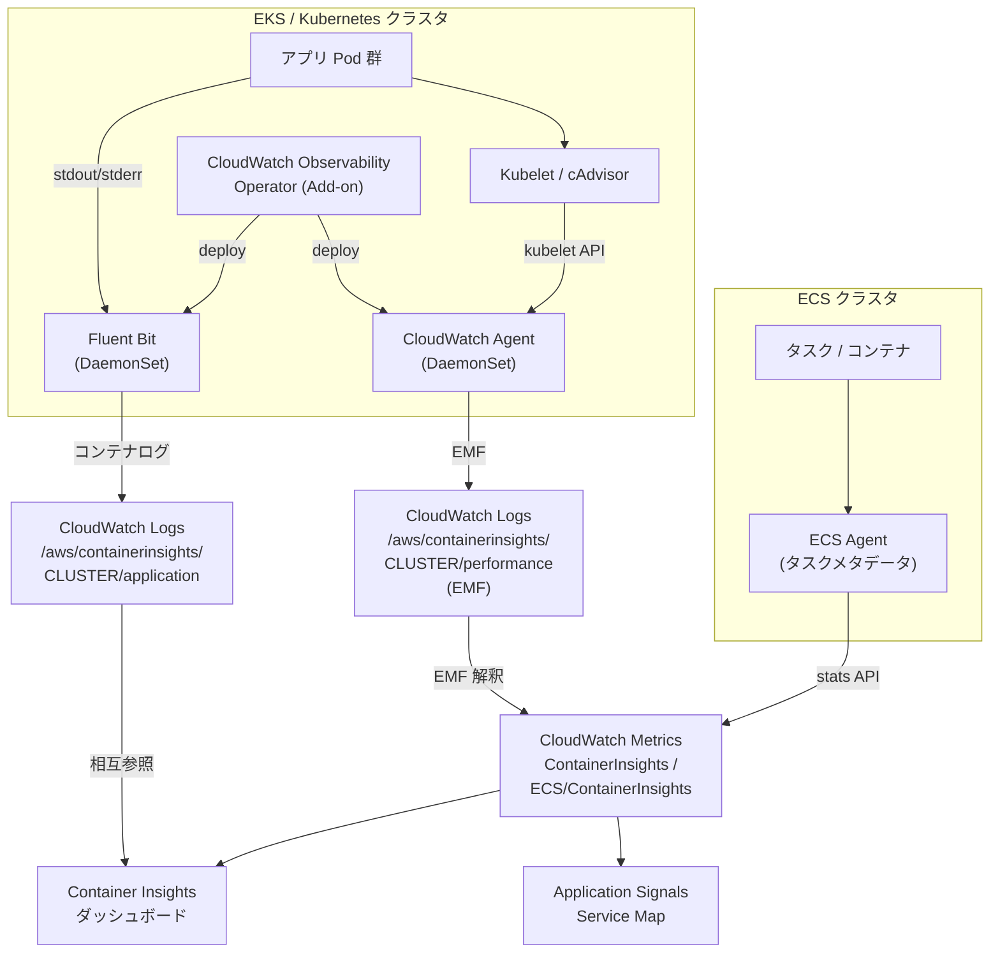

# Container Insights

CloudWatch Container Insights は、Amazon ECS / Amazon EKS / Kubernetes on EC2 / RedHat OpenShift on AWS (ROSA) で稼働するコンテナ環境から、CPU・メモリ・ディスク・ネットワークといった**インフラテレメトリ**を自動収集して階層化ダッシュボード上に可視化するマネージド監視機能です。本章では標準版と「**Enhanced observability**（拡張版）」の違い、CloudWatch Observability Operator (EKS Add-on) の役割、Performance log として CloudWatch Logs に着地する仕組み、そして Application Signals との関係を整理します。

## 解決する問題

コンテナ環境を CloudWatch だけで観測しようとすると、次のような壁に当たります。

1. **階層が深い** — クラスタ → ノード → Namespace → Deployment → Pod → コンテナ、と縦に 5〜6 段の集計軸が必要で、CPU/メモリの素のメトリクスを CloudWatch の Dimension で全部表現するのは現実的ではない
2. **生メトリクスの取得元が分散** — Kubelet、cAdvisor、Kubernetes API server、各ノードの `/proc`、ECS Agent の Stats API など、ソースが複数ありそれぞれフォーマットが違う
3. **ECS と EKS で別の見方になりがち** — チームによって ECS / EKS が混在しているとダッシュボードもアラームも別建てになり、運用知見が分断する
4. **ポッドが短命** — オートスケールやリスタートで Pod 名が変わると CloudWatch メトリクスのディメンションが激しくチャーンし、グラフが断絶して傾向が見えない
5. **コンテナ → アプリ → サービスの相互参照が手作業** — Pod の CPU 高騰と特定 API のレイテンシ悪化を結びつけるのに、別ダッシュボードを行き来する必要がある

Container Insights は、これらに対して「**CloudWatch Agent または CloudWatch Observability Operator がコンテナを自動検出 → メトリクスを Embedded Metric Format (EMF) の Performance log として CloudWatch Logs に出力 → CloudWatch が自動で集計してメトリクス化と階層ダッシュボードに変換**」という統一フローで応えます。EKS でも ECS でも同じ概念モデルで観測でき、Application Signals 側からも同じ Performance log を相互参照できます。

## 全体像



ポイントは 3 つあります。第一に、**メトリクスは一度ログ（Performance log）として書き込まれ、CloudWatch 側が EMF を解釈して自動的にメトリクス化する**こと。これにより 1 回の収集で「ログとして検索可能」かつ「メトリクスとしてグラフ・アラーム化可能」を両立しています。第二に、EKS では **CloudWatch Observability EKS Add-on**（実体は CloudWatch Observability Operator）が Agent と Fluent Bit を DaemonSet として展開し、Pod Identity でクラスタへ最小権限で統合する形が標準になったこと。第三に、Container Insights が出力する Performance log は **Application Signals の Service Map と同じインフラ視点メトリクスを共有する** ため、APM 側からインフラ側へ自然に降りていけることです。

## 主要仕様

### 標準 Container Insights

ECS / EKS / Kubernetes on EC2 / ROSA の基本セットです。Container Insights は CloudWatch Agent のコンテナ版を使ってクラスタ内の稼働コンテナを自動検出し、CPU・メモリ・ディスク・ネットワークのメトリクスを **EMF Performance log として CloudWatch Logs に出力**、CloudWatch が EMF を読み取って自動的にカスタムメトリクスに変換します。

- **メトリクス名前空間**: EKS は `ContainerInsights`、ECS は `ECS/ContainerInsights`
- **収集粒度（標準）**: クラスタ・サービス・ノード・Namespace 単位の集計値が中心。Pod / コンテナ単位のシグナルは限定的
- **ログ**: アプリコンテナの `stdout` / `stderr` は Fluent Bit DaemonSet で別途 CloudWatch Logs に転送（自動構成オプションあり）
- **対応プラットフォーム**: ECS（EC2 / Fargate）、EKS（EC2 / Fargate）、Kubernetes on EC2、ROSA、Linux / Windows ノード両対応
- **ネットワーク**: bridge / awsvpc モードのコンテナはネットワークメトリクスあり、host モードは取得不可

「クラスタの様子を俯瞰したい」「サービス単位の CPU/メモリの大枠を見たい」用途では標準で十分です。

### Enhanced observability for EKS（拡張版）

2023 年 11 月 6 日リリースの **Container Insights with enhanced observability for Amazon EKS** は、標準版に対して **Pod / コンテナ / Control Plane / HPA / Network まで踏み込んだ詳細メトリクス**を追加します。

- **対応**: Amazon EKS on EC2（Fargate ノード上の Pod は対象外）/ Linux + Windows ワーカーノード
- **追加メトリクス**: Pod / コンテナレベルの CPU・メモリ・ファイルシステム使用量、ネットワーク I/O、再起動回数、コンテナ準備状態、Control Plane（API server / scheduler / etcd）の RED 系メトリクス、HPA / Cluster Autoscaler のスケーリング状況、GPU・AWS Neuron（Trainium / Inferentia）・EFA・SageMaker HyperPod 等のアクセラレータ系シグナルまで
- **ダッシュボード**: クラスタ概観 → ノード → Workload → Pod → コンテナ、を縦に降りる **Curated Dashboard** が自動生成される
- **クロスアカウント**: CloudWatch cross-account observability に対応し、複数アカウントを 1 つの監視アカウントで集約可能
- **2023/11 以降の新規 EKS インストール**: Container Insights を有効化すると自動的に Enhanced 版が選ばれる。既存クラスタは公式手順でアップグレード可能

ECS 側にも 2024 年 12 月 2 日に同じコンセプトで **Container Insights with enhanced observability for Amazon ECS** がリリースされ、**EC2 / Fargate 両ローンチタイプでタスク・コンテナ単位のメトリクスが取れる**ようになりました（詳細は後述）。

### CloudWatch Observability Operator

EKS で Container Insights（と Application Signals）を最も簡単に立ち上げる手段が **Amazon CloudWatch Observability EKS Add-on** です。EKS Console / API / `eksctl` / CloudFormation から「Add-on を有効化する」操作だけで、内部的に **CloudWatch Observability Operator** が CRD と Controller として展開され、必要なリソースを揃えます。

Add-on が展開する主要コンポーネント:

| コンポーネント | 役割 |
|------|------|
| CloudWatch Agent（DaemonSet） | 各ノードで Kubelet / cAdvisor からメトリクス収集、EMF として CloudWatch Logs に送信 |
| Fluent Bit（DaemonSet） | アプリコンテナの stdout/stderr を `/aws/containerinsights/CLUSTER/application` に転送 |
| Application Signals 計装フック | 対応言語（Java / Python / Node.js / .NET）の Pod に自動計装エージェントを注入 |

特徴:

- **EKS Pod Identity** での最小権限統合が推奨（IRSA からの移行も可）
- **クラスタ作成時の 1 ステップ有効化**（2025/01）にも対応し、EKS クラスタ新規作成と同時に Container Insights + Application Signals が立ち上がる
- **バージョン 5.0.0 以降（2026/02）**、Application Signals は新規・アップグレード時に **デフォルトで有効化**。Container Insights と Application Signals が「実質ワンセット」で配布される
- Linux + Windows ワーカーノード両対応（Add-on v1.5.0 以降。ただし Application Signals は Linux のみ）
- AWS Distro for OpenTelemetry (ADOT) を使う構成や、CloudWatch Agent 単体（Helm 等で自前運用）の構成も並行して残されており、Operator は「Operator が公式の最短ルート」という位置づけ。OTel・ADOT との接続は [Ch 12 OpenTelemetry](./12-opentelemetry.md) を参照

セルフホスト Kubernetes（オンプレ含む）では Add-on は使えず、Helm Chart や CloudFormation テンプレート経由で同じ Agent + Fluent Bit を手動展開する形になります。

### Performance log の構造（EMF）

Container Insights のすべてのメトリクスは、**Embedded Metric Format (EMF)** として記述された Performance log を経由して CloudWatch Logs に着地します。EMF は 1 つの JSON ログイベントの中に「メトリクス定義（`_aws.CloudWatchMetrics`）」と「実値」を同居させる構造化ログで、CloudWatch がパース時に自動でカスタムメトリクスを作ります。

ロググループは用途別に分かれます。

| ロググループ | 内容 |
|------|------|
| `/aws/containerinsights/CLUSTER_NAME/performance` | Performance log（EMF メトリクス本体） |
| `/aws/containerinsights/CLUSTER_NAME/application` | Pod の stdout/stderr（Fluent Bit 経由） |
| `/aws/containerinsights/CLUSTER_NAME/dataplane` | Kubelet・コンテナランタイム・kube-proxy 等のシステムログ |
| `/aws/containerinsights/CLUSTER_NAME/host` | ノードの `/var/log/messages`、`dmesg` 等 |
| `/aws/ecs/containerinsights/CLUSTER_NAME/performance` | ECS 版 Performance log（タイプ別 `Container` / `Task` / `Service` / `Volume` / `Cluster`） |

Performance log のタイプ（`Type` フィールド）は EKS なら `Cluster`・`ClusterNamespace`・`ClusterService`・`Node`・`NodeFilesystem`・`NodeDiskIO`・`NodeNet`・`Pod`・`PodNet`・`Container` 等、ECS なら `Container`・`Task`・`Service`・`Volume`・`Cluster` です。EMF として書かれているため、メトリクス側に出ていない属性も **CloudWatch Logs Insights から JSON パスでクエリ可能**で、トラブル時の深掘りに使えます。

例として、EKS の Pod レコードには `pod_name` / `pod_status` / `pod_cpu_utilization` / `pod_cpu_reserved_capacity` / `pod_memory_working_set` / `pod_number_of_container_restarts` のような数十フィールドが入り、これらが CloudWatch メトリクスとしても、Logs Insights の検索対象としても使えます。

EMF Performance log の典型的な姿は次のとおりです（EKS Pod レコードを抜粋・整形）。

```json
{
  "_aws": {
    "Timestamp": 1714387200000,
    "CloudWatchMetrics": [{
      "Namespace": "ContainerInsights",
      "Dimensions": [["ClusterName","Namespace","PodName"]],
      "Metrics": [
        {"Name": "pod_cpu_utilization", "Unit": "Percent"},
        {"Name": "pod_memory_working_set", "Unit": "Bytes"}
      ]
    }]
  },
  "Type": "Pod",
  "ClusterName": "demo",
  "Namespace": "checkout",
  "PodName": "checkout-api-7c5d-abc",
  "pod_cpu_utilization": 42.1,
  "pod_memory_working_set": 184549376,
  "pod_number_of_container_restarts": 0
}
```

`_aws.CloudWatchMetrics` がメトリクス定義そのもので、CloudWatch がこのログを取り込む瞬間に `pod_cpu_utilization` がカスタムメトリクス化されます。それ以外のフィールド（`PodName`、`pod_number_of_container_restarts` など）はログ属性としてだけ残り、Logs Insights からクエリできる「副情報」になります。

Logs Insights から「直近 1 時間で再起動したコンテナ Top 10」を見たい場合は次のようなクエリで実行できます。

```text
fields @timestamp, ClusterName, Namespace, PodName,
       pod_number_of_container_restarts
| filter Type = "Pod"
| filter pod_number_of_container_restarts > 0
| sort pod_number_of_container_restarts desc
| limit 10
```

メトリクスとログを 1 つの源泉から作っている設計の利点は、**メトリクスで「何かがおかしい」と気づいた瞬間に、同じ Performance log を Logs Insights で開いて「どの Pod・どの Namespace か」を即座に絞り込める**ことです。

### ECS / Fargate 対応

ECS 側は標準と Enhanced のどちらも次のような特徴を持ちます。

- **メトリクス名前空間**: `ECS/ContainerInsights`
- **ローンチタイプ**: EC2 と Fargate の両方
- **データソース**: ECS Agent のタスクメタデータ + Stats API。Fargate では Task Metadata Endpoint v4（`ECS_CONTAINER_METADATA_URI_V4`）と内蔵のテレメトリパスから収集
- **Enhanced for ECS（2024/12〜）**: 標準版のメトリクス一式に加え、`TaskCpuUtilization` / `TaskMemoryUtilization` / `TaskEphemeralStorageUtilization` / `ContainerCpuUtilization` / `ContainerMemoryUtilization` / `ContainerNetworkRxBytes` / `RestartCount` / `UnHealthyContainerHealthStatus` などタスク・コンテナ粒度のメトリクスを追加
- **EBS ボリューム**: タスクが ECS Managed EBS を使う場合は `EBSFilesystemSize` / `EBSFilesystemUtilized` も自動取得
- **Curated Dashboard**: Enhanced を有効化するとクラスタ → サービス → タスク → コンテナの階層ダッシュボードが自動生成
- **クロスアカウント**: ECS Enhanced も CloudWatch cross-account observability に対応
- **EC2 launch type の追加メトリクス**: コンテナインスタンスに CloudWatch Agent をデプロイすると `instance_cpu_utilization` 等のホスト層メトリクスが追加される（Fargate では取得不可）

ECS の Enhanced は **AWS は明確に「standard より Enhanced を推奨」**と公式ドキュメントで述べており、新規クラスタは Enhanced を選ぶのが基本線です。

### Application Signals との連携

Container Insights と [Application Signals (Ch 7)](../part3/07-application-signals.md) は、CloudWatch Observability EKS Add-on によって**同じデプロイ単位でまとめて有効化される姉妹機能**です。Add-on バージョン 5.0.0 以降は Application Signals がデフォルト有効になっており、両者は次のように相互参照します。

- **Service Map → Container Insights**: Application Signals の Service Map 上のサービスをクリックすると、その Pod が動いている **ノード・コンテナの Container Insights ダッシュボードに直接遷移**できる
- **メトリクス相関**: APM の P99 レイテンシ悪化と同時刻の Pod CPU 飽和を、同一ダッシュボード上で並べて見られる
- **Resource attribute の共有**: `service.name` / `k8s.namespace.name` / `k8s.deployment.name` 等の OTel Resource を APM・Container Insights 双方が参照
- **Logs 一括検索**: Application Signals 側のトレースから対応する Pod の `/aws/containerinsights/.../application` ログへワンクリックでジャンプ

つまり Application Signals は「コンテナ視点の Container Insights を内蔵し、APM 視点を被せた拡張」と理解するのが実態に近く、**EKS では両方を別々に運用するのではなく Add-on で同時起動するのが標準**です。

## 設計判断のポイント

### 標準 vs Enhanced の選び分け

| 状況 | 推奨 |
|------|------|
| EKS で Pod / コンテナ単位の問題切り分けをしたい | **Enhanced** |
| EKS Control Plane（API server / scheduler / etcd）の挙動を見たい | **Enhanced** |
| EKS で GPU / Neuron / EFA / SageMaker HyperPod を使っている | **Enhanced** |
| ECS で task / container 粒度のメトリクスが必要 | **ECS Enhanced** |
| ECS Fargate のみで運用、最低限のクラスタ俯瞰でよい | **標準でも可、ただし Enhanced 推奨** |
| EKS Fargate ノード上の Pod を細かく見たい | **Enhanced 非対応**。Fargate 上は標準のみ |
| クラスタ概観のみ必要・コスト最小化が最優先 | **標準** |

新規 EKS で Container Insights を有効化すると、**2023/11 以降の挙動として既定で Enhanced** が入ります。明示的にコスト最適化を狙わない限り、Enhanced を選ぶのが現実的です。なお ECS 側は明示有効化が必要で、AWS は Enhanced の利用を推奨しています。

### CloudWatch Agent (DaemonSet) と Operator の関係

EKS では「Agent を直接デプロイする」「CloudWatch Observability Operator (Add-on) を使う」「ADOT Collector を使う」の 3 通りが選択できます。

| 構成 | 特徴 | 向いている場面 |
|------|------|-------------|
| **CloudWatch Observability Add-on** | EKS API でワンクリック有効化、Agent + Fluent Bit + Application Signals 計装フックを Operator が一括管理、Pod Identity 連携あり | **新規 EKS の既定**、Application Signals も同時に使う場合 |
| **CloudWatch Agent を Helm/CFN で自前展開** | Add-on 非対応のセルフホスト Kubernetes / オンプレ向け、設定の細部まで握れる | Add-on が使えない、特殊な ConfigMap が必要 |
| **ADOT Collector** | OTel ベース、メトリクス・ログ・トレースを多目的に流せる、Container Insights for OTel（preview）で PromQL 直接クエリ可能 | OTel ファーストの組織、マルチベンダー出力 |

Add-on と CloudWatch Agent の単体デプロイを **同一クラスタに併存させる必要はありません**。Add-on を有効化すると Operator が Agent を所有・管理するため、Helm 等で並行に入れているとリソース競合や二重課金の原因になります。

### コスト最適化

Container Insights の課金は標準と Enhanced で構造が異なります。

- **標準（EKS / ECS）**: 出力された **EMF Performance log の取り込み + CloudWatch カスタムメトリクスの保存・呼び出し** で課金。メトリクスはおおよそクラスタ・サービス・ノード・Pod の集計分が `ContainerInsights` / `ECS/ContainerInsights` 名前空間に積まれる
- **Enhanced for EKS**: 「**観測（observation）あたりの課金**」モデル。メトリクスやログ取り込みではなく、収集した観測点の数で計算され、Pod / コンテナ粒度を取っても従量予測がしやすい
- **Enhanced for ECS**: 出力されるメトリクスは**カスタムメトリクスとして課金**。粒度が増える分メトリクス本数も増えるため、`PutMetricData` 相当の単価で増加

実務上のコスト圧縮テクニックは次のとおり。

- **アプリログ（`/aws/containerinsights/.../application`）の取捨選択**: Fluent Bit の `Filter` で本当に必要な namespace / Pod だけ転送
- **Performance log の保持期間**: 既定は無期限。**14 日 / 30 日に短縮**して保管コストを下げる
- **不要メトリクスの opt-out**: EKS Enhanced では GPU / Neuron / EBS NVMe 等のメトリクスを CloudWatch Agent の ConfigMap で除外できる
- **Container Insights for OTel（preview）の併用**: PromQL 取り込みのほうがラベルが豊富で従量がコントロールしやすいケースもある

### Self-managed Kubernetes / オンプレでの利用

Add-on（CloudWatch Observability Operator）は EKS 専用ですが、Container Insights の **コンセプトと EMF Performance log の仕組み自体は EKS 外でも使えます**。

- **オンプレ K8s / EKS Anywhere / 他クラウド K8s**: AWS が公開する CloudWatch Agent の Helm Chart / CloudFormation テンプレートで、Agent + Fluent Bit を DaemonSet 展開
- **認証情報**: ノードに IAM ロール相当を当てる手段がないため、IAM ユーザの長期キーやサービスアカウントトークン経由でクレデンシャルを供給。**AWS IAM Roles Anywhere** で証明書ベースに置き換えるとよりセキュアに運用できる
- **EKS Hybrid Nodes**: 通常の EKS と同じ Add-on 経路で扱える
- **ROSA**: AWS 公式のサポート対象プラットフォームで、EKS 同様の手順で Container Insights を有効化できる

オンプレで使う場合は **メトリクスのリージョン跨ぎ送信のレイテンシ・帯域コスト**が無視できないため、リージョン選定は AWS 側のリージョンとネットワーク経路を意識して決めます。

## ハンズオン

> TODO: 執筆予定

## 片付け

> TODO: 執筆予定

## まとめ

- Container Insights は ECS / EKS / Kubernetes / ROSA で稼働するコンテナのインフラテレメトリを **EMF Performance log → CloudWatch Logs → 自動メトリクス化** の流れで集める統一機能
- **Enhanced observability** は EKS（2023/11）と ECS（2024/12）の両方に存在し、Pod / タスク / コンテナ粒度の詳細シグナルと Curated Dashboard を提供する。新規環境は Enhanced が事実上の既定
- EKS では **CloudWatch Observability EKS Add-on**（実体は CloudWatch Observability Operator）が Agent + Fluent Bit + Application Signals 計装フックを一括展開。バージョン 5.0.0 以降は Application Signals がデフォルト有効
- Performance log は EMF で書かれているため、Logs Insights からの深掘りとメトリクス・アラームの両方に使える
- Application Signals は Container Insights を内蔵した APM 拡張であり、Service Map から Container Insights ダッシュボードへ直接降りていける

## 次章へ

次章 [Database Insights](./14-database-insights.md) では、同じ「Insights」シリーズのデータベース版として、RDS / Aurora を対象にしたパフォーマンス可視化機能を扱います。
