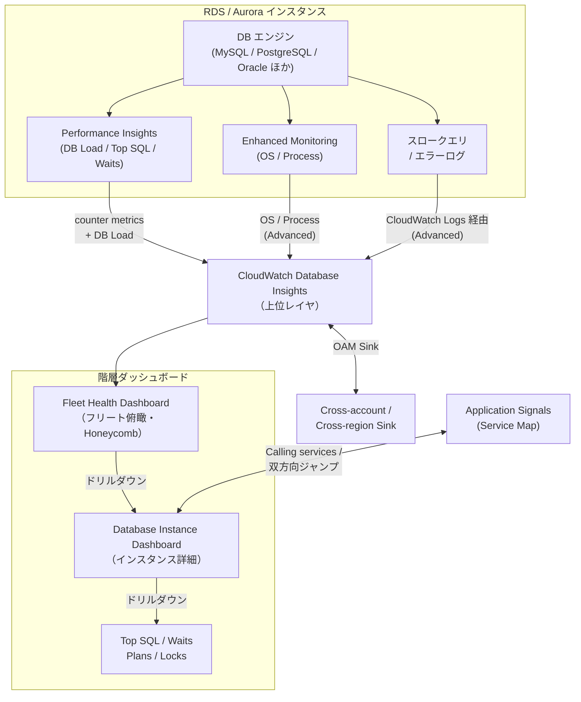

# Database Insights

CloudWatch Database Insights は、Amazon Aurora（MySQL / PostgreSQL / Aurora Serverless v2 / Aurora PostgreSQL Limitless）と Amazon RDS（MySQL / PostgreSQL / MariaDB / Oracle / SQL Server）のフリート全体を、**DB Load（Database Load）** を中核指標としたキュレート済みダッシュボードで俯瞰し、フリート → インスタンス → SQL までドリルダウンできるマネージド監視機能です。本章では Performance Insights との関係（Database Insights は Performance Insights を内包する上位レイヤ）、Standard / Advanced 2 つのモード、Top SQL と待機イベント、cross-account / cross-region 監視、そして Application Signals との双方向ドリルダウンまでを整理します。

## 解決する問題

RDS / Aurora のパフォーマンスを CloudWatch だけで追おうとすると、次のような壁に当たります。

1. **監視のサイロ化** — 1 つの DB を見るのに「RDS コンソールの Performance Insights」「CloudWatch のメトリクスダッシュボード」「Enhanced Monitoring の OS メトリクス」「`rds.log` を CloudWatch Logs に流したスロークエリログ」と複数面を行き来することになる
2. **フリート俯瞰がない** — 「アカウント内に何十台もある RDS / Aurora のうち、いま負荷が高いのはどれか」を一目で見るビューが Performance Insights だけでは作りにくい（Performance Insights は基本「1 インスタンスごとの画面」）
3. **DB エンジンごとに用語と画面が違う** — Aurora PostgreSQL のロック分析、Oracle の PDB、MySQL の Performance Schema など、エンジン固有のシグナルを統一フォーマットで並べづらい
4. **アプリ側の遅延と DB 側の負荷を結びつけにくい** — APM 側で P99 レイテンシが悪化したとき、それが「どの DB のどの SQL のせいか」を辿るのに、画面間を手で繋ぐ必要があった
5. **マルチアカウント・マルチリージョンの DB を 1 つのコンソールで見られない** — 監視アカウントから他アカウントの RDS フリートを一望する仕組みは Performance Insights 単体には無かった
6. **Performance Insights の有償ダッシュボード EOL（2026/06/30）** — Performance Insights のコンソール体験と柔軟な保持期間は **2026 年 6 月 30 日で EOL** が告知されており、それ以降は Database Insights Advanced モードへ移行しないと execution plan / on-demand analysis 等の機能が使えなくなる

Database Insights は、これらに対して「**RDS / Aurora を有効化するだけでフリート → インスタンス → SQL の階層ダッシュボードと Top SQL / 待機イベント分析が CloudWatch コンソール内に揃う**」という統一フローで応えます。下層では既存の Performance Insights が動いており、Database Insights はその上に **フリートビュー・15 ヶ月保持・Application Signals 連携・cross-account/region 集約** を重ねた上位レイヤと理解するのが正確です。

## 全体像

ポイントは 3 つあります。第一に、**Performance Insights は無くなったわけではなく、Database Insights の中で動き続けている**こと。Database Insights は Performance Insights が出す DB Load・Top SQL・待機イベントを CloudWatch メトリクスとして自動取り込みし、その上にフリートビューと長期保持を重ねる構成です。第二に、**Advanced モードは Enhanced Monitoring とログのエクスポートを「前提」**として OS プロセス分析・スロークエリ分析・実行計画分析を解禁する設計になっており、Standard と Advanced で取れる情報の質が階段状に変わります。第三に、Database Insights の Calling services タブは [Application Signals (Ch 7)](../part3/07-application-signals.md) と双方向接続されており、APM 側の P99 悪化からこのインスタンスのその SQL まで一貫した動線で降りていけます。

## 主要仕様

### 対応サービスと検出

Database Insights は次のエンジンを対象に、アカウント・Region 内の DB を**自動検出**して Fleet Health Dashboard に並べます。

| エンジン | 対応モード | 備考 |
|------|------|------|
| Amazon Aurora MySQL | Standard / Advanced | Aurora Serverless v2 を含む |
| Amazon Aurora PostgreSQL | Standard / Advanced | ロック分析・実行計画分析は **Aurora PostgreSQL のみ** Advanced で利用可 |
| Aurora PostgreSQL Limitless | Standard / Advanced | — |
| Amazon RDS for MySQL | Standard / Advanced | スロークエリ分析は Advanced |
| Amazon RDS for PostgreSQL | Standard / Advanced | ロック分析は **2026/02 に Advanced で追加** |
| Amazon RDS for MariaDB | Standard / Advanced | — |
| Amazon RDS for Oracle | Standard / Advanced | 実行計画分析は Advanced |
| Amazon RDS for SQL Server | Standard / Advanced | 実行計画分析は Advanced |

検出は **オプトインの有効化**で動きます。RDS / Aurora は既定で **Standard モードが ON** で、追加設定なしに DB Load 等のキュレート済みメトリクスが Database Insights コンソールに表示されます。Advanced モードに切り替えるには、対象 DB で **Performance Insights を有効化**したうえで、RDS コンソール / API / SDK / CloudFormation のいずれかから明示的に Advanced を選択します。Advanced ON の前提条件は次のとおりです。

- **Performance Insights が有効**（counter metrics の自動取り込みに必要）
- **OS プロセス分析を使う場合は RDS Enhanced Monitoring が有効**
- **スロークエリ分析を使う場合は DB ログを CloudWatch Logs にエクスポート**

DocumentDB / ElastiCache 等の NoSQL / インメモリ系は Database Insights のスコープ外で、CloudWatch メトリクス + 個別ダッシュボードで監視します。

### ダッシュボード階層（フリート → クラスタ → インスタンス → SQL）

Database Insights は次の 4 段のドリルダウンを基本動線としています。

1. **Fleet Health Dashboard（フリート俯瞰）**
    - **Honeycomb（ハニカム）ビュー**: フリート内の全インスタンスをタイル化し、Alarm 状態または DB Load 状態（`High` / `Warning` / `Ok` / `Idle`）で色分け
    - **RDS instances overview**: 各インスタンスの Alarm 状態 / Max DB Load / 最終更新時刻を表で並べる
    - **Top 10 instances per relative DB Load**: 直近で DB Load が高い 10 インスタンス、その代表 SQL と代表待機イベント
    - **Top 10 instances per metric**: CPU / Freeable Memory / DB Connections / Network Throughput / Read IOPS / Write IOPS / Read Latency / Write Latency を 10 台ぶん並べて比較
    - **Events** セクション: フリート全体の RDS イベント（フェイルオーバー、メンテナンスなど）
    - **Calling services**: Application Signals 側からこのフリート内の DB エンドポイントを呼んでいるサービス
2. **Fleet view（フィルタ保存）**
    - タグ・クラスタ名・インスタンス名でフィルタした「監視対象グループ」を**名前付きビューとして保存**できる（例: `production-aurora-only`）。チームごとのダッシュボード分割に使う
3. **Database Instance Dashboard（インスタンス詳細）**
    - **DB Load チャート**（毎秒収集）を中核に、ディメンション（Database / Host / SQL / User / Waits / Application / Plans / Session type / Blocking object・session・SQL）でスライス
    - **DB Load analysis** タブ: 各ディメンションの Top 寄与
    - **Database telemetry** タブ: 既定メトリクス（エンジン別キュレート）/ Logs / OS Processes（Advanced）/ Slow SQL Queries（Advanced）/ Events
    - **Top SQL** タブ: クエリごとの DB Load / 統計
    - **Plans / Locks** タブ: 実行計画・ロック分析（Advanced、対応エンジンのみ）
    - **Calling services** タブ: このインスタンスを呼んでいる Application Signals サービスとレイテンシ・エラー
4. **Top SQL → 単一クエリの深掘り**
    - クエリのダイジェスト（リテラル値が `?` に正規化された形）を選ぶと、AAS（Average Active Sessions）の時系列、紐づく待機イベント、実行計画（Aurora PG / RDS Oracle / RDS SQL Server で Advanced）に降りられる

ダッシュボードの**メトリクス部分はエンジンごとに既定構成があり、必要なら OS メトリクス・DB カウンタメトリクス・任意の CloudWatch メトリクスを Widget として追加可能**です（2025/03 追加機能、追加課金なし）。カスタマイズはアカウント × Region × エンジンタイプ単位で共有される点に注意します（特定インスタンスだけ違うレイアウト、はできない）。

### Top SQL と待機イベント分類

Database Insights の問題切り分けは **DB Load** という単一メトリクスを軸にすべてが動きます。DB Load は **Average Active Sessions (AAS) — 平均アクティブセッション数**で、ある瞬間に「DB エンジンに仕事を投げて応答待ちのセッション」が何本あるかの平均です。CPU 上限本数を超えて積み上がったぶんは、何かしらの**待機イベント**で詰まっていることを意味します。

DB Load チャートは次のディメンションでスライスできます。

| ディメンション | 何が見えるか |
|------|------|
| **Waits** | I/O 待ち・ロック待ち・CPU・ネットワーク等の待機イベント分類 |
| **SQL** | どの SQL ダイジェストが負荷の主役か（Top SQL の元データ） |
| **Host** | クライアント側ホスト別 |
| **User** | DB ユーザ別 |
| **Database** | スキーマ / DB 別 |
| **Application** | Aurora PostgreSQL のみ：`application_name` 別 |
| **Plans** | 対応エンジン：実行計画 ID 別（Aurora PG / RDS Oracle / RDS SQL Server、Advanced） |
| **Session type** | Aurora PostgreSQL のみ：ユーザセッション / バックグラウンド |
| **Blocking object / session / SQL** | ロック分析対応エンジン：ブロックの根元 |

**Top SQL タブ**は既定で AAS 寄与の高いクエリを 25 件表示し、クエリごとに `executions/sec`、`rows_examined/sec`、`tmp_disk_tables/sec` などの**単位時間あたり統計**と**コールごと統計**を見せます。Aurora PostgreSQL ではリテラル値を `?` に置換した「**ダイジェスト**」と「実行された具体クエリ」の両方が見られ、同じ形のクエリの集合体として比較できます。

実務上の標準的な使い方は「**DB Load を Waits でスライス → 主要待機イベントに当たりをつける → Waits を SQL でブレイクダウン → 該当クエリを Top SQL で深掘り → 必要なら実行計画 / ロックタブへ**」という縦の動線で、これがいわゆる **DB のトリアージ動線**になります。

### Performance Insights との関係（Standard vs Advanced）

Database Insights は **Performance Insights を置き換える機能ではなく、Performance Insights を内包・拡張する上位レイヤ**です。実装を分解するとこういう関係です。

- **Performance Insights** が DB Load・Top SQL・待機イベント・counter metrics を集める「**測定インフラ**」を提供
- **Database Insights** がそれを「**CloudWatch メトリクスとして自動取り込み + フリートビュー + 15 ヶ月保持 + Application Signals 連携**」する「**監視レイヤ**」を提供

Standard と Advanced の機能差は次のとおりです（公式ドキュメント記載の対応表を要約）。

| 機能 | Standard | Advanced |
|------|------|------|
| Top contributors to DB Load by dimension（Waits / SQL / Host …） | 対応 | 対応 |
| 7 日間の DB メトリクス保持・グラフ・アラーム | 対応 | 対応 |
| SQL テキスト等への fine-grained access control | 対応 | 対応 |
| OS プロセス分析（Enhanced Monitoring 必須） | 非対応 | **対応** |
| Fleet-wide monitoring view 保存 | 非対応 | **対応** |
| SQL ロック分析（15 ヶ月保持・GUI 誘導付き） | 非対応 | **対応**（Aurora PostgreSQL / RDS PG ※2026/02〜） |
| 実行計画分析（15 ヶ月保持） | 非対応 | **対応**（Aurora PG / RDS Oracle / RDS SQL Server） |
| Per-query 統計の可視化 | 非対応 | **対応** |
| スロークエリ分析（CloudWatch Logs エクスポート必須） | 非対応 | **対応** |
| Application Signals の Calling services 表示 | 非対応 | **対応** |
| 統合 telemetry ダッシュボード（metrics + logs + events + applications） | 非対応 | **対応** |
| Performance Insights counter metrics の CloudWatch 自動取り込み | 非対応 | **対応** |
| RDS イベントの CloudWatch 表示 | 非対応 | **対応** |
| On-demand performance analysis（時間範囲指定の ML ベース原因分析） | 非対応 | **対応** |

データ保持の差も大きく、**Advanced は Performance Insights のメトリクスを 15 ヶ月保持**、**Standard は Performance Insights が有効でも counter metrics を 7 日のみ保持**です。長期トレンド比較・四半期レビュー・SLO 評価に Database Insights を使う場合、Advanced が事実上の前提となります。

#### 2026/06/30 の Performance Insights EOL

AWS は **Performance Insights のコンソール体験と「柔軟な保持期間」の有償プランを 2026 年 6 月 30 日で終了**することをアナウンスしています。EOL 後の挙動は次のとおりです。

- **Performance Insights API は維持**（pricing 変更なし）。料金は CloudWatch / Database Insights 側に統合される
- **execution plan / on-demand analysis / proactive recommendations の各機能は Advanced モードの Database Insights でのみ提供**
- **既存の Performance Insights 有償プラン利用クラスタは、EOL までに Database Insights Advanced モードへアップグレード**することが AWS から推奨されている
- アップグレードしないと EOL 後は Database Insights Standard モードに落ち、**performance data の履歴が 7 日に短縮**される

つまり、長期保持・実行計画・on-demand 分析を業務で使っている DB は EOL までに Advanced へ移行が必要です。

### Cross-account / Cross-region

Database Insights は **CloudWatch cross-account observability（OAM）** と **cross-account cross-region CloudWatch コンソール**の上に構築されており、監視アカウント 1 つから複数アカウント・複数 Region の DB フリートを一望できます。セットアップは段階的です。

1. **CloudWatch cross-account observability** を有効化し、ソースアカウント → 監視アカウントの **Sink** を作る。Database Insights のために共有が必須なデータ種別は **Logs / Metrics / Traces / Application Signals - Services, SLOs**
2. **Cross-account cross-Region CloudWatch console** を有効化し、Step 5 の権限で **Include CloudWatch automatic dashboards** と **Include read-only access for Database Insights** を選択
3. Fleet Health Dashboard 左側の **Filters** で「**Cross-account cross-region mode**」をトグル ON

cross-account/region モードの制約は次のとおり。

- **アラーム作成は監視アカウント側のみ**。ソース側のメトリクスを参照したアラームを監視アカウントで作る
- **Fleet monitoring view の保存は監視アカウント側のみ**
- **Instance dashboard のカスタムメトリクス Widget も監視アカウント側のみ**
- **同時に表示できる Region の最大は 3**
- **モニタリング側は read-only**（performance analysis report の作成は不可、ソース側で実行する必要あり）
- **AWS Resource Tags / 一部リソースプロパティでのフィルタ**は cross-account/region モード時には使えない

「中央 SRE / DBA チームが組織横断で DB を監視する」「リードレプリカやレプリケーションが Region 跨ぎになっている構成を一画面で監視する」のが代表的なユースケースです。

### Application Signals との連携

Database Insights と [Application Signals (Ch 7)](../part3/07-application-signals.md) は、Advanced モードで**双方向ドリルダウン**するように接続されます。

- **Database Insights → Application Signals**（誰が呼んでいるか）: Database Instance Dashboard の **Calling services** タブで、このインスタンス／クラスタエンドポイントを呼んでいる Application Signals 側のサービスとオペレーション、それらのレイテンシ・エラー・呼び出し量を一覧化する
- **Application Signals → Database Insights**（依存先 DB に飛ぶ）: Application Signals の Service Map で **DB ノードを選んで Database Insights ダッシュボードに直接ジャンプ**できる
- **Aurora の Calling services 表示**: Application が呼ぶエンドポイントが Aurora クラスタの場合、Calling services テーブルには **writer エンドポイント / reader エンドポイント単位**で表示され、個別インスタンスにはばらされない（RDS クラスタは個別インスタンス単位）
- **APM 起点のトリアージ**: SLO バーンが上がる → Service Map で原因サービスを特定 → そのサービスの Calling services から DB を選ぶ → Database Insights で Top SQL を絞り込む、という一直線の動線が組める

これは Container Insights と Application Signals の連携と同じ思想で、**Application Signals を「インフラ層 Insights 群（Container / Database / Lambda）への入口」**として位置付ける統合方針が CloudWatch 全体で進んでいます。

## 設計判断のポイント

### Standard vs Advanced の選び分け

| 状況 | 推奨 |
|------|------|
| Production の RDS / Aurora で SQL 単位の根本原因分析を継続的にやる | **Advanced**（Performance Insights 有効化必須） |
| Aurora PostgreSQL でロック競合の調査が頻繁にある | **Advanced**（ロック分析） |
| RDS Oracle / SQL Server / Aurora PG で実行計画の劣化を追いたい | **Advanced**（実行計画分析） |
| スロークエリログを CloudWatch Logs に出して Database Insights から検索したい | **Advanced**（ログエクスポート前提） |
| Application Signals 側からこの DB へのドリルダウンを使いたい | **Advanced**（Calling services は Advanced のみ） |
| 既存 Performance Insights 有償プランで 1 ヶ月以上の保持を使っている | **Advanced へ移行**（2026/06/30 EOL 対応） |
| 開発・検証環境で「DB Load の俯瞰だけあれば十分」 | **Standard**（既定 ON、追加コストなし） |
| 軽量な内部用 DB で 7 日保持で困らない | **Standard** |

新規プロダクション DB を立てる場合、**Performance Insights を有効化したうえで Database Insights Advanced を選ぶ**のが 2026 年以降の標準線です。Performance Insights を意図的に切るのは「DB が極端に小さく、監視を CloudWatch メトリクス最低限に留めたい」ときだけです。

### Cross-account 集約の構成

組織横断で Database Insights を集約する典型構成は次のとおりです。

- **Sink アカウント**: CloudWatch OAM の Sink を持ち、**Logs / Metrics / Traces / Application Signals** を受ける専用の監視アカウント。SOC / Central SRE が所有
- **ソースアカウント**: 各事業部の AWS アカウント。OAM Source として Sink にデータを流す。アラームは Sink 側で作る
- **Region の選び方**: 同時 3 Region 制約があるため、**最大頻度で見る 3 Region をプライマリ**、それ以外は別ビューに切り替える運用
- **アラームは監視アカウント側で集約**: ソース側にもプリミティブな CloudWatch アラームを残しつつ、SLO ベースの集約アラームを監視アカウントで作る

この構成は [Ch 7 Application Signals](../part3/07-application-signals.md) の SLO 集約や Container Insights のクロスアカウント観測と**同じ Sink を再利用**でき、組織横断観測のインフラを 1 度作れば全 Insights 系で使い回せます。

### スロークエリ調査の標準ワークフロー

Advanced モードで「アプリ側から遅延報告が来た」ときの定石は次のとおりです。

1. **Application Signals の Service Map** から遅延サービスを特定し、SLO バーンレートを確認
2. その Service の **Calling services** から DB ノード（Aurora writer / reader か RDS インスタンス）に飛ぶ
3. **Database Instance Dashboard の DB Load を Waits でスライス** — 主要待機イベントを把握
4. 同じ DB Load を **SQL ディメンションでスライス** — Top SQL を特定
5. Top SQL タブで該当クエリを開き、**実行計画タブ**（Aurora PG / RDS Oracle / RDS SQL Server）で計画劣化を確認、必要なら **Plans 比較**でいつ変わったかを見る
6. ロック疑いがあれば **Lock 分析タブ**（Aurora PG / RDS PG）でブロッキング根元のセッション・SQL を特定
7. **On-demand performance analysis**（Aurora PG / Aurora MySQL / RDS PG / RDS MySQL / RDS MariaDB / RDS Oracle 等で対応）で時間範囲を指定し、ML ベースの寄与要因解析レポートを生成

ここまでが Database Insights だけで完結します。手作業で `pg_stat_statements` や `slow_query.log` を SSM Session 経由で覗きに行く必要はありません。

### Performance Insights 単体との使い分け

「Performance Insights だけで十分」というケースは、2026/06/30 の EOL アナウンス以降は実質**ありません**。Database Insights Standard は **追加課金なしで Performance Insights のキュレートビューを CloudWatch コンソール内に出してくれる**ため、わざわざ Performance Insights のみで運用する理由は技術的に乏しいです。Performance Insights 有償プランを使っている DB は **EOL 前に Advanced へ移行**するのが既定路線で、Database Insights を「上に立ち寄り道として使う」ではなく「これが既定の入口」として使う前提で運用設計します。

なお、**Performance Insights API は今後も維持される**ため、自社 DBA ツールが Performance Insights API を直接叩いている場合のコードはそのまま動きます。コンソール体験と保持期間プランだけが Database Insights に統合される、と整理してください。

### 料金特性

Database Insights は **vCPU ベース（プロビジョンドインスタンス）と ACU ベース（Aurora Serverless v2）** の従量課金で、Standard は無料、Advanced は有償です。詳細レートは [CloudWatch 料金ページ](https://aws.amazon.com/cloudwatch/pricing/)を参照しますが、設計判断の基本は次のとおりです。

- **Standard**: 既定 ON、追加課金なし。Performance Insights を有効化していれば 7 日保持の counter metrics が無料で見える
- **Advanced**: 監視対象 DB の **vCPU 数 / ACU 数 × 月額単価**。15 ヶ月保持・OS プロセス分析・実行計画分析・スロークエリ分析・Application Signals 連携・on-demand 分析がコミ
- **既存 Performance Insights 有償プランからの移行**: 月額レートのモデルは変わるが、Performance Insights API への課金は CloudWatch Database Insights 側に統合される
- **コスト最適化**: 開発・検証 DB は Standard、本番のみ Advanced というインスタンス単位の選び分けが現実的。スロークエリログは保持期間を 14 日 / 30 日に絞り、Enhanced Monitoring の粒度（1 秒〜60 秒）も実効負荷に合わせて緩める

「Advanced を全 DB に一括 ON」する前に、**プロダクション・大型インスタンスから先に Advanced 化**し、開発・小型 DB は Standard のまま、というポートフォリオ的な ON/OFF が運用上もコスト上も無難です。

## ハンズオン

> TODO: 執筆予定

## 片付け

> TODO: 執筆予定

## 参考資料

**AWS 公式ドキュメント**
- [CloudWatch Database Insights](https://docs.aws.amazon.com/AmazonCloudWatch/latest/monitoring/Database-Insights.html) — Standard / Advanced 2 モードの機能差と RDS / Aurora 対応一覧
- [Get started with CloudWatch Database Insights](https://docs.aws.amazon.com/AmazonCloudWatch/latest/monitoring/Database-Insights-Get-Started.html) — DB 単位での Standard / Advanced の有効化と必要な IAM 権限
- [Set up cross-account cross-region monitoring for CloudWatch Database Insights](https://docs.aws.amazon.com/AmazonCloudWatch/latest/monitoring/Database-Insights-Cross-Account-Cross-Region.html) — OAM とフリート Health Dashboard の cross-account / region 設定
- [Analyzing lock trees for Aurora PostgreSQL / RDS PostgreSQL](https://docs.aws.amazon.com/AmazonCloudWatch/latest/monitoring/Database-Insights-Lock-Analysis.html) — Advanced 限定機能：15 秒間隔のロックツリー分析（2026/02 公開）
- [Overview of Performance Insights on Amazon RDS](https://docs.aws.amazon.com/AmazonRDS/latest/UserGuide/USER_PerfInsights.Overview.html) — 2026/06/30 EOL アナウンスと Database Insights Advanced への移行ガイダンス

**AWS ブログ / アナウンス**
- [New Amazon CloudWatch Database Insights: Comprehensive database observability from fleets to instances](https://aws.amazon.com/blogs/aws/new-amazon-cloudwatch-database-insights-comprehensive-database-observability-from-fleets-to-instances/) — Database Insights ローンチ告知（2024/12）
- [Amazon CloudWatch Database Insights applied in real scenarios](https://aws.amazon.com/blogs/database/amazon-cloudwatch-database-insights-applied-in-real-scenarios/) — Missing index など 3 つの実シナリオでの Advanced モード活用例

## まとめ

- Database Insights は RDS / Aurora を対象に「フリート → クラスタ → インスタンス → SQL」の階層ダッシュボードと Top SQL / 待機イベント分析を CloudWatch コンソール内に統合した上位レイヤ
- 下層では **Performance Insights** が動き、Database Insights はその counter metrics を CloudWatch に自動取り込みし 15 ヶ月保持・フリートビュー・APM 連携を重ねる
- **Standard は既定 ON で無料**、**Advanced は有償**で OS プロセス分析・スロークエリ・実行計画・ロック・Application Signals 連携・on-demand 分析を解禁する。新規本番 DB は Advanced が事実上の標準
- **Performance Insights のコンソール体験は 2026/06/30 で EOL**。長期保持・実行計画・on-demand 分析を使う DB は Advanced へ移行が必要
- **CloudWatch OAM** の上に cross-account / cross-region 監視が乗り、組織横断 DB 監視を監視アカウント 1 つに集約できる（最大 3 Region 同時、read-only）
- **Application Signals の Calling services / Service Map** と双方向ドリルダウンし、APM 起点のトリアージ動線が一本化される

## 次章へ

次章 [Lambda Insights](./15-lambda-insights.md) では、同じ「Insights」シリーズの最後として、サーバレス関数（AWS Lambda）の CPU・メモリ・コールドスタート・並列実行といったランタイムテレメトリを可視化する機能を扱います。
