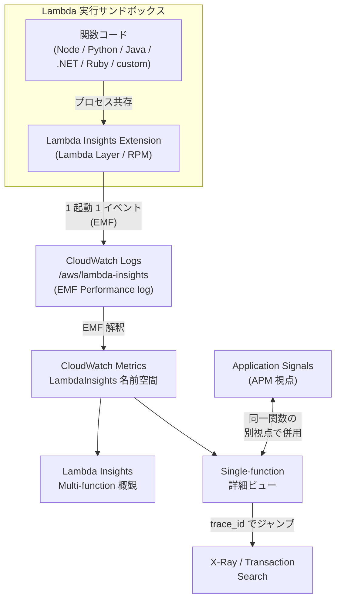

# Lambda Insights

CloudWatch Lambda Insights は、AWS Lambda 関数の実行環境（Linux サンドボックス）から **CPU 時間・メモリ実測・コールドスタート時間・`/tmp` 使用量・ネットワーク I/O・ファイルディスクリプタ・スレッド数**といった**システムレベル**のシグナルを Lambda 拡張機能（Extension Layer）として収集し、フリート横断のキュレート済みダッシュボードに出すマネージド監視機能です。本章では、標準 Lambda メトリクスでは見えないコンテナ内部の挙動が Performance log（EMF）としてどう着地するか、多関数ダッシュボードと単一関数ビューの構造、そして APM 視点の [Application Signals (Ch 7)](../part3/07-application-signals.md) との重複と棲み分けを整理します。

## 解決する問題

Lambda 関数を CloudWatch だけで観測しようとすると、次のような壁に当たります。

1. **標準 Lambda メトリクスはサンドボックスの中身を見せない** — `Invocations` / `Errors` / `Duration` / `Throttles` / `ConcurrentExecutions` のような Lambda サービス境界の指標は出るが、**実際にメモリをいくら使ったか**（`Max Memory Used` は CloudWatch Logs の `REPORT` 行にしかなく、メトリクスにはなっていない）、**CPU 時間の内訳**（user / system）、**`/tmp` 残量**、**ネットワーク I/O のバイト数**は標準メトリクスには出てこない
2. **コールドスタートの実測値がメトリクスにない** — `Init Duration` も同じく `REPORT` ログ行にしかなく、フリートをまたいで「P95 init_duration」を見るには Logs Insights のクエリで毎回集計するしかない
3. **多関数フリートの俯瞰がない** — 関数が数十・数百ある環境で「CPU 高騰している関数 Top 10」「メモリ実測がギリギリの関数」を見るマネージドダッシュボードは標準では存在しない
4. **トリアージのリンクがない** — 関数の Duration が伸びたとき、それが「CPU が詰まったのか」「I/O 待ちなのか」「コールドスタートなのか」を切り分けるための **inside-the-sandbox** メトリクスを揃えるには自前計装が必要だった
5. **APM だけでは「リソース起因」の悪化が見えない** — Application Signals は **APM 視点（リクエスト・レイテンシ・エラー）** を担うが、メモリ枯渇による Duration スパイクの**根本原因**は APM 層からは見えない

Lambda Insights は、これらに対して「**Lambda 拡張機能としてサンドボックスに同居する Insights エージェント → 1 起動ごとに Performance log（EMF）を `/aws/lambda-insights` に出力 → CloudWatch が EMF からメトリクスを自動生成 → `LambdaInsights` 名前空間に集約 → 多関数 / 単一関数のキュレートビューに表示**」という統一フローで応えます。標準 Lambda メトリクスや Application Signals を**置き換える**ものではなく、**「サンドボックスの中の物理層」を補う**位置づけです。

## 全体像



ポイントは 3 つあります。第一に、**Lambda Insights は Lambda 拡張機能**として動くので、関数コード本体に手を入れず Layer を 1 つ足すだけで有効化できる。第二に、メトリクスは [Ch 13 Container Insights](./13-container-insights.md) と同じ **Embedded Metric Format (EMF)** で書かれた Performance log を経由しており、CloudWatch がログ取り込み時に自動でカスタムメトリクス化する設計です。第三に、**Application Signals（APM 視点）と Lambda Insights（インフラ視点）は同じ関数を別レイヤから見る関係**で、両方有効化するのが現代的な定石です。

## 主要仕様

### 拡張メトリクス（コールドスタート / メモリ / CPU / ネットワーク）

Lambda Insights が `LambdaInsights` 名前空間に出すメトリクスは、ディメンション `function_name`（および `function_name + version`）で集約され、**ほとんどが標準 Lambda メトリクスでは取れない物理層のシグナル**です。

| メトリクス | 単位 | 意味 |
|------|------|------|
| `init_duration` | ミリ秒 | コールドスタート時の `init` フェーズ所要時間。フリート横断の P50/P95 をグラフ化できる |
| `cpu_total_time` | ミリ秒 | 関数実行中の CPU 時間合計（`cpu_user_time + cpu_system_time`） |
| `memory_utilization` | % | 割り当てメモリに対する**最大**実測使用率 |
| `used_memory_max` | MB | 実測メモリ使用量（最大値） |
| `total_memory` | MB | 関数に割り当てたメモリ量（設定値） |
| `tx_bytes` / `rx_bytes` / `total_network` | Bytes | 関数からの送信・受信・合計ネットワーク I/O |
| `tmp_free` / `tmp_used` | Bytes | `/tmp` ディレクトリの空き／使用量 |

加えて、**EMF Performance log の中**には CloudWatch メトリクスにはなっていない補助フィールドとして次のものが入ります。Logs Insights からのクエリで使えます。

| フィールド | 意味 |
|------|------|
| `cpu_user_time` / `cpu_system_time` | ユーザ / カーネル CPU 時間の内訳 |
| `fd_use` / `fd_max` | 使用中ファイルディスクリプタ／上限 |
| `threads_max` | プロセスが使用したスレッド数の最大値 |
| `tmp_max` | `/tmp` の総容量 |
| `cold_start` | この起動がコールドスタートだったか（boolean） |
| `duration` / `billed_duration` / `billed_mb_ms` | 関数の実行時間・課金時間・課金 MB×ms |
| `timeout` / `shutdown_reason` | タイムアウト発生・シャットダウン理由 |
| `request_id` / `trace_id` | リクエスト ID と X-Ray トレース ID（X-Ray ジャンプに使う） |
| `agent_version` / `agent_memory_max` / `agent_memory_avg` | 拡張機能エージェント自身のバージョンとメモリ消費 |

`cold_start: true` の起動だけを `init_duration` で集計すれば、**フリート全体のコールドスタート分布**が Logs Insights から一発で出ます。

### Lambda Extension Layer の仕組み

Lambda Insights は **Lambda 拡張機能（Lambda Extension）として、Lambda Layer の形で配布**されます。有効化するとサンドボックス内に拡張プロセスが常駐し、関数のハンドラと**同一プロセス空間**から `/proc` 等のシステム情報を読み取って EMF イベントに整形、CloudWatch Logs に書き込みます。

主要事実は次のとおりです。

- **配布形態**: AWS が公開する **Lambda Layer**（マネージドな ARN）。リージョンごと・x86_64 / ARM64 ごとに別 ARN
- **対応 OS**: Lambda Insights エージェントは **Amazon Linux 2 / Amazon Linux 2023 ベースのランタイムでのみ動作**
- **対応ランタイム**: Lambda 拡張機能をサポートするランタイムすべて（Node.js / Python / Java / .NET / Ruby / カスタムランタイムによる Go など）
- **アーキテクチャ**: x86_64 と ARM64（Graviton2）両対応。**Layer ARN がアーキテクチャ別**に分かれており、関数のアーキテクチャに合わせて選ぶ
- **Container Image 関数**: Layer 添付ではなく、**Dockerfile に RPM パッケージを `rpm -U` で焼き込む**形でエージェントを内蔵する。`x86_64` / `ARM64` で別 RPM
- **IAM**: マネージドポリシー **`CloudWatchLambdaInsightsExecutionRolePolicy`** を関数の実行ロールに付与（`/aws/lambda-insights/*` への `CreateLogStream` / `PutLogEvents` 権限を含む）
- **VPC 内関数**: プライベートサブネットでインターネット出口がない場合、**CloudWatch Logs 用の VPC エンドポイント**を作って Logs API へ到達できるようにする必要がある
- **データ送信頻度**: 通常関数は **1 起動につき 1 EMF イベント**、Lambda Managed Instances では **1 分あたり 1 EMF イベント**で 12 メトリクスを 1 分粒度で生成
- **データ遅延**: Lambda はハンドラ完了後にサンドボックスを **freeze** するため、バッファ済みデータの flush は次回起動またはシャットダウン時。データの CloudWatch 反映までに**最大 20 分**遅れることがある
- **デバッグ**: 環境変数 `LAMBDA_INSIGHTS_LOG_LEVEL=info` で詳細ログを有効化できる

Lambda Layer 自体は **無料**で配布されており、課金されるのは出力された EMF Performance log の取り込みと、生成された CloudWatch カスタムメトリクスの保存・呼び出しのみです。

### Performance log の構造

Lambda Insights が書く EMF イベントは **1 関数起動につき 1 件**で、`/aws/lambda-insights` ロググループに出力されます。EMF の典型例（公式ドキュメントの抜粋）は次の形です。

```json
{
  "_aws": {
    "Timestamp": 1605034324256,
    "CloudWatchMetrics": [{
      "Namespace": "LambdaInsights",
      "Dimensions": [["function_name"], ["function_name", "version"]],
      "Metrics": [
        {"Name": "memory_utilization", "Unit": "Percent"},
        {"Name": "total_memory",       "Unit": "Megabytes"},
        {"Name": "used_memory_max",    "Unit": "Megabytes"},
        {"Name": "cpu_total_time",     "Unit": "Milliseconds"},
        {"Name": "tx_bytes",           "Unit": "Bytes"},
        {"Name": "rx_bytes",           "Unit": "Bytes"},
        {"Name": "total_network",      "Unit": "Bytes"},
        {"Name": "init_duration",      "Unit": "Milliseconds"}
      ]
    }]
  },
  "event_type":     "performance",
  "function_name":  "cpu-intensive",
  "version":        "Blue",
  "request_id":     "12345678-8bcc-42f7-b1de-123456789012",
  "trace_id":       "1-5faae118-12345678901234567890",
  "duration":       45191,
  "billed_duration":45200,
  "billed_mb_ms":   11571200,
  "cold_start":     true,
  "init_duration":  130,
  "tmp_free":       538329088,
  "tmp_max":        551346176,
  "threads_max":    11,
  "used_memory_max":63,
  "total_memory":   256,
  "memory_utilization": 24,
  "cpu_user_time":  6640,
  "cpu_system_time":50,
  "cpu_total_time": 6690,
  "fd_use":         416,
  "fd_max":         32642,
  "tx_bytes":       4434,
  "rx_bytes":       6911,
  "timeout":        true,
  "shutdown_reason":"Timeout",
  "total_network":  11345,
  "agent_version":  "1.0.72.0"
}
```

Container Insights や Application Signals と同じく、**`_aws.CloudWatchMetrics` の宣言を CloudWatch が読み取り、その瞬間にカスタムメトリクスが生成される**設計です。`request_id` / `trace_id` / `cold_start` / `timeout` / `shutdown_reason` のような**メトリクスにはならない補助フィールド**は Logs Insights から JSON パスでクエリでき、メトリクスで「異常」を見つけてからログで「どの起動か」を絞り込む動線が組めます。

例として、コールドスタートのフリート分布を見るクエリは次のとおりです。

```text
fields @timestamp, function_name, init_duration
| filter event_type = "performance" and cold_start = 1
| stats pct(init_duration, 50) as p50,
        pct(init_duration, 95) as p95,
        count() as cold_starts
        by function_name
| sort cold_starts desc
| limit 20
```

### 多関数ダッシュボード

Lambda Insights のコンソール（CloudWatch → Insights → Lambda Insights）は 3 つのビューを提供します。

1. **Multi-function（多関数概観）**: アカウント × Region 内で Lambda Insights が有効な**全関数**を集計表示。CPU 時間・メモリ使用率・コールドスタート率・呼び出し量で並び替え、関数名フィルタ、時間範囲指定、CloudWatch ダッシュボードへの Widget 追加に対応。**過剰利用 / 過小利用の関数を一望で見つける**用途
2. **Single function（単一関数詳細）**: 関数を 1 つ選び、メモリ・CPU・ネットワーク・`/tmp`・スレッド・コールドスタート率を時系列で並べる。X-Ray が有効なら**`trace_id` を選んで X-Ray Trace Map に直接ジャンプ**でき、`View logs` で **Logs Insights にスコープ済みクエリで遷移**する
3. **Managed Instances Functions**: Lambda Managed Instances 上で動く関数のメトリクスを Capacity Provider / Instance Type / Function 単位で集約

両ビューは **CloudWatch ダッシュボードの Widget として埋め込み可能**で、SLO 系ダッシュボード（Application Signals 由来）に Lambda Insights のリソース系 Widget を並置するのが標準パターンです。

### Application Signals との棲み分け

Lambda 関数の観測には、CloudWatch 内に**視点の違う 2 つの機能**が共存しています。

| 観点 | [Application Signals (Ch 7)](../part3/07-application-signals.md) | Lambda Insights |
|------|------|------|
| 視点 | **APM**（リクエスト / トレース / SLO） | **インフラ**（サンドボックス物理層） |
| 主要シグナル | RED 指標（Latency / Error / Fault）、Service Map、SLO、Burn Rate | CPU 時間、メモリ実測、コールドスタート、`/tmp`、ネットワーク I/O |
| 計装方式 | **AWS Lambda Layer for OpenTelemetry**（ADOT） + 環境変数 `AWS_LAMBDA_EXEC_WRAPPER=/opt/otel-instrument` | **Lambda Insights Extension Layer**（独立 Layer） |
| 出力先 | Application Signals コンソール / `ApplicationSignals` 名前空間 / X-Ray | `/aws/lambda-insights` ロググループ / `LambdaInsights` 名前空間 |
| IAM ポリシー | `CloudWatchLambdaApplicationSignalsExecutionRolePolicy` | `CloudWatchLambdaInsightsExecutionRolePolicy` |
| 対応ランタイム | Java / Python / Node.js / .NET（Lambda 向け APM、2024/11 GA、Java/.NET は 2025/02 追加） | Lambda 拡張機能をサポートする全ランタイム（Amazon Linux 2 / 2023） |
| 追加コスト | OTel Layer 自体は無料、トレース・スパン課金 | Insights Layer 自体は無料、Performance log 取り込み + メトリクス課金 |

両者は**競合せず役割が違う**ため、本番 Lambda では「**Application Signals で SLO バーンに気づく → Lambda Insights でメモリ・CPU・コールドスタートを根本原因として確認**」という縦の動線が標準です。Application Signals の Service Operations タブからは Faults / Errors の寄与スパンに辿れますが、「メモリが足りずに OOM-Kill されかけている」「`/tmp` が満杯」のような**プロセス境界より下の物理理由**は Lambda Insights 側でしか見えません。

なお、Application Signals は ADOT Layer 経由で動くため**ランタイム側に約 100〜300ms のコールドスタートペナルティ**が乗ります。Lambda Insights エージェントは独立した拡張プロセスなのでハンドラの初期化は遅らせませんが、サンドボックスの**メモリフットプリントが数 MB 増える**（`agent_memory_max` で実測可能）点だけは押さえておきます。

### 対応ランタイムとアーキテクチャ

Lambda Insights が公式に対応するランタイムは「**Lambda 拡張機能 API をサポートし、Amazon Linux 2 / 2023 を実行環境とするすべてのランタイム**」です。具体的には:

| ランタイム | x86_64 | ARM64 | 注 |
|------|------|------|------|
| Node.js（18.x / 20.x / 22.x ほか） | OK | OK | 一般的な構成 |
| Python（3.9〜3.13） | OK | OK | 一般的な構成 |
| Java（11 / 17 / 21） | OK | OK | コールドスタート観測の主要ターゲット |
| .NET（6 / 8） | OK | OK | 同上 |
| Ruby（3.x） | OK | OK | — |
| Go | カスタムランタイム経由（`provided.al2` / `provided.al2023`）で対応 | 同左 | Go 公式マネージドランタイムは廃止済み |
| カスタムランタイム（`provided.al2` / `provided.al2023`） | OK | OK | Rust / Go など |
| Amazon Linux 1 ベースのレガシー | 非対応 | — | 拡張バージョン 1.0.317.0 で AL1 対応は削除 |

Container Image 関数では Lambda Layer ではなく **AWS が S3 で公開する RPM パッケージ**を Dockerfile で `rpm -U` インストールします。この場合も x86_64 / ARM64 で別パッケージで、`CloudWatchLambdaInsightsExecutionRolePolicy` の付与は同じです。

## 設計判断のポイント

### Application Signals と Lambda Insights を両方有効化すべきか

結論は「**本番関数は両方 ON が現代的な標準**」です。理由は次のとおりです。

- **見える層が違う**: Application Signals は RED 指標と SLO 評価で「**ユーザ視点で何かがおかしい**」を検知し、Lambda Insights は「**サンドボックス内のリソースで何が起きていたか**」を補う。片方だけだと根本原因に届かないケースが残る
- **計装が独立**: それぞれ別 Layer・別 IAM ポリシー・別 Wrapper 設定なので、片方を試験的に外す運用が可能
- **コスト構造が異なる**: Application Signals はトレース／スパン課金、Lambda Insights は Performance log 取り込み課金。両者を**個別にコスト最適化できる**

逆に「**片方で十分**」と言えるのは次の状況です。

- **ホット系の高頻度関数で APM が要らない**: Internal な ETL バッチや非リアルタイム処理は Application Signals を切って Lambda Insights のリソース観測のみで運用してよい
- **SLO ドリブンで動く外向き API**: Application Signals だけで運用し、Lambda Insights はメモリ枯渇の調査が出てから追加有効化する段階運用も可

[Ch 13 Container Insights](./13-container-insights.md) で「**Container Insights は Application Signals に内蔵される姉妹機能**」と整理したのと**同じ思想**で、Lambda Insights は Application Signals が見えないインフラ層を補う位置に立ちます。

### Layer 注入 vs Container Image 内蔵

Lambda Insights の有効化には 2 つの実装があり、関数の配布形態で選択が決まります。

| 状況 | 推奨 |
|------|------|
| ZIP デプロイ（一般的な Lambda） | **Lambda Layer 注入**（Console / CDK / SAM / CloudFormation 1 行で完結） |
| Container Image デプロイ | **Dockerfile で RPM 焼き込み**（`rpm -U lambda-insights-extension.rpm`） |
| マルチアーキテクチャ（同関数を x86_64 / ARM64 両方でデプロイ） | **アーキテクチャ別の Layer ARN / RPM** を使い分け（誤って違う方を当てると起動エラー） |
| エッジでオフラインビルドが必要 | **RPM をビルド前に Pin して内部ミラーから取る**運用にし、AWS S3 への外向き依存を切る |
| エンタープライズで RPM 署名検証が必須 | **GPG 鍵で署名検証**（公式手順あり、フィンガープリント `E0AF FA11 FFF3 5BD7 349E E222 479C 97A1 848A BDC8` を確認） |

**Layer の更新**は CDK / CloudFormation の ARN を新バージョンに上げるだけですが、**Container Image は再ビルド・再 Push が必要**な点が運用上の差です。本番フリートで素早くエージェントバージョンを上げたい場合は ZIP + Layer の方が機動力が高くなります。

### コスト最適化（Performance log の頻度・量）

Lambda Insights の課金構造は次の 2 軸です。

- **Performance log の取り込み**: 1 起動につき約 1KB（JSON）。月間 1,000 万起動なら約 10GB のログ取り込み相当
- **CloudWatch カスタムメトリクスの保存・呼び出し**: 関数 1 つにつき 8 メトリクス（標準関数）または 12 メトリクス（Managed Instances）が `LambdaInsights` 名前空間に積まれる

実務上のコスト圧縮テクニックは次のとおりです。

- **本番関数のみ ON、開発・検証はオフ**: アカウント単位で**全 Lambda に一律有効化しない**。CDK で `enableLambdaInsights` の boolean フラグを `Stage.production` でだけ true にする運用が定石
- **Performance log の保持期間を短く**: `/aws/lambda-insights` ロググループの **`retentionInDays` を 14 日 / 30 日**に絞る。長期トレンドはメトリクス側で 15 ヶ月取れる
- **高頻度・短時間関数は ON しない**: 1 起動 1KB の取り込みが効くのは **月間 100 万起動以上**の関数。10ms × 1 億回のような hot path に有効化するとログ取り込みコストが Lambda 本体課金を超えうる
- **ログ転送先を選別**: `/aws/lambda-insights` を S3 にエクスポートして長期保持に回し、CloudWatch Logs 側は短期にする
- **メトリクスの opt-out は不可**: Container Insights の Enhanced と違い、**Lambda Insights は出すメトリクスを減らせない**。コスト管理は ON/OFF 単位で行う

Lambda **拡張機能の実行時間も 1ms 単位で Lambda 課金に乗る**点は地味に効いてくるため、極短時間関数では拡張のオーバーヘッドが相対的に大きくなります。

### 既存の関数ログ運用との共存

Lambda Insights は `/aws/lambda-insights` という**専用ロググループ**に書くため、既存の `/aws/lambda/<関数名>` ロググループ（`console.log` / `print` の出力先）とは**独立**です。これは次の意味で運用上ありがたい性質です。

- **既存のメトリクスフィルタ・サブスクリプションフィルタは無影響**: 既に `/aws/lambda/<関数名>` から特定パターンを抽出するフィルタが走っていても、Lambda Insights を有効化することで挙動が変わらない
- **Logs Insights クエリも分離**: Performance log を集計したい場合は明示的に `/aws/lambda-insights` を選ぶ。アプリケーションログを汚さない
- **保持期間を別管理**: アプリログは長期、Performance log は短期、のように非対称に設定できる

ただし、**「アプリログにメモリ使用量を独自に書き出していた」運用がある場合は、Lambda Insights 導入後はそちらを廃止**して `LambdaInsights` 名前空間のメトリクスに揃えるのが筋のよい整理です。EMF を使った Embedded Metric の自前実装を Lambda 内で続ける必要はもうありません（[Ch 11 取り込み](./11-ingestion.md) の EMF 解説と整合）。

## ハンズオン

> TODO: 執筆予定

## 片付け

> TODO: 執筆予定

## まとめ

- Lambda Insights は AWS Lambda のサンドボックス内部から **CPU 時間・メモリ実測・コールドスタート・ネットワーク・`/tmp`・スレッド数**を 1 起動 1 EMF イベントで `/aws/lambda-insights` に出し、`LambdaInsights` 名前空間のカスタムメトリクスに自動変換する Lambda 拡張機能
- 標準 Lambda メトリクス（`Invocations` / `Duration` / `Throttles`）と Application Signals（APM）では見えない**サンドボックスの物理層**を補う位置づけで、本番関数では **両方 ON が定石**
- 配布は **Lambda Layer**（ZIP デプロイ）または **RPM 内蔵**（Container Image）。x86_64 / ARM64 別、Amazon Linux 2 / 2023 ベースのランタイムで動作。Layer 自体は無料、課金は Performance log 取り込みとカスタムメトリクスのみ
- **多関数概観 / 単一関数詳細**のキュレートビューがコンソールに用意され、X-Ray の Trace Map / Logs Insights にワンクリックでジャンプできる
- 関数ログ（`/aws/lambda/...`）とは別ロググループに書くため、既存の Logs パイプラインに干渉しない

## 第IV部の総括 / 第V部への橋渡し

第IV部「取り込みとインフラ監視」では、データの**入口**（[Ch 11 Ingestion](./11-ingestion.md) の Logs / Metrics / EMF / Embedded Metric Format / X-Ray、[Ch 12 OpenTelemetry](./12-opentelemetry.md) の OTLP / ADOT）と、**インフラ視点の 3 つの Insights**（[Ch 13 Container Insights](./13-container-insights.md) / [Ch 14 Database Insights](./14-database-insights.md) / 本章 Lambda Insights）を貫く設計思想を確認しました。すべてに共通するのは「**EMF Performance log → CloudWatch Logs → 自動メトリクス化 → キュレートダッシュボード → Application Signals との双方向ジャンプ**」というアーキテクチャで、コンテナ・DB・Lambda という**実行基盤の違いに依らず観測モデルが揃う**ことが CloudWatch の Insights シリーズの本質です。

第IV部でアプリ層（Application Signals）とインフラ層（Container / Database / Lambda Insights）が揃ったことで、CloudWatch の主要観測機能はほぼ網羅できました。次の[第V部 ネットワーク監視と AI 機能](./../part5/16-network-monitoring.md)では、これらの上位レイヤとは異なる**ネットワーク観測の世界**（Internet Monitor / Network Flow Monitor）と、生成 AI / 投資的トリアージの新世代機能（Investigations / Bedrock AgentCore）に進みます。コンテナや DB 起点では見えなかった**「インターネット側の経路品質」「VPC 内のフロー」「LLM ベースの自動調査」**を観測パイプラインに組み込んでいくのが残りの章の主題です。
