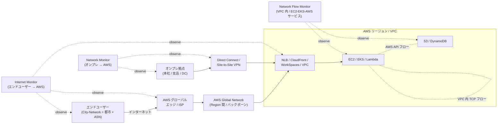

# ネットワークモニタリング

CloudWatch のネットワークモニタリングメニューには **Internet Monitor** / **Network Flow Monitor** / **Network Monitor（Network Synthetic Monitor）** という独立した 3 つのサービスが並びます。本章では、第 III 部の APM（[Application Signals (Ch 7)](../part3/07-application-signals.md)）や能動監視（[Synthetics (Ch 10)](../part3/10-synthetics.md)）では覆えない**ネットワークレイヤ（おおよそ Layer 3-4）の品質**を、エンドユーザー側 / VPC 内 / オンプレミス側の 3 つのアングルから観測する仕組みを整理します。第 V 部「ネットワーク監視と AI 機能」の冒頭にあたるこの章を済ませると、次章以降の Investigations / 生成 AI オブザーバビリティが**何の信号を入力にするのか**が立体的に見えてきます。

## 解決する問題

CloudWatch でアプリ層（メトリクス・トレース・SLO）を整えても、次のような**ネットワーク起因の品質劣化**は依然として観測しにくいまま残ります。

1. **エンドユーザーから AWS への外部到達性が見えない** — リージョン内の RUM や Synthetics は動いていても、「ある国の ISP（ASN）から見て可用性が落ちている」「特定 City-Network（都市 × ISP の組）でレイテンシが跳ねている」という **AWS の外側のネット品質**は、CloudWatch 標準メトリクスには出ない
2. **VPC 内ワークロード間の TCP 品質が見えない** — VPC Flow Logs はパケット**通過の事実**は出るが、TCP 再送 / 再送タイムアウト / RTT のような**実用的なネットワーク品質指標**は出ない。EKS の Pod 間や、EC2 → S3 / DynamoDB のような AWS サービスへのフローも同様
3. **Direct Connect / VPN 経由のオンプレ → AWS が継続監視できない** — ハイブリッド構成で「いつから本社の事業所から VPC に届きにくくなったか」を遡及するには、自前の `ping` / `tcping` をスケジュール実行して CloudWatch にメトリクスを叩き込む必要があった
4. **APM や Synthetics で見えない層がある** — Application Signals は**サービス境界の RED 指標**、Synthetics は **HTTP / API レベル**の死活。Layer 3-4 のパケットロス・経路品質・グローバル ISP 障害には届かない
5. **AWS Global Network のヘルスをアプリ視点で読みたい** — グローバルインターネットイベント（特定地域の ISP 障害など）を、自分のアプリ**にどれだけ影響するか**として読み替える仕組みは標準では存在しなかった

CloudWatch のネットワークモニタリング 3 兄弟は、これらに対して**観測対象のレイヤと位置を変えて応える**設計です。

## 全体像

3 つの機能の対象範囲は、ユーザー → エッジ → AWS Global Network → VPC → オンプレ の経路上で**ほぼ重ならない**ように分担されています。

ポイントは 3 つあります。第一に、**Internet Monitor は AWS の外側**（エンドユーザー側のネット品質）を担当する。第二に、**Network Flow Monitor は AWS の中**（VPC 内 / EC2 / EKS / Lambda / 他 AWS サービス間）を担当する。第三に、**Network Monitor（旧称: Network Synthetic Monitor）は AWS とオンプレを結ぶ線**（Direct Connect / VPN 経由のハイブリッド経路）を担当する、という地理的な棲み分けです。

## 主要仕様

### Internet Monitor

**Amazon CloudWatch Internet Monitor** は、AWS が世界中のネットワークから集めている内部計測データを使い、**「自分のアプリにとって」インターネット経路の品質がどうか**を可視化するサービスです。AWS の外部到達性を扱う唯一のマネージドサービスでもあります。

- **対象リソース**: VPC、Network Load Balancer、CloudFront ディストリビューション、Amazon WorkSpaces ディレクトリ。「アプリの公開面となるリソース」をモニターに紐づけると、そのリソースに到達するクライアント側の ASN・都市が自動推定される
- **City-Network という単位**: 「都市」と「ASN（ISP）」のペアを City-Network と呼ぶ。Internet Monitor はトラフィック量上位 **500 City-Network** に対して可用性スコア・パフォーマンススコア・bytes transferred・round-trip time を継続的に出力する
- **ヘルスイベント**: 可用性 / パフォーマンスのスコアが**しきい値（既定 95%）**を下回った時にイベント化される。**全体しきい値**と **City-Network 単位のローカルしきい値**が独立に設定可能で、ローカルしきい値は既定が **60%**、対象が**全トラフィックの 0.1% 以上**を占めるとき発火する設計
- **インターネットウェザーマップ**: モニターを作らなくても全 AWS 顧客が閲覧できる、過去 24 時間のグローバル ISP 障害の世界地図ビュー。**15 分ごとに更新**され、全体俯瞰に使う
- **トラフィック寄与（Traffic Optimization Suggestions）**: 各 City-Network のトラフィック量と TTFB（Time To First Byte）を集計し、「より近い AWS Region に展開する」「CloudFront を入れる」「Local Zones を使う」といった**最適化提案**を生成する
- **出力先**: ヘルスイベントは **CloudWatch Logs / CloudWatch Metrics / Amazon EventBridge** に流れる。アラーム化や SNS 通知は通常の CloudWatch アラームの仕組みに乗る
- **Network Path Visualization**: ヘルスイベントごとに、原因と推定されるノード（AWS 側 or ASN 側）を**経路図**として表示し、責任分界の判断を助ける
- **計測の限界**: ヘルス測定は **IPv4 ネットワーク**を介して行われる（IPv6 で配信していてもバックエンドは IPv4 で品質測定）
- **料金**: **モニター対象リソースごと**の料金 + **モニター対象 City-Network ごと**の料金。City-Network 数を制限することでコストを下げられる

Internet Monitor が出す主要シグナルを表にまとめると次のとおりです。

| シグナル | 単位 | 何がわかるか |
|---|---|---|
| Performance score | % | ある City-Network からの**性能劣化が起きていない**割合 |
| Availability score | % | ある City-Network からの**到達性が確保されている**割合 |
| Round-trip time (RTT) | ミリ秒 | クライアント → AWS のラウンドトリップ実測値 |
| Time to first byte (TTFB) | ミリ秒 | 体感に効くファーストバイトまでの時間 |
| Bytes transferred | Bytes | アプリ ↔ City-Network 間の総トラフィック量 |
| Monitored bytes transferred | Bytes | モニター対象リソース分のトラフィック量 |

ヘルスイベントは**全体しきい値**と**ローカルしきい値**の OR で発火するため、「**全体は問題ないが特定の ISP だけ劣化**」のようなケースもローカル側でキャッチできるよう設計されています。逆にトラフィックがほとんどない City-Network での揺らぎを拾いすぎないよう、**MinTrafficImpact**（既定 0.1%）で「全体トラフィックのこれ以上を占めるイベントだけイベント化」とゲートをかけられます。

### Network Flow Monitor

**Amazon CloudWatch Network Flow Monitor** は、2024 年 re:Invent で発表された比較的新しい機能で、**VPC 内および VPC ↔ AWS サービス間の TCP フロー**を、ホスト上のエージェントから直接観測します。VPC Flow Logs では出ない TCP 品質指標（再送・タイムアウト・RTT）を扱える点が特徴です。後述の Network Monitor（旧称 Network Synthetic Monitor）とは**別の製品**である点に注意してください。

- **対象**: EC2 / EKS / 自己管理 Kubernetes に**エージェントを入れる**ことで、その**ローカルリソース**を起点に、リモート側が EC2 / EKS / **Amazon S3** / **Amazon DynamoDB** / 他リージョンのエッジ等への TCP フローを観測する
- **エージェントの実装**: Linux カーネルの **eBPF**（`bpf_sock_ops`）を使い、TCP コネクションの**ペイロードには触れず**にローカル / リモート IP・ポート・カウンタ・RTT のみを取得。**30 秒ごと**（±5 秒のジッタ）に集約して Network Flow Monitor バックエンドに送信
- **配布形態**:
  - **EC2**: AWS Systems Manager Distributor 経由で `AmazonCloudWatchNetworkFlowMonitorAgent` パッケージをインストール
  - **EKS**: マネージド add-on（`AWS Network Flow Monitor Agent`）を有効化。EKS Pod Identity Agent add-on が前提
  - **自己管理 Kubernetes**: マニフェストでデプロイ
- **収集メトリクス**: TCP 往復遅延（RoundTripTime）、TCP 再送数（Retransmissions）、TCP 再送タイムアウト（Timeouts）、転送バイト数（DataTransferred）、ネットワーク健全性指標（HealthIndicator）。CloudWatch メトリクスの **`AWS/NetworkFlowMonitor`** 名前空間に着地する
- **Workload Insights**: スコープ全体のフローを**集計ビュー**で表示し、再送・タイムアウト・データ転送量の **Top Contributors** を出すページ。「どのフローが品質を悪化させているか」を俯瞰する用途
- **Monitor**: スコープから**特定のフロー（VPC 間・AZ 間・対 AWS サービス等）を選んで継続監視**する単位。Overview / Traffic summary / Historical explorer / Monitor details の 4 タブで構成される
- **Network Health Indicator (NHI)**: 「この劣化が AWS 起因か / ワークロード起因か」を**バイナリ**で示す指標。`Degraded` 表示は AWS 側ネットワーク要因を示唆し、責任分界の一次切り分けに使う
- **キャパシティ**: 1 スコープあたり **約 500 万 flows/分**（≒ 約 5,000 インスタンス相当）が公称上限
- **Container Network Observability との関係**: EKS では Container Network Observability の **Service map / Flow table / Performance metric endpoint** が裏で Network Flow Monitor を利用しており、Pod 間トポロジー可視化や OpenMetrics 形式の Prometheus 連携が同じデータソースで成立する
- **マルチアカウント**: AWS Organizations 連携によりスコープを組織横断にできる
- **料金**: 「**監視対象リソース（アクティブにデータ送信中のエージェント数）**」課金 + 「**vended される CloudWatch メトリクス数**」課金 の 2 軸。前払いやコミット不要

Network Flow Monitor のフロー分類は次の 2 系統に分かれ、それぞれに対応する Top Contributors テーブルが Workload Insights ページに表示されます。

| 分類 | 説明 | 主な使い所 |
|---|---|---|
| **NHI フロー** | Network Health Indicator 評価対象になる、AWS バックボーンを経由するフロー | 「AWS の中で起きた劣化か」を判定 |
| **Non-NHI フロー** | NHI 評価対象外（インターネット出口経由など） | ワークロード側 / インターネット側起因の劣化を読む |

たとえば「**EKS Pod から S3 への再送が増えた**」ケースなら NHI フローとして観測でき、NHI が `Degraded` であれば AWS 側の責任範囲、`Healthy` のままなら**自分のワークロード or 設定**側の問題、と一次切り分けできます。これは Application Signals の SLO バーン時に「次にどこを見るか」の意思決定を加速させる重要な指標です。

### Network Monitor（オンプレ・ハイブリッド系）

**Amazon CloudWatch Network Monitor**（API では `networkmonitor`、コンソール表記は **Network Synthetic Monitor**）は、**AWS にホストしたソース VPC / サブネットからオンプレミス IP に対して継続的にプローブを撃つ**フルマネージド能動監視サービスです。Direct Connect や Site-to-Site VPN を経由するハイブリッド構成の継続的なネットワーク品質測定に使います。

- **モニターとプローブの構造**:
  - **Monitor**: モニター名・集約期間（aggregation period）・タグを持つ親オブジェクト
  - **Probe**: 「ソースサブネット ARN × 宛先 IP × プロトコル（**TCP** or **ICMP**）× （TCP の場合）宛先ポート × パケットサイズ（56〜8500 bytes）」 を 1 単位として、その経路の品質を継続測定する子オブジェクト
- **典型的な配置**: Direct Connect 配下の VPC のサブネットをソース、本社 LAN の特定 IP をターゲットにすることで「本社 → AWS のラウンドトリップ品質」を 24/7 観測する
- **メトリクス**: パケットロス率・レイテンシ等が CloudWatch メトリクスとして出る。通常の CloudWatch アラームと SNS 通知に乗せられる
- **状態管理**: プローブは **Activate / Deactivate** で課金を停止可能。削除する前にいったん非アクティブ化しておけば、後で再開しても設定が残る
- **責任分界の補助**: **Direct Connect 自体**には別途 `VirtualInterfaceBgpStatus` / `VirtualInterfaceBgpPrefixesAccepted` / `VirtualInterfaceBgpPrefixesAdvertised` の CloudWatch メトリクス（2026/03 追加）が用意されており、**経路品質は Network Monitor、BGP セッション健全性は Direct Connect メトリクス**、と層を分けて押さえるのが現代の定石

> **命名の混乱に注意**: 「Network Monitor」「Network Flow Monitor」「Network Synthetic Monitor」は名前が似ていますが**別サービス**です。`Network Flow Monitor` = VPC 内 TCP 品質、`Network (Synthetic) Monitor` = オンプレ → AWS プローブ、と覚えておくと混乱しません。

3 機能の出力先と通知連携を比較すると、**どこにアラームを生やすか**の選択肢が一目でわかります。

| 出力先 | Internet Monitor | Network Flow Monitor | Network Monitor |
|---|---|---|---|
| CloudWatch Metrics | ○（ヘルススコア / RTT 等） | ○（`AWS/NetworkFlowMonitor`） | ○（パケットロス / レイテンシ） |
| CloudWatch Logs | ○（ヘルスイベント詳細） | -（メトリクス中心） | -（メトリクス中心） |
| Amazon EventBridge | ○（ヘルスイベントを直接） | -（メトリクス経由でアラーム → EB） | -（メトリクス経由でアラーム → EB） |
| 専用コンソール | Internet Monitor + ウェザーマップ | Workload Insights / Monitor | Network Synthetic Monitor |

### Synthetics との違い

[Synthetics (Ch 10)](../part3/10-synthetics.md) の Canary も「AWS から相手を叩いて品質を測る」点で Network Monitor と似て見えますが、**叩く層が違います**。

| 観点 | Synthetics Canary | Network Monitor（プローブ） | Internet Monitor | Network Flow Monitor |
|---|---|---|---|---|
| 観測レイヤ | **L7（HTTP / API / ブラウザ）** | **L3-L4（ICMP / TCP）** | L4 ベースの**外部到達性メタ計測** | **L4（TCP 品質、eBPF 観測）** |
| 駆動方式 | スケジュール能動（Lambda） | スケジュール能動（プローブ） | AWS が世界中で常時計測したベースライン + 自分のアプリへのマッピング | 受動（実トラフィックを eBPF で覗く） |
| 主な用途 | アプリの機能・体験の死活 | ハイブリッド経路の継続品質 | エンドユーザーの ISP 品質 | VPC 内ワークロード間の TCP 品質 |
| 検出可能な問題例 | ブラウザでログイン不可、API 200 だが JSON 不正 | 本社 → VPC でパケットロス急増 | ある国の ISP で AWS 到達性低下 | EKS Pod → S3 で TCP 再送が増えた |

**Synthetics は L7 のユーザーシナリオ**、**Network Monitoring 3 兄弟は L3-4 のパス品質**、と整理して両方並走させるのが Well-Architected 的にも筋がよい構成です。

## 設計判断のポイント

### 3 つのうちどれを選ぶか

3 つの機能は対象範囲がほぼ重ならないため、「どれか 1 つを選ぶ」というより「**監視したい区間ごとに必要なものを足す**」発想が正解です。実務上の判断基準は次のとおりです。

| 監視したい区間 | 第一選択 | 補完するもの |
|---|---|---|
| 公開アプリへのエンドユーザーアクセス品質 | **Internet Monitor** | RUM (Ch 9) で実体験、Synthetics (Ch 10) で死活 |
| VPC 内マイクロサービス間 / EKS Pod 間 | **Network Flow Monitor** | Application Signals (Ch 7) で APM、Container Insights (Ch 13) で Pod リソース |
| EC2 → S3 / DynamoDB の AWS API 経路 | **Network Flow Monitor** | サービス側のクライアントメトリクス |
| 本社 / 支店 → AWS（Direct Connect / VPN） | **Network Monitor**（プローブ） | Direct Connect の BGP 系 CloudWatch メトリクス |
| グローバル ISP 障害の俯瞰 | **Internet Monitor のインターネットウェザーマップ**（モニター不要、無料） | EventBridge へ流して通知連携 |
| HTTP API レベルの可用性 SLA | **Synthetics Canary** | Application Signals SLO |

特に **Internet Monitor は CloudFront / Global Accelerator を使う場合に効果が大きい**点を覚えておきます。CloudFront ディストリビューションをモニター対象に追加すると、エッジから見たクライアントの ASN 単位でヘルスが取れ、Traffic Optimization Suggestions が「Local Zones を使う」「Region を変える」といった**配置最適化**を提案してくれます。

逆にやりがちな**ミスマッチ**として、次の 3 つは早めに気づきたいパターンです。

- **オンプレ ↔ AWS の品質を Internet Monitor で見ようとする** — Internet Monitor はあくまで**インターネット越しの ISP 品質**が前提で、Direct Connect / VPN は対象ではない。これは **Network Monitor**（プローブ）の仕事
- **VPC 内 Pod 間の品質を Synthetics Canary で見ようとする** — L7 で叩いて死活は取れるが、TCP 再送やタイムアウトの粒度では見えない。これは **Network Flow Monitor** の仕事
- **エンドユーザー由来の遅延を VPC Flow Logs で読み解こうとする** — Flow Logs は VPC 境界の通過記録で ISP 側の劣化は出ない。これは **Internet Monitor** の仕事

### Application Signals との合わせ方

Application Signals は「**サービス境界の RED 指標と SLO**」を担当し、ネットワークモニタリング 3 兄弟は「**その下のネット品質**」を担当します。両者の合流点は次の 3 通りです。

1. **SLO がバーンしたとき → Network Flow Monitor の Workload Insights で TCP 再送 / RTT を確認** — APM レイヤで原因が見つからない場合（コードに変化がないのに Latency が上がっている等）、L4 品質の劣化を疑う
2. **特定地域からの SLO 違反 → Internet Monitor のヘルスイベントを確認** — エンドユーザー由来の到達性低下なら、自分のサーバ側修正で直せない問題と即断できる
3. **オンプレ起点のサービスで SLO 違反 → Network Monitor のプローブ品質を確認** — Direct Connect / VPN の劣化を排除した上で APM の中身に進む

「**APM で何かおかしいに気づく → ネットワーク 3 兄弟で原因の責任分界を切る**」という縦の動線を持っておくのが、複数機能を組み合わせる利点です。

### コスト最適化

ネットワーク監視は「**観測単位**」が課金単位になっているので、何を観測対象に乗せるかでコストが大きく変わります。

- **Internet Monitor**:
  - 「**モニター対象リソース数**」と「**モニター対象 City-Network 数**」が課金軸。**監視対象トラフィックの割合（percentage of monitored traffic）** を抑えれば City-Network 数も自動的に上位だけに絞られる
  - グローバル展開していないアプリでは、`MaxCityNetworksToMonitor` を低めにして上位都市だけに集中する
  - ローカルしきい値の `MinTrafficImpact` を 0.1% から少し上げると、ノイズと一緒にコスト計算上の効率も上がる
- **Network Flow Monitor**:
  - 「**アクティブなエージェント数**」と「**vended メトリクス数**」が課金軸。**全インスタンスに入れない**で、観測したいワークロードのインスタンスだけに Distributor / EKS add-on で絞り込む
  - 開発環境は外して**本番のみ**に有効化する運用が定石
  - スコープを Organizations 全体にすると一見便利だが、レポート対象フローが増えて vended メトリクスが膨らむため、まずは特定アカウント / 特定 VPC で start small が安全
- **Network Monitor**:
  - **プローブ数 × アクティブ時間**で課金。Direct Connect / VPN 経由で監視したい区間が複数あっても、**重要拠点の代表 IP に絞る**
  - 短期検証のあとは Activate / Deactivate で簡単に止められる。削除しなくても課金は止まる

加えて、3 機能とも CloudWatch メトリクス・アラーム・ダッシュボード・Logs に出した分は**通常の CloudWatch 課金**が乗ることに注意します。

### CloudFront / Global Accelerator を使う場合の Internet Monitor の見え方

CDN や Global Accelerator を入れると、**「クライアント → エッジ」と「エッジ → オリジン」が分離**します。Internet Monitor で観測したいのは前者の「クライアント → エッジ」です。

- **CloudFront 利用時**: モニター対象に **CloudFront ディストリビューション**を直接追加すると、エッジロケーションから見た**クライアント側 ASN**ごとのヘルスが取れる。VPC を直接モニターするより**正しい意味のエンドユーザー観測**になる
- **Global Accelerator 利用時**: 多くのケースでバックエンドが NLB なので、**NLB をモニター対象**に登録するか、Global Accelerator が引いている AWS Edge への経路を Internet Monitor のヘルスイベントで読む
- **Region 配置の見直し**: Traffic Optimization Suggestions が「日本のあの ISP からは ap-northeast-3 (Osaka) の方が TTFB が低い」のように具体的な提案を出すので、**Route 53 ルーティングポリシーやエッジロケーションの選定**にフィードバックできる

CloudFront を使わないオリジン直接公開のケースだと、Internet Monitor のヘルスイベントは**ASN 単位の品質劣化に偏って見える**ため、「自分の AWS 側に問題があるのか / クライアント側 ISP に問題があるのか」の切り分けは Network Path Visualization と組み合わせて読みます。

### マルチアカウント / Organizations での集約

Network Flow Monitor は **AWS Organizations 連携**で複数アカウントのフローを 1 つのスコープに集約できます。一方、Internet Monitor / Network Monitor は基本的に**アカウント単位**のリソースで、組織横断の集約はクロスアカウントダッシュボード（[Ch 19 Cross-account / OAM](../part6/19-setup.md)）や CloudWatch のクロスアカウント可観測性で行います。

- **本番アカウントを横断したい**: Network Flow Monitor のスコープを Organizations 単位に広げ、Workload Insights を組織レベルで見るのが最短
- **アカウント別で運用責任が異なる**: 各アカウントで個別にモニター / プローブを立て、Cross-account Observability で**メトリクスだけ集約**し、コンソール操作は各アカウントで完結させる
- **コストの按分**: Organizations 連携時は親アカウントに料金が集中する場合があるため、組織のコスト配分タグ運用と整合を取る

### IPv4 / IPv6 と PrivateLink の取り扱い

ネットワーク 3 兄弟は IP プロトコルの扱いが微妙に異なるので、設計時に把握しておきます。

- **Internet Monitor**: ヘルス測定は **IPv4 経路**で行われる。IPv6 で配信していてもバックエンドは IPv4 で品質測定する点に注意
- **Network Flow Monitor**: エージェント → バックエンドの通信は **AWS PrivateLink** 経由を選択でき、インターネット出口を持たない VPC でも観測を継続できる。プライベートサブネットの EC2 / EKS で重要
- **Network Monitor**: プローブの宛先は **IPv4 / IPv6 両対応**。ICMP / TCP のいずれかを選び、TCP の場合は宛先ポート（1〜65535）を必須指定

`provided.al2` / `provided.al2023` ベースの極小ホストや、Bottlerocket / EKS Optimized AMI のような限定された Linux でも、Network Flow Monitor エージェントの**サポートされた Linux ディストリ / カーネル**かは事前確認が必要です（公式ドキュメントの「Linux versions supported」セクション参照）。

## ハンズオン

> TODO: 執筆予定

## 片付け

> TODO: 執筆予定

## 参考資料

**AWS 公式ドキュメント**
- [What is Internet Monitor?](https://docs.aws.amazon.com/AmazonCloudWatch/latest/monitoring/CloudWatch-InternetMonitor.what-is-cwim.html) — City-Network 単位のヘルスイベントとモニター対象リソース（VPC / NLB / CloudFront / WorkSpaces）の概念整理
- [Install Network Flow Monitor agents on EC2 and self-managed Kubernetes instances](https://docs.aws.amazon.com/AmazonCloudWatch/latest/monitoring/CloudWatch-NetworkFlowMonitor-agents.html) — eBPF エージェントの配布方法と PrivateLink 経由の閉域構成
- [Using Network Synthetic Monitor](https://docs.aws.amazon.com/AmazonCloudWatch/latest/monitoring/what-is-network-monitor.html) — Direct Connect / VPN 経由のオンプレ宛プローブとパケットロス・レイテンシ計測
- [Monitor with Amazon CloudWatch (AWS Direct Connect)](https://docs.aws.amazon.com/directconnect/latest/UserGuide/monitoring-cloudwatch.html) — 仮想インターフェイス BGP 系メトリクスを含む Direct Connect 全般の CloudWatch 監視

**AWS ブログ / アナウンス**
- [Visualizing network performance of your AWS Cloud workloads with Network Flow Monitor](https://aws.amazon.com/blogs/networking-and-content-delivery/visualizing-network-performance-of-your-aws-cloud-workloads-with-network-flow-monitor/) — re:Invent 2024 発表の Network Flow Monitor と Network Health Indicator の解説（2024/12）
- [Introducing CloudWatch Metrics for AWS Direct Connect Virtual Interface BGP Health and Prefix Count](https://aws.amazon.com/blogs/networking-and-content-delivery/introducing-cloudwatch-metrics-for-aws-direct-connect-virtual-interface-bgp-health-and-prefix-count/) — `VirtualInterfaceBgpStatus` などの BGP メトリクス追加発表（2026/03）
- [Monitor network performance and traffic across your EKS clusters with Container Network Observability](https://aws.amazon.com/blogs/aws/monitor-network-performance-and-traffic-across-your-eks-clusters-with-container-network-observability/) — Network Flow Monitor を裏で使う EKS Container Network Observability の発表

## まとめ

- CloudWatch のネットワークモニタリングは **Internet Monitor / Network Flow Monitor / Network Monitor（旧 Network Synthetic Monitor）** の 3 つから成り、対象が **AWS の外側 / VPC 内 / オンプレ↔AWS** で重ならない
- **Internet Monitor** は City-Network（都市 × ASN）単位でヘルスイベントとトラフィック寄与を出し、CloudFront / NLB / WorkSpaces / VPC をモニター対象として登録する
- **Network Flow Monitor** は eBPF ベースのエージェントで TCP 再送・RTT・タイムアウトを 30 秒粒度に集約し、Workload Insights の Top Contributors と Network Health Indicator で AWS 起因 / ワークロード起因を切り分ける
- **Network Monitor** は AWS 内ソースサブネットからオンプレ IP に TCP / ICMP プローブを撃ち、Direct Connect / VPN 経由のハイブリッド経路を 24/7 監視する
- [Application Signals (Ch 7)](../part3/07-application-signals.md) の APM や [Synthetics (Ch 10)](../part3/10-synthetics.md) の L7 死活と組み合わせ、**APM で気づいたら 3 兄弟で責任分界を切る**縦の動線を作るのが定石

## 次章へ

3 つのネットワーク信号と APM の信号が揃ったところで、次は[第 17 章 CloudWatch Investigations](./17-investigations.md) で、これらを横断して**自動でトリアージ・原因仮説を立てる AI オペレーション**を見ていきます。

Investigations は Internet Monitor のヘルスイベントや Network Flow Monitor の NHI、Application Signals の SLO バーンを**まとめて入力に取る**設計になっており、本章で押さえた信号の意味付けがそのまま活きます。「**人がレイヤを切り分けて原因に近づく動線**」を [Application Signals (Ch 7)](../part3/07-application-signals.md) と本章で言語化したうえで、それを**自動で行うエージェント**側の章に進みます。
