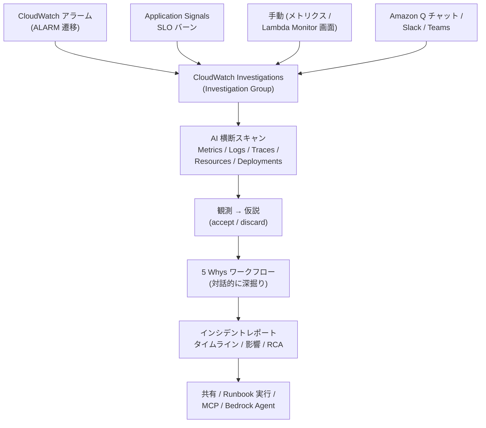

# CloudWatch Investigations

CloudWatch Investigations は、CloudWatch コンソールの「**AI オペレーション**」メニューにあたる機能で、アラームや SLO バーンを起点に **AI エージェントが関連シグナルを横断スキャンし、根本原因の仮説と対処案を提示する**マネージド・トリアージ補助です。本章は前章 [ネットワークモニタリング (Ch 16)](./16-network-monitoring.md) で揃えた L3-4 信号を含め、[Application Signals (Ch 7)](../part3/07-application-signals.md) の RED / SLO、[Transaction Search (Ch 8)](../part3/08-transaction-search.md) の全スパン、Logs / X-Ray の従来資産を**一気に縦断する**運用層を扱います。

## 解決する問題

インシデント時の初動には、いつも同じ「人手の作業」が並びます。Investigations はこの作業のうち**情報収集と仮説立案の前段**を AI に肩代わりさせる発想で設計されています。

1. **シグナル収集が属人的で時間を食う** — アラーム発火後、対応者がメトリクス → 関連メトリクス → ログ → トレース → 直近のデプロイ履歴を**一つずつ**コンソールを巡って確認するため、初動の数十分が情報収集に消える
2. **「なぜ」の深掘りが暗黙知に偏る** — 5 Whys のような構造化された RCA は属人的で、ベテランしかうまく回せない。中堅以下のオンコールがいきなり同じ質問の連鎖を立てるのは難しい
3. **ポストモーテムが書けない / 書く時間がない** — 復旧後にタイムライン・影響範囲・根本原因・対処を整えてレポート化するのは重い作業で、忙しい組織ほど書かれずに知見が消える
4. **関連シグナルの横断ができていない** — SLO バーン時に Application Signals 側だけ見て、Network Flow Monitor の NHI や Internet Monitor のヘルスイベントを参照し損ねる、というレイヤ取りこぼしが起きやすい
5. **生成 AI / エージェントから運用データを呼びたい欲求が増えている** — チャットや IDE の AI に「直近の障害を要約して」と頼みたいが、観測データへの公式な API 入口が標準化されていなかった

Investigations は、AI がまず**観測**（observation）を集め、続いて**仮説**（hypothesis）を出し、それをユーザーが accept / discard で揉んで**インシデントレポート**まで持っていく、という「**人 × AI の協調ワークフロー**」の場として機能します。

## 全体像

トリガー（アラーム / SLO / 手動 / チャット）から、AI による横断スキャン、5 Whys を通したインシデントレポート生成、共有までの流れを 1 枚で押さえます。

ポイントは 3 つです。第一に、**起動経路は複線**で、コンソール / アラーム / SLO / チャットのいずれでも入口になる。第二に、AI は**仮説まで提示**してくるが、accept するかは人間が決める「**人を Out of the Loop にしない**」設計である。第三に、**インシデントレポートの生成と外部共有まで一本のレールに乗っている**ため、復旧後のポストモーテム作業が大幅に軽くなる。

## 主要仕様

### Investigation の起動方法

Investigation を作る経路は AWS ドキュメント上、大きく次の 4 つに整理されます。

| 起動経路 | 操作 | 主なユースケース |
|---|---|---|
| **CloudWatch アラーム自動起動** | アラームの **alarm action** に Investigation Group ARN を指定。ALARM 遷移時に自動で Investigation を作成 / 既存に追記 | 24/7 の自動初動。重要アラームには標準で仕掛ける |
| **Application Signals SLO** | SLO 関連メトリクスから「Investigate」を選択 | SLO バーン時の RCA。アプリ視点起点 |
| **コンソール手動** | メトリクスグラフ / アラームページ / Lambda Monitor タブの **Investigate** ボタン | アドホックなトラブルシュート |
| **Amazon Q チャット / Slack / Teams** | チャットで「直近のインシデントを調査して」のように自然言語で依頼 | オンコールがチャットで起こす運用 |

アラーム経由で起動する場合は、アラームの `alarm-actions` に **Investigation Group ARN** を指定します。ARN にはオプションで **deduplication string**（例: `webserver-performance`）を含められ、同じ問題種別のアラームを 1 つの Investigation に**集約**できる仕組みです。これにより「複数のアラームが同時に鳴る」状況でも調査が分断されません。

> **Investigation Group**: アクセス制御・暗号化・保持期間（既定 90 日）・通知チャネル（Slack / Teams）を**共通プロパティ**として束ねる親オブジェクト。1 アカウント 1 リージョンに 1 つだけ作成できる。

未設定状態でも「**Ephemeral 投資**」と呼ばれる**読み取り専用・24 時間で自動削除**のセッションは利用でき、メトリクスやアラーム画面の「Investigate」ボタンから即座に AI 観測を見ることができます。Investigation Group を作成すると、以降は永続化・accept/discard・レポート生成・runbook 実行などのフル機能が解禁されます。

### AI 駆動の根本原因分析

Investigations の中核は、**AI エージェントが観測データを横断スキャンして仮説を返す**ループです。スキャン対象とアウトプットを表で整理します。

| スキャン対象 | 取得 API / 対象 | 何のために |
|---|---|---|
| CloudWatch Metrics | `ListMetrics`、`GetMetricData` 等 | 関連メトリクスの異常検知 |
| CloudWatch Logs | Logs Insights クエリ | エラー文字列・例外パターン抽出 |
| X-Ray / Transaction Search | `GetServiceGraph`、`GetTraceSummaries`、`BatchGetTraces` | レイテンシ寄与スパンの特定 |
| デプロイ・変更履歴 | CloudTrail / AWS Cloud Control API | 直近のリソース変更との相関 |
| アプリトポロジー | Application Signals Service Map | 隣接サービスへの影響伝搬 |
| インフラ層 | Container Insights / Database Insights / EBS / EC2 Agent | リソース起因の劣化（既定 ON 推奨） |

エージェントの出力は次の 3 種類に分類されます（公式用語）。

- **Observation（観測）** — 「このメトリクスがこの時間に逸脱した」「このログにこのエラー文字列が増えた」のような**事実**寄りの一次情報
- **Suggestion（提案）** — Observation を元に「次にこのメトリクスも見たらどうか」「このランブックを試したらどうか」と人間に推す中間アウトプット
- **Hypothesis（仮説）** — 「DB コネクション枯渇により API レイテンシが上昇している」のような**因果モデル**。AI は確度順にランク付けして提示し、ユーザーは **accept / discard** で評価する

ここで重要な設計判断は、AI の出力を**「正解」ではなく「リード」として扱う**点です。AWS 公式ドキュメントも「AI-derived facts は出発点であり、人間の検証が前提」と明示しており、相関と因果の区別・隠れ変数・新規パターンへの弱さは AI 側の限界として認識されています。

### 5 Whys ワークフロー

2025/11 GA の 5 Whys（Five Whys）分析は、Amazon が社内のオペレーションでも使う伝統的な RCA 手法を、**Amazon Q による対話チャット形式**で実装したワークフローです。

- **進め方**: 「なぜ X が起きたか？」 → 仮説 → 「なぜそれが起きたか？」 を**最大 5 段**繰り返し、症状から根本（プロセス・設定・体制起因）まで降りる
- **対話性**: AI が次の「なぜ」を自動で提案するが、各ステップで**ユーザーが介入**して質問の言い換え・追加事実の入力ができる
- **分岐の扱い**: 単一の根本原因に収束しない複合インシデントには、**branch analysis**（複数枝の同時 5 Whys）が適用される
- **出力先**: 5 Whys の結論は**インシデントレポートの「Root cause analysis」セクションに直接組み込まれる**

5 Whys ワークフローの起点は、Investigation 内で **Incident report → Five Whys** を選ぶことです。**追加コストはかからず**、Investigations の機能の一部として動きます。

### インシデントレポート生成

2025/10 から **interactive incident report** が GA され、Investigation の Feed（観測・仮説・ノートの時系列ログ）から**自動でレポートを生成**できるようになりました。レポートの主要セクションは次のとおりです。

| セクション | 内容 |
|---|---|
| **Incident overview** | 発生時刻・関連アラーム・初期症状 |
| **Impact assessment** | 影響範囲（顧客数・トランザクション数・ダウンタイム）の定量・定性評価 |
| **Detection and response** | 検知から初動・エスカレーション・復旧までのアクション |
| **Timeline events** | CloudWatch Logs / Metrics / CloudTrail から自動抽出した出来事の時系列 |
| **Root cause analysis** | 5 Whys ワークフローの結果（任意で深掘り） |
| **Mitigation and resolution** | 暫定対応 / 恒久対応の区別 |
| **Lessons learned & corrective actions** | AI が抽出した再発防止のための具体的な action items |

レポート生成には Investigation Group の IAM ロールに **`AIOpsAssistantIncidentReportPolicy`** マネージドポリシーを追加する必要があります（既定の `AIOpsAssistantPolicy` には含まれない）。生成後は**編集 / コピー / 共有**ができ、暗号化設定は親 Investigation のものを継承します。

### 関連サービスとの連携

Investigations が「使えるシグナル」は、組織でどれだけのオブザーバビリティ機能を有効化しているかに比例します。AWS 公式の推奨セットは以下です。

| サービス | 役割 | 推奨設定 |
|---|---|---|
| [Application Signals (Ch 7)](../part3/07-application-signals.md) | サービストポロジー / RED / SLO | 必ず有効化（仮説の質が大きく上がる） |
| [Transaction Search (Ch 8)](../part3/08-transaction-search.md) | 全スパンのトレース検索基盤 | X-Ray と併せて有効化 |
| AWS X-Ray | トレース・サービスグラフ | Application Signals と組み合わせて使う |
| Container Insights (Ch 13) | EKS / ECS のコンテナリソース | EKS / ECS 環境では必ず有効化 |
| Database Insights (Ch 14) | RDS の SQL レベル分析 | **Advanced mode** 必須（Standard では Investigations 連携不可） |
| CloudWatch Agent (Ec2 / EBS) | OS レベルメトリクス | バージョン **1.300049.1 以降** を推奨 |
| AWS CloudTrail | 制御プレーン操作の履歴 | Trail を CloudWatch Logs に流しておく |
| [ネットワーク 3 兄弟 (Ch 16)](./16-network-monitoring.md) | Internet Monitor / Network Flow Monitor / Network Monitor | SLO バーン時の責任分界に効く |

特に Application Signals と X-Ray の組み合わせは、Investigations が「**サービス境界をどう辿るか**」の地図そのものになるため、優先度が高いです。Database Insights を **Standard モード**にしていると、Investigations から RDS の Performance Insights データに到達できないため注意が必要です。

加えて、生成 AI 側からの呼び出しでは **Application Signals MCP server**（[Ch 18 生成 AI オブザーバビリティ](./18-genai-observability.md)で扱う）を介して、Investigation の API を**自然言語インターフェース**から叩けます。これにより、Slack の AI ボットや IDE の AI アシスタントから「直近の SLO バーンを調査して」と依頼する運用が可能になります。

### 必要な IAM 権限とセットアップ

Investigations の権限設計は **「ユーザー側ポリシー」**と **「Investigation Group 側のサービスロール」** の 2 階建てです。

#### ユーザー側マネージドポリシー

| ポリシー | 用途 |
|---|---|
| `AIOpsConsoleAdminPolicy` | Investigation Group の作成・全管理操作・レポート生成 |
| `AIOpsOperatorAccess` | 既存の Investigation を扱うオンコール用 |
| `AIOpsReadOnlyAccess` | 結果を閲覧するだけのステークホルダー用 |

#### Investigation Group のサービスロール

| ポリシー | 用途 |
|---|---|
| `AIOpsAssistantPolicy` | AI が AWS リソースをスキャンするための既定権限 |
| `AIOpsAssistantIncidentReportPolicy` | インシデントレポート生成を有効化（追加付与） |
| `AmazonRDSPerformanceInsightsFullAccess` | Database Insights を Investigations から使う場合に追加付与 |

セットアップの最短手順は次のとおりです。

1. CloudWatch コンソール → **AI Operations** → **Configuration** → **Configure for this account** を開く
2. Investigation Group 名・retention（既定 90 日）・暗号化（KMS CMK 任意）を設定
3. サービスロールに `AIOpsAssistantPolicy` を付与（既定提案あり）。必要なら `AIOpsAssistantIncidentReportPolicy` を追加
4. Slack / Microsoft Teams 通知を使う場合はチャットチャネル設定
5. アラーム自動起動を使う場合は Investigation Group リソースポリシーで `cloudwatch.amazonaws.com` を許可（`PutInvestigationGroupPolicy` API）

リソースポリシーの設定を忘れると、アラーム経由の自動起動が `AccessDenied` で失敗するため、手動起動だけでは気づきにくい落とし穴です。

### 対応リージョンと料金

- **対応リージョン**: 2025/06 GA 以降、米国（バージニア / オハイオ / オレゴン）、東京 / シドニー / ムンバイ / シンガポール / 香港、フランクフルト / アイルランド / ストックホルム / スペイン などで提供。新しいリージョンに順次拡大中
- **クォータ**:
  - Investigation Group: **1 アカウント / リージョンに 1 つ**
  - 同時アクティブ Investigation（AI 解析中）: **2 / アカウント / リージョン**
  - **Enhanced（AI-assisted）investigations**: **150 / 月 / アカウント / リージョン**
- **料金**: GA 時点で「**Investigations 機能自体は追加料金なし**」とアナウンスされている。一方で、AI が呼ぶ周辺 API（`ListMetrics`、`GetDashboard`、`GetInsightRuleReport`、X-Ray の `GetServiceGraph` / `GetTraceSummaries` / `BatchGetTraces`、AWS Cloud Control API 経由で呼ぶ Lambda・Kinesis 等）は**通常の従量課金が乗る**点に注意。Slack / Teams 連携で使う SNS も同様
- **データ保持**: Investigation データの retention は Investigation Group で 1〜90 日の範囲で設定可能。インシデントレポートも親 Investigation の暗号化設定を継承

「**機能料金は 0 だが、AI が大量に API を叩くので隣接サービスのコストは多少ふくらむ**」というのが運用上の正しい理解です。

## 設計判断のポイント

### いつ Investigations を起動するか

「全部のアラームに紐づける」のはノイズと月間 Enhanced 上限（150 / 月）を圧迫するので非効率です。**起動価値が高いのは次のアラーム**に絞るのが定石です。

- **顧客影響に直結する SLO バーン**（Application Signals SLO の Fast burn）
- **マルチサービス連鎖が疑われる Composite Alarm**（自分のサービス単体で完結しないもの）
- **デプロイ直後の劣化検知用アラーム**（CloudTrail と相関させる価値が大きい）
- **インフラ層（Container / Database Insights）の主要メトリクス**

逆に、単純なディスクフル / メモリしきい値超過のような**原因が自明な単一アラーム**は、Investigations を回さず通常の Runbook に直行する方がトータルで速いことが多いです。

### 「決定的な RCA」と思わない使い方

Investigations の出力は**仮説（hypothesis）**であり、確度ランクが付いています。これを「正解」と読み替えると、誤った復旧手順を実行しかねません。安全な運用は次のように整理できます。

1. **AI の仮説で次に見るべき場所を絞る** — 横断スキャンの結果、「ここを見ろ」というフォーカス先を提案させる
2. **Observation までは事実として扱う** — 「このメトリクスが何時にスパイクした」「このログ行が増えた」は事実
3. **Hypothesis は accept する前に裏取りする** — 自分でメトリクス / ログを見て一致を確認してから accept
4. **Runbook の自動実行は限定的に** — 提案された runbook 実行は、影響範囲が限定的（例: ECS タスク再起動）なものに留める

特に**新規パターンのインシデント**では AI のパターン認識が外れやすいので、**ベテランは AI を疑う**くらいの姿勢が安全です。

### MCP / Bedrock Agent からの呼び出し方

2025/11 に **Model Context Protocol (MCP) servers for CloudWatch / Application Signals** が発表され、Investigations の API を**自然言語で外部 AI から呼べる**経路が標準化されました。

- **典型構成**: Slack ボット → Bedrock Agent / Amazon Q → MCP server → Investigations API
- **使いどころ**: 「直近 1 時間で Fast burn した SLO は」「あのインシデントのレポートを要約して」のような**横断クエリ**を、コンソールを開かずチャットで完結させる
- **注意**: MCP 経由でも IAM ポリシーは効くため、エンドユーザーの権限境界を `AIOpsReadOnlyAccess` 程度に絞る運用が前提
- **詳細**: 次章 [Ch 18 生成 AI オブザーバビリティ](./18-genai-observability.md) で MCP / AgentCore と合わせて深掘りする

これは「Investigations を**人間専用ツールから AI エージェント間の API**へ昇格させる」変化で、運用エージェントを内製していく組織にとって基盤となる動きです。

### コスト管理（API 呼び出しの間接費）

機能料金は 0 でも、Investigations が回ると周辺サービスの API コール数が跳ねるので、コスト管理は **「月間 Enhanced 数の制御」+ 「隣接サービスの料金監視」**の二段構えにします。

- **Enhanced investigations の月間上限（150）を意識して、不要なアラーム連携を切る**
- **`GetInsightRuleReport` / Logs Insights / X-Ray の `BatchGetTraces` を含むメトリクスをダッシュボード化**して、突発的な増分を検知
- **長期間 open のままの Investigation は archive する** — 開きっぱなしだと再評価で API が叩かれ続ける可能性がある
- **Database Insights Advanced mode の追加コスト**（RDS インスタンスごとの追加料金）と Investigations 連携の価値を秤にかける

### 既存のオンコール運用との統合

Investigations は既存のオンコール（PagerDuty / OpsGenie / 自社 IM）を**置き換えるものではなく前段の「初動補助」**として置きます。具体的な統合パターンは以下です。

- **Slack / Teams 通知**: Investigation Group に chatbot 通知チャネルを登録し、新規 Investigation 起動を即座に通知
- **インシデント番号と Investigation の紐付け**: PagerDuty で起こした incident のメモ欄に Investigation の ARN を貼り、相互参照
- **ポストモーテムは Investigations のレポートを下書きとして使う** — そのまま貼り付けではなく、5 Whys と Lessons learned を**ベテランが校正**する形に
- **Runbook の正本は別管理** — Investigations が提案する runbook は補助。自社の **AWS Systems Manager Documents / 社内 Wiki** が一次情報

「**AI が初動を整え、人間が判断と恒久対応を担う**」境界線を明文化しておくことが、運用の納得感に直結します。

## ハンズオン

> TODO: 執筆予定

## 片付け

> TODO: 執筆予定

## まとめ

- CloudWatch Investigations は **AI エージェントによるトリアージ補助**で、アラーム / SLO / 手動 / チャットの 4 経路から起動し、Metrics / Logs / Traces / Resources を横断スキャンして観測 → 仮説 → 5 Whys → インシデントレポートまでをワンレールで支援する
- 機能自体は GA 時点で**追加料金なし**だが、Investigation Group は 1 アカウント / リージョンに 1 つ・同時アクティブ 2 件・**月 150 件の Enhanced** という量的な制限がある
- **AI の出力は仮説**であり「正解」ではない。Observation は事実扱い、Hypothesis は accept する前に必ず裏取り、という運用規律が安全
- 連携の質は [Application Signals (Ch 7)](../part3/07-application-signals.md)・[Transaction Search (Ch 8)](../part3/08-transaction-search.md)・[ネットワーク 3 兄弟 (Ch 16)](./16-network-monitoring.md)・Container / Database Insights を**どれだけ事前に有効化しているか**で決まる
- **Incident report + 5 Whys** が GA したことで、ポストモーテムの初稿生成までが Investigations の責任範囲に入った。**人間の役割は「校正と恒久対応」へ**シフトしている

## 次章へ

Investigations の API を**外部 AI エージェントから呼ぶ**経路と、生成 AI ワークロード自体の観測を扱う次章 [第 18 章 生成 AI オブザーバビリティ](./18-genai-observability.md) へ進みます。MCP server / Bedrock AgentCore / トークン使用量メトリクスを軸に、本書を貫いてきたオブザーバビリティの考え方を「**LLM を含む新しいワークロード**」に適用していきます。
