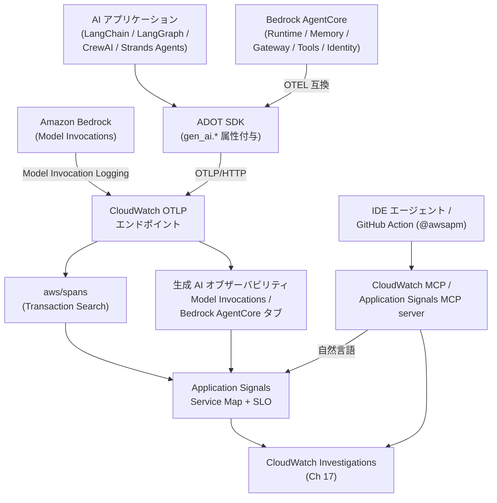

# 生成 AI オブザーバビリティ

CloudWatch 生成 AI オブザーバビリティ（CloudWatch generative AI observability）は、CloudWatch コンソールの「**生成 AI オブザーバビリティ**」メニューにあたる機能で、Amazon Bedrock の **Model Invocations** と **Bedrock AgentCore agents** を中心に、LLM・エージェント・ナレッジベース・ツールにまたがる **エンドツーエンドのプロンプトトレース** をすぐに見られる状態にする最新カテゴリです。本章は前章 [Ch 17 Investigations](./17-investigations.md) で扱った AI トリアージの土台に、**観測される側が AI ワークロード**になったときの広がりを乗せる位置付けで、[Ch 7 Application Signals](../part3/07-application-signals.md) と [Ch 12 OpenTelemetry](../part4/12-opentelemetry.md) の延長として読むのがおすすめです。

## 解決する問題

LLM とエージェントを本番に乗せると、従来の APM では拾いきれない問題が一気に増えます。CloudWatch 生成 AI オブザーバビリティはこの「**特殊だが定番化しつつある GenAI 観測課題**」を CloudWatch 側に取り込むことで、AI 特化の SaaS を別途使わずに済むようにする方向性で設計されています。

1. **出力が決定論でない** — 同じプロンプトでもモデルバージョン・温度・top_p で結果が変わるため、テストやアラームの基準を従来のように「**完全一致**」では作れない
2. **トークン課金とレイテンシのコスト・パフォーマンス天秤** — モデルごとに 1 トークンあたり料金とレイテンシが違うため、`gen_ai.usage.input_tokens` × モデル ID の軸で**コスト按分**しないと請求書を読み解けない
3. **エージェントが多段に呼ぶ** — 1 リクエストの裏でツール呼び出し・ナレッジベース検索・モデル推論が**N 段**走るため、X-Ray の素のトレースだけだと「どのスパンがどの責務か」が読みづらい
4. **ハルシネーションとガードレール発火の追跡** — 「もっともらしいが事実でない出力」「ガードレールでブロックされた出力」を**シグナル化**して観測しないと、品質劣化を検知できない
5. **オープンソースのエージェントフレームワーク** — LangChain / LangGraph / CrewAI / Strands Agents が並立する世界で、各フレームワーク向けに別計装を書くのは現実的でない
6. **観測データを AI から自然言語で叩きたい** — オンコールが Slack / IDE で「直近の SLO バーンを調べて」と頼める入口（MCP）が標準化されていなかった

CloudWatch 生成 AI オブザーバビリティは、これらを **Model Invocations + AgentCore + Application Signals + MCP / GitHub Action** という 4 本柱で受け止めます。AI ワークロードを「**他のサービスと同じ Application Signals の世界**」に取り込みつつ、トークン使用量や `gen_ai.*` 属性、エージェント primitives の専用ダッシュボードといった **GenAI 特化のレイヤー**だけを追加で重ねる、という構造です。

## 全体像

アプリ・エージェントから出る OTel テレメトリが ADOT 経由で CloudWatch に流れ、Model Invocations と AgentCore のダッシュボードに着地し、同じデータを Application Signals が「サービス」として一級で扱い、Investigations や IDE / GitHub の AI が MCP server 経由で参照する全体像を 1 枚で押さえます。



ポイントは 3 つです。第一に、**AI ワークロードのテレメトリは OTel に統一**されており、ADOT SDK が `gen_ai.system` や `gen_ai.usage.input_tokens` などの **OpenTelemetry GenAI セマンティック規約** を自動付与します。これにより Transaction Search と Application Signals に**コード変更ゼロ**で AI スパンが流れ込みます。第二に、**生成 AI オブザーバビリティ専用ダッシュボードと Application Signals は別物ではなく重ね合わせ**で、AI 視点のキュレートビュー（トークン・モデル ID・エージェント primitives）と汎用のサービス視点（RED / SLO / Service Map）を行き来できます。第三に、**MCP server と GitHub Action は AI 側からこの観測データを参照する経路**であり、IDE の AI コーディングエージェントや GitHub PR から「直近の SLO バーン」「どの行が遅い」を自然言語で問えます。

## 主要仕様

### Model Invocations の観測

Model Invocations ダッシュボードは、Amazon Bedrock の `Converse` / `ConverseStream` / `InvokeModel` / `InvokeModelWithResponseStream` API 呼び出しを **CloudWatch コンソールから 1 画面で**追えるキュレートビューです。

| カテゴリ | 主要メトリクス | 用途 |
|---|---|---|
| 呼び出し量 | Invocation count、Requests grouped by input tokens | トラフィック傾向、長文プロンプトの偏り |
| パフォーマンス | InvocationLatency、**TimeToFirstToken (TTFT)** | ストリーミング体感の劣化検知（2026/03 GA） |
| トークン | Token Counts by Model、Daily Token Counts、InputTokenCount、OutputTokenCount | コスト按分、モデル選定 |
| エラー / 制限 | Invocation Throttles、Invocation Error Count、**EstimatedTPMQuotaUsage** | クォータ枯渇前の発報（2026/03 GA） |

Model Invocations を有効化するには、Bedrock コンソール →  **Settings** → **Model invocation logging** から **CloudWatch Logs** を送信先に選びます（Amazon S3 への併送も可）。ログには入出力（プロンプトと応答）が含まれるため、必要に応じて [CloudWatch Logs データ保護ポリシー](https://docs.aws.amazon.com/AmazonCloudWatch/latest/logs/cloudwatch-logs-data-protection-policies.html)（PII マスキング）を併用します。

ダッシュボードは **ModelID** ドロップダウンでモデル別フィルタリングでき、各メトリクスから直接アラームを作れる設計です。Request ID 行を開けば、入出力プロンプトの実体・応答の中身を **右ペイン**で参照でき、`View in Logs Insights` で対応するログにジャンプできます。

#### TTFT と EstimatedTPMQuotaUsage（2026/03）

ストリーミング系の体感品質を捉える `TimeToFirstToken` と、レート制限の枯渇予兆を捉える `EstimatedTPMQuotaUsage` は 2026/03 に追加されました。前者は SLA / SLO の入力に直接使え、後者は**キャッシュ書き込みトークンや出力バーンダウン倍率を加味した実効クォータ消費**を 1 分粒度で出すため、`AWS Service Quotas` の引き上げ申請を**枯渇前**に出すための判断材料になります。

### Bedrock AgentCore agents の観測

AgentCore タブでは、Bedrock AgentCore の **5 つの primitives**（Runtime / Memory / Built-in Tools / Gateways / Identity）にまたがる組み込みメトリクスとトレースを 1 つの画面で見られます。AgentCore は 2025/07 に登場した **AI エージェント実行基盤の primitives 集合**で、エージェントの本体（Runtime）に加え、会話/状態の記憶（Memory）、外部 API の橋渡し（Gateway）、認証情報・リソースアクセス（Identity）、Web ブラウザや code interpreter のような組み込みツール（Built-in Tools）を**部品単位で組み合わせて**エージェントを組み上げる思想で設計されています。観測も同じ単位で切られています。

| Primitive | 既定で出るデータ | 主に何を見るか |
|---|---|---|
| **Runtime（Agent）** | 呼び出し回数 / レイテンシ / 実行時間 / トークン使用量 / エラー率（セッション粒度） | 全体 SLO とフリート俯瞰 |
| **Memory** | メトリクス、Spans*、Logs* | 短期/長期メモリの取得・保存パターン、抽出失敗 |
| **Gateway** | API 変換成功率、エンドポイントごとのレイテンシ | 外部 API ↔ エージェントの橋渡し品質 |
| **Built-in Tools** | ツール呼び出し回数、実行時間、エラー | ツール実装側のバグ検知 |
| **Identity** | 認証/認可成功率、リソースアクセスメトリクス（`AWS/Bedrock-AgentCore` 名前空間） | 不正アクセス・トークンリーク疑い |

\* Memory の Spans / Logs はメモリ作成時に**トレースを有効化**したときのみ出力。

AgentCore メトリクス・スパンを CloudWatch 生成 AI オブザーバビリティで見るには、**Transaction Search の有効化が前提**です（[Ch 8 Transaction Search](../part3/08-transaction-search.md) と同じ仕組みで、`aws/spans` ロググループにスパンを構造化ログとして取り込みます）。アカウント単位の 1 回限りのセットアップで、その後はランタイム上のエージェントが自動でスパンを送ります。

> **Sessions / Traces / Spans の階層**: AgentCore の観測モデルは「セッション（ユーザーとの会話全体）→ トレース（1 リクエスト/応答サイクル）→ スパン（個別の作業単位）」という 3 階層です。1 セッションには複数トレースが乗り、1 トレースには複数スパンが入ります。

### OSS GenAI フレームワークの連携

CloudWatch 生成 AI オブザーバビリティは、**ADOT SDK が自動計装する OSS フレームワーク** からのテレメトリをそのまま受け付けます。AWS 公式に名前が挙がっているのは次の 4 つです。

- **Strands Agents**（AWS 製の OSS フレームワーク）
- **LangChain**
- **LangGraph**
- **CrewAI**

これらを使ったエージェントが AgentCore Runtime の中で動く場合は**追加コードなし**で観測でき、Runtime 外（EKS / ECS / EC2 / オンプレ）で動く場合も ADOT SDK を仕込んでログ・スパン・カスタムメトリクスを CloudWatch OTLP エンドポイントへ流せば同じダッシュボードに乗ります。**OTel が共通入力**なので、CloudWatch から Langfuse・Instana など他のオブザーバビリティ SaaS にデュアル送信したい場合は ADOT Collector / OTel Collector の Exporter を分岐させるだけで済みます。

### Application Signals との統合

Application Signals は GenAI ワークロードを**普通のマイクロサービスと同列に扱います**。Bedrock を呼ぶアプリ側に ADOT 自動計装が入っていれば、Application Signals は Amazon Bedrock の API 呼び出しを **Model ID / Guardrails ID / Knowledge Base ID / Bedrock Agent ID 単位のリソース**としてサービスマップに描き、レイテンシ・エラー率・スループットの RED 指標を出します。サポートされる LLM ファミリは執筆時点で **AI21 Jamba / Amazon Titan / Amazon Nova / Anthropic Claude / Cohere Command / Meta Llama / Mistral AI** です。

つまり Application Signals の Service Map では、`checkout-api`（Lambda）→ `inventory-api`（Lambda）→ DynamoDB のような従来のサービス連鎖と同じ画面に、`recommendation-agent`（Strands Agents）→ `anthropic.claude-3-5-sonnet`（Bedrock 呼び出し）→ `OpenSearch Knowledge Base` のような **AI 連鎖が並列で描かれる**ことになります。SLO バーンが発生したとき「どこが遅かったか」を、AI ワークロードか従来のマイクロサービスかに関係なく**同じ作法**で特定できるのが、CloudWatch がこの統合に振った最大の価値です。

さらに、Application Signals は **OpenTelemetry GenAI セマンティック規約** に対応しています。スパンには次の属性が付き、Transaction Search からそのまま PPL でクエリできます。

| 属性 | 意味 |
|---|---|
| `gen_ai.system` | 推論プロバイダ（例: `aws.bedrock`） |
| `gen_ai.request.model` | モデル ID（例: `anthropic.claude-3-5-sonnet`） |
| `gen_ai.request.max_tokens` / `temperature` / `top_p` | リクエストの推論パラメータ |
| `gen_ai.usage.input_tokens` / `gen_ai.usage.output_tokens` | 入出力トークン数 |
| `gen_ai.response.finish_reasons` | 終了理由（`stop` / `length` / `content_filter` 等） |

これにより、**「同じプロンプトに対する 3 つのモデルのトークン × コスト × レイテンシ比較」を Transaction Search の集約クエリで作れる**ようになり、モデル選定の根拠を運用データから示せます。AI ワークロードに対しても [Ch 7](../part3/07-application-signals.md) の **SLO（Period-based / Request-based）** がそのまま使えるため、「P99 レイテンシ < 8 秒」「フォルト率 < 0.5%」のような GenAI 用 SLO を Lambda や ECS のサービスと**同じ画面で運用**できるのが最大の利点です。

> **Transaction Search との関係**: `gen_ai.*` 属性は OTel スパンに乗って `aws/spans` ロググループに着地します。[Ch 8 Transaction Search](../part3/08-transaction-search.md) の PPL クエリで `WHERE gen_ai.system = 'aws.bedrock'` のように絞り込めば、AI 由来のスパンだけを 100% トラフィックで分析できます。Application Signals は同じスパンから RED 指標を計算するため、**スパン → メトリクス → SLO** が一気通貫で繋がります。

### MCP サーバー連携

2025/07 に **AWS Labs から CloudWatch MCP server と CloudWatch Application Signals MCP server** が公開され、2025/11 にはコーディング AI 向けの強化と **GitHub Action** が GA しました。MCP（[Model Context Protocol](https://modelcontextprotocol.io/)）は LLM に外部コンテキストを渡すためのオープン仕様で、これに対応した IDE エージェント（Amazon Q Developer CLI、Claude Code、Kiro、GitHub Copilot など）から **自然言語で観測データを叩ける** ようになります。

| サーバ | できること（代表例） |
|---|---|
| **CloudWatch MCP server** | アラーム起点のインシデント対応、メトリクス分析、ログパターン検知、アラーム推奨、CloudWatch 全般 |
| **Application Signals MCP server** | サービス健全性、SLO 遵守状況、分散トレース調査、**「どの行のコードが遅延を起こしたか」**の特定、CDK / Terraform 等 IaC への OTel 計装注入 |

両者は[awslabs/mcp](https://awslabs.github.io/mcp/) でオープンソース公開されており、ローカルにクローン → Amazon Q Developer CLI / Claude Code / Kiro / GitHub Copilot などの MCP 対応クライアントに登録するだけで使えます。Amazon Q CLI に登録した場合は、CLI に直接 `「過去 1 時間の SLO バーンを要約して」` と打てば、Application Signals MCP server が `ListSLOs` → `GetServiceLevelObjective` → `GetMetricData` の API 連鎖を**裏で自動実行**して結果を自然言語で返します。

GitHub Action（**Application observability for AWS**）を導入すると、GitHub Issue 上で `@awsapm` をメンションして「checkout サービスのレイテンシが高い理由は」と聞けば、SLO 違反やサービスエラーの**観測ベースの回答**が返ってきます。Pull Request の CI に組み込めば、計装漏れや SLO 劣化を**マージ前に検知**できます。

> **権限のスコープ**: MCP 経由でも IAM ポリシーは効くため、利用するアシスタントに紐づく IAM ロールは **`AIOpsReadOnlyAccess`** や CloudWatch / Application Signals の読み取り権限に絞るのが基本です。書き込み（IaC 修正）を許す場合は別ロールに分離します。

これらは [Ch 17 Investigations](./17-investigations.md) と組み合わせると効果が最大化します。Investigations の API を MCP 経由で呼べるため、**Slack ボット → Application Signals MCP → Investigations** という運用エージェントを内製できます。

### GenAI 特有のシグナル

「LLM ならでは」のシグナルは、CloudWatch 上では次の 4 系統に整理できます。

- **トークン消費**: 入力 / 出力 / 合計トークン数。`gen_ai.usage.*` 属性 + `Token Counts by Model` メトリクス。**コストに直結**する一次指標
- **ガードレール発火 / 終了理由**: `gen_ai.response.finish_reasons` で `content_filter` の出現率を監視。Bedrock Guardrails の発火回数は専用メトリクスでも追える
- **ハルシネーション疑い**: モデル単独では「真偽」を測れないため、**RAG の検索ヒット率・スコア**、`gen_ai.response.finish_reasons = stop` 以外の比率、**応答長の異常**などを代理指標として組み合わせる
- **セッション履歴 / 多段呼び出し**: AgentCore のセッション単位メトリクスとトレース。同じ `session.id` 配下のトレースをまとめて見て「ループに陥っていないか」「Memory の取得に失敗していないか」を判定する

CloudWatch 自体に「ハルシネーション検知」の単一メトリクスはまだ存在しません。実務的には **応答長 / 終了理由 / RAG メトリクス / 利用者フィードバック** を Application Signals のカスタムメトリクスや Logs Insights のクエリで合成し、**SLO の対象**に含める設計が主流です。

#### よく見る Logs Insights クエリ例

Bedrock の Model invocation logs に対する基本的なクエリ例です。トークン量上位のリクエストや、ガードレール発火の件数集計など、コスト管理・品質監視の入口として使えます。

```text
fields @timestamp, modelId, input.inputTokenCount, output.outputTokenCount
| stats sum(input.inputTokenCount) as total_in,
        sum(output.outputTokenCount) as total_out,
        count(*) as calls
  by modelId
| sort total_out desc
```

ガードレールに引っかかった件数を時系列で出すなら次のような形になります（フィールド名はログスキーマのバージョンに依存するため、実環境のフィールドに合わせて調整します）。

```text
fields @timestamp, modelId, output.outputBodyJson
| filter output.outputBodyJson like /content_filter/
| stats count(*) as filtered_calls by bin(5m), modelId
```

### 対応リージョンと料金

- **対応リージョン（GA、2025/10 時点）**: バージニア北部、オハイオ、オレゴン、フランクフルト、アイルランド、東京、ムンバイ、シンガポール、シドニー
- **料金**: 生成 AI オブザーバビリティ機能自体に**追加料金はありません**。CloudWatch の通常料金（Logs 取り込み・保管、Metrics、Transaction Search のスパン取り込み、Application Signals）が**取り込んだテレメトリ量に応じて**課金されます
- **前提機能**: AgentCore タブを使うには **Transaction Search** の有効化（一度きり）が必須。Model Invocations ダッシュボードを完全に使うには **Bedrock の Model invocation logging** を CloudWatch Logs 宛に有効化する必要があります

## 設計判断のポイント

### どこから観測を始めるか

GenAI ワークロードの観測は「**全部まとめて入れる**」より段階的にスコープを切るのが安全です。最小から大きい順に整理すると次のようになります。

1. **Bedrock の Model invocation logging** を CloudWatch Logs に向けて、**Model Invocations ダッシュボードだけ**先に動かす（コード変更不要）
2. アプリに **ADOT SDK** を導入し、Application Signals 上で Bedrock 呼び出しを **gen_ai.\* 属性付きスパン** として可視化
3. エージェントを AgentCore Runtime で動かしているなら、**Transaction Search を有効化**して AgentCore タブの primitives メトリクスを解禁
4. Application Signals の **SLO（TTFT / レイテンシ / エラー率）** を作り、Burn Rate アラームと連携
5. 必要に応じて **MCP server** を IDE / Slack に接続し、AI からの自然言語問い合わせ経路を開く

「**まず Model Invocations**、次に gen_ai.\* スパン、最後にエージェント全体観測」という順序が、コスト・実装手間・効果のバランスが取りやすいパスです。

### コスト管理（トークン課金 + CloudWatch 課金）

GenAI ワークロードのコストは「**Bedrock のトークン課金**」と「**CloudWatch の取り込み・保管課金**」の二重構造になります。観測を厚くするほど CloudWatch 側がかさむため、次の節約レバーを意識します。

- **入出力ログのフィルタリング**: Bedrock の Model invocation logging は入出力本文をログに残すため、**長文プロンプトを大量に流すと Logs 取り込み課金が跳ねる**。Logs データ保護ポリシーで PII マスキング、不要フィールドの除外を併用
- **トレースサンプリング**: Application Signals / Transaction Search のスパンは [Ch 7](../part3/07-application-signals.md) のサンプリング設定で制御可能。低トラフィック環境は 100% でよいが、本番は 5〜10% から始めて必要に応じて増やす
- **ロググループ保持期間**: AgentCore の OTEL 構造化ログは情報量が多い。**保持期間 30〜90 日**で落とし、長期分析用は S3 エクスポート + Athena に逃がす
- **モデル選定との往復**: トークン課金を `gen_ai.request.model` × `gen_ai.usage.*` の集約で見て、**重い質問にだけ大型モデル**を割り当てるルーティング（モデルメッシュ）を設計

### ハルシネーション・ガードレール監視の入れ方

「**完全な真偽判定は不可能**」を前提に、**シグナルを組み合わせる**設計に倒すのが現実的です。

| 観測対象 | 取り方 | 何を疑うか |
|---|---|---|
| `finish_reasons = content_filter` の比率 | Application Signals スパン属性で集計 | 入力プロンプトの劣化、ガードレール強度の過剰 |
| 応答長の異常（極端に短い / 長い） | `gen_ai.usage.output_tokens` メトリクス + 異常検出アラーム | 早期切断、無限ループ、プロンプト崩壊 |
| RAG のヒット件数 / スコア分布 | カスタムメトリクスを ADOT で送出 | 知識ベース起因のハルシネーション |
| 利用者フィードバック（thumbs up/down） | カスタムメトリクスで送出し SLO 化 | 長期的な品質劣化 |

これらのうち**少なくとも 2 つ以上の劣化が同時に出たとき**にだけアラームを上げる **Composite Alarm 設計**にすると、誤発報を抑えながらハルシネーションの兆候を捕まえられます。

### MCP / GitHub Action でどこまで AI に任せるか

[Ch 17](./17-investigations.md) と同じく、**AI には初動を任せ、判断は人間に残す**境界線を引くのが運用上の安全策です。具体的には次の整理が無難です。

- **MCP からの読み取り（メトリクス・SLO・トレース・ログ）は積極的に許可** — 観測データのフェッチは副作用がない
- **MCP からの IaC 修正（CDK / Terraform への OTel 計装注入）は PR レビューを必須に** — 直 Apply は禁止、PR 経由のみ
- **GitHub Action の `@awsapm` 応答は「ヒント」扱い** — 自動マージのゲートには使わず、人間レビューの補助に留める
- **Investigations の Hypothesis を MCP 経由で取り込む場合も accept は人間** — [Ch 17](./17-investigations.md) のルールをそのまま適用

「**AI が観測 → 仮説 → 提案、人間が承認 → 実行**」という前章の境界線は、生成 AI ワークロードの観測でも変わりません。

## ハンズオン

> TODO: 執筆予定（Strands Agents を CDK で AgentCore Runtime にデプロイし、ADOT SDK で観測有効化 → Model Invocations / AgentCore ダッシュボード / Application Signals SLO を確認 → MCP server を Amazon Q CLI に接続して自然言語問い合わせ）

## 片付け

> TODO: 執筆予定

## まとめ

- CloudWatch 生成 AI オブザーバビリティは **Model Invocations + Bedrock AgentCore + Application Signals + MCP / GitHub Action** の 4 本柱で、AI ワークロードを CloudWatch の世界に取り込む 2025 年の中核機能（Preview 2025/07、GA 2025/10）
- ADOT SDK が **OpenTelemetry GenAI セマンティック規約**（`gen_ai.system` / `gen_ai.usage.*` / `gen_ai.response.finish_reasons` 等）を自動付与するため、コード変更ゼロで「**モデル × トークン × コスト × レイテンシ**」を Transaction Search で分析できる
- AgentCore の 5 primitives（Runtime / Memory / Gateway / Tools / Identity）はそれぞれ専用メトリクスを持ち、**Transaction Search 有効化** が前提条件として必要
- **MCP server と GitHub Action（`@awsapm`）** で IDE / Slack / GitHub からの自然言語アクセス経路が標準化され、Investigations と組み合わせれば運用エージェントを内製できる
- 機能料金は無料だが、**Bedrock のトークン課金 + CloudWatch の取り込み課金**の二重コスト構造になるため、**サンプリング・保持期間・ログマスキング**でレバーを引きながら段階的に観測を厚くするのが定石

## 第V部の総括 / 第VI部への橋渡し

第V部「ネットワーク監視と AI 機能」では、L3-4 のネットワーク 3 兄弟（[Ch 16](./16-network-monitoring.md)）、AI による横断トリアージ（[Ch 17](./17-investigations.md)）、そして **GenAI ワークロード自体の観測**（本章）という 3 層を扱いました。共通するのは、**CloudWatch が 2024〜2026 年にかけて「データを集める基盤」から「AI と協調する運用プラットフォーム」へ進化している**点です。Application Signals が AI ワークロードまで一級で扱い、MCP / GitHub Action が AI 側からの参照経路を開いたことで、本書序盤で紹介した Metrics / Logs / Alarms（[Ch 3-5](../part2/03-metrics.md)）の素朴な世界が、運用 AI の文脈に**自然に接続**するようになりました。

最後の[第 VI 部](./19-setup.md)では、ここまで紹介してきた機能群をマルチアカウント・マルチリージョンで運用するための土台 — **Cross-account observability / OAM / Log Centralization** を扱います。本書の締めくくりとして、組織単位で CloudWatch を回すときの「**設置の作法**」を整理します。
