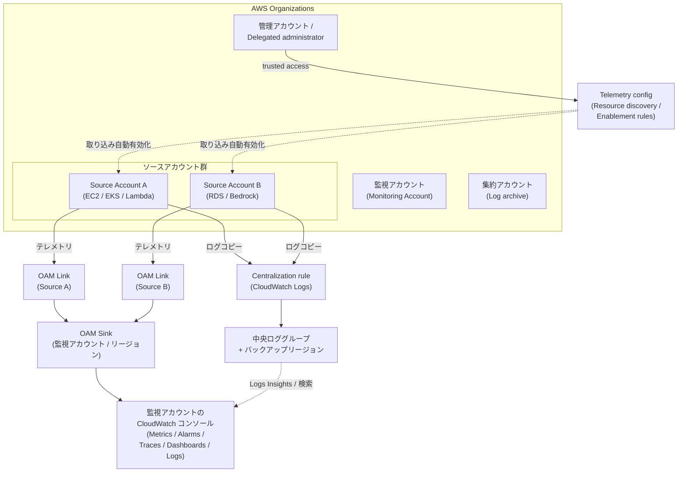

# 横断・セットアップ

CloudWatch コンソール左メニューの最後のピース、「**セットアップ**」は、これまで章ごとに扱ってきた個別機能を**マルチアカウント・マルチリージョンでまとめて回す**ための土台です。本章では中核となる **Observability Access Manager (OAM)** によるクロスアカウント・オブザーバビリティ、**Cross-account / Cross-region コンソール**、2025/09 GA の **Cross-account / Cross-region log centralization**、そして **Telemetry config** による組織横断の自動オンボーディングまでを通して見ていきます。

## 解決する問題

組織が成長すると、CloudWatch を「アカウントごとに」運用する素朴な構成は次の摩擦を生みます。**「観測したい場所と、観測対象が散らばっている場所が違う」**ことを、毎回 IAM ロール引き受けと画面遷移で吸収するのは、規模が大きくなるほど割に合いません。

1. **アカウント切替の手間** — 数十〜数百のメンバーアカウントに対して `aws sso login` → ロールスイッチ → CloudWatch コンソールを開き直す、という一連の動作を**インシデント中**にやる余裕はない
2. **ログ集約の困難** — Subscription Filter / Kinesis Firehose / S3 Replication など旧来の集約手段はパイプラインが長く、KMS / IAM / バックプレッシャの落とし穴が多い
3. **リージョン間の見方統一** — Tokyo と Frankfurt にまたがるサービスを 1 ダッシュボードで見るには、リージョン切替なしの仕組みが必要
4. **新規アカウントのオンボーディング負担** — Organizations にアカウントが増えるたびに、テレメトリ有効化・ログ送信先設定・OAM Link 作成を**毎回手で**やるのは現実的でない
5. **データ保護と暗号化のガバナンス** — ログ本文に PII が混入しがちで、CMK や Logs データ保護ポリシーをアカウント横断で揃える必要がある
6. **課金の見通し** — 各アカウントが個別に CloudWatch Logs 取り込み・Metrics・Application Signals を使うと、合計請求書が読めず、節約レバーが見えなくなる

「セットアップ」メニューは、これらを **OAM + Telemetry config + Log centralization + Organizations 連携** という 4 本柱で吸収する位置付けです。本章はそれらの**設置の作法**を整理します。

## 全体像

組織のソースアカウント群から、OAM Sink/Link 経由で監視アカウントのコンソールにテレメトリが集まり、別系統の Log centralization が中央リポジトリへログをコピーし、Telemetry config が Organizations 全体に対して**取り込み有効化**を自動適用する全体像を 1 枚で押さえます。

ポイントは 3 つあります。第一に、**OAM の Sink/Link はリージョン単位で 1 対多のメッシュ**を作る仕組みで、Cross-account observability の中核です。テレメトリ自体はコピーされず、監視アカウントから「**境界を越えて見に行く**」モデルです。第二に、**Log centralization は別系統の機能**で、ログ本文を**コピー**して中央リポジトリに集める用途に特化します（OAM の「見に行く」とは方向が逆）。第三に、**Telemetry config は Organizations 連携の設定面**を担い、新規アカウントがゼロタッチで取り込み対象に乗ってくるルールを敷きます。3 つは独立して使えますが、組み合わせて初めて「**設置の作法**」が完成します。

## 主要仕様

### Observability Access Manager (OAM)

OAM は **Cross-account observability の中核 API** で、リソースは 2 種類だけです。

| リソース | 置く場所 | 役割 |
|---|---|---|
| **Sink** | 監視アカウント（リージョンに 1 つ） | テレメトリの**受け口**。誰から受けるかをポリシーで制御 |
| **Link** | ソースアカウント | Sink への接続点。**何を共有するか**（テレメトリ種別）を選ぶ |

監視アカウントで Sink を作り、各ソースアカウントで Sink ARN 宛の Link を作ると、監視アカウント側のコンソールから**ロール引き受けなし**でソース側のテレメトリを参照できるようになります。

#### 共有可能なテレメトリ種別

OAM が受け持つ「観測対象」は次の 6 種です。これは [Ch 7 Application Signals](../part3/07-application-signals.md) や [Ch 11 取り込み](../part4/11-ingestion.md) で扱った機能群と対応しており、有効化したものだけが監視アカウントに見えます。

| 種別 | 内容 | 参照先 |
|---|---|---|
| **Metrics** | CloudWatch メトリクス（名前空間単位で全部 / 一部選択可） | [Ch 3 Metrics](../part2/03-metrics.md) |
| **Logs** | CloudWatch Logs ロググループ（名前パターンで部分選択可） | [Ch 4 Logs](../part2/04-logs.md) |
| **Traces** | X-Ray / Transaction Search のトレース | [Ch 8 Transaction Search](../part3/08-transaction-search.md) |
| **Application Signals services / SLO** | サービスマップ・RED 指標・SLO | [Ch 7 Application Signals](../part3/07-application-signals.md) |
| **Application Insights applications** | Application Insights のアプリケーション | — |
| **Internet Monitor** | インターネット側ヘルス / TTFB | [Ch 16](../part5/16-network-monitoring.md) |

**監視アカウントが共有を許可した種別 ∩ ソースアカウントが共有を選んだ種別**だけが実際に流れます。両側の AND になる点が落とし穴で、「設定したのに見えない」場合はまず両端の選択を見直します。

#### スケール上限と料金

| 項目 | 値 |
|---|---|
| 監視アカウントあたりの Sink | リージョン内 **1** |
| 監視アカウントが束ねられるソース | 最大 **100,000** |
| ソースアカウントが共有先にできる監視アカウント | 最大 **5** |
| 料金 | **Logs / Metrics / Application Signals は追加料金なし**。トレースは**最初の 1 コピー無料**、それ以降の追加コピーは X-Ray の通常料金 |

監視アカウントは実質「アカウントの集合のビュー」であり、ストレージ複製ではないため、有効化のコストは小さいのが OAM の最大の利点です。

#### Link の解除と Sink の削除

Link 解除は**ソースアカウント側から**行います（監視側からは Link を消せない設計で、データ提供側に主権があります）。Sink を削除するには、その Sink にぶら下がる**全ての Link を先に解除**する必要があります。誤って Sink を消すと監視アカウントの全クロスアカウントビューが落ちるため、IAM で `oam:DeleteSink` を厳しく絞るのが定石です。

### Cross-account / Cross-region コンソール

OAM が「リージョン内の」クロスアカウント観測を担うのに対し、**Cross-account / Cross-region コンソール**は**リージョンをまたぐ**閲覧体験を提供します。中身は次の 3 軸です。

- **アカウントセレクタ** — Metrics / Alarms / Traces のコンソールで、画面上部のドロップダウンから別アカウント・別リージョンに切り替え。**ログイン状態は維持**されたまま、参照先だけ変わる
- **クロスアカウント・クロスリージョンダッシュボード** — 1 枚のダッシュボードに、複数アカウント × 複数リージョンのウィジェットを並列配置。`accountId` と `region` パラメータをウィジェット定義に持たせる
- **Search 関数の活用** — `SEARCH('{AWS/EC2,InstanceId} CPUUtilization', 'Average', 60)` のような関数を `accountId` 違いで複数並べ、メトリクス算術で合算

このメニューは**追加料金なし**で、必要なのは IAM 側で `cloudwatch:GetMetricData` 等のクロスアカウント参照権限（典型的には `CloudWatchReadOnlyAccess` 相当）が監視アカウント側のロールに付いていることだけです。OAM と組み合わせると、**「リージョン内は OAM、リージョン横断はコンソール機能」**という棲み分けで両軸をカバーできます。

### Cross-account / Cross-region Log Centralization

2025/09 に GA した **CloudWatch Logs centralization** は、ログ本文を**中央アカウントへコピー**して、長期保管・全社検索・コンプライアンス用途に使えるようにする機能です。OAM の「見に行く」モデルとは方向が逆で、こちらは**物理的な複製**を作ります。

#### Centralization rule の構造

ルールは「**ソース条件**」と「**宛先設定**」の組で表現されます。

| 構成要素 | 例 |
|---|---|
| ソースアカウント | 組織全体 / 特定 OU / アカウント ID リスト |
| ソースリージョン | リージョン ID のリスト |
| ソース選択基準 | ロググループ名パターン、または**データソース種別**（VPC Flow Logs / EKS Audit / CloudTrail 等、2026/03 から） |
| 宛先アカウント | 集約用アカウント |
| 宛先リージョン | プライマリ宛先 + 任意のバックアップリージョン |
| 宛先ロググループ命名 | `${source.accountId}` / `${source.region}` / `${source.logGroup}` / `${source.org.ouId}` 等の変数で動的命名 |
| 暗号化 | AWS-owned KMS / 宛先指定の CMK |

ルールが作られると、**新規に到着するログ**だけがコピー対象になります。**既存ログの過去分は対象外**である点は重要で、過去分を含めたい場合は別途 S3 経由のバルク移送を組む必要があります。

#### コピー後のログに自動付与されるフィールド

集約先のログイベントには、出自を保つための系統情報が**自動で**乗ります。

- `@aws.account` — ソースアカウント ID
- `@aws.region` — ソースリージョン

Logs Insights からはこれを使ってアカウント別・リージョン別の集計が即できるため、**「どのアカウントから流れてきたログか」**がコピー後も失われません。

#### 監視メトリクスと健全性

Centralization rule はそれ自体がメトリクスを出します。

| メトリクス | 用途 |
|---|---|
| `IncomingCopiedBytes` / `IncomingCopiedLogEvents` | 集約先の流入量。容量とコストの一次指標 |
| `OutgoingCopiedBytes` / `OutgoingCopiedLogEvents` | ソース側からの送出量 |
| `CentralizationError` | コピー失敗（KMS 権限・スキーマ不整合・宛先未存在など） |
| `CentralizationThrottled` | スロットルの発生 |

Rule には **health status** が紐付き、AWS CloudTrail で API 呼び出しを監査できます。`CentralizationError` が立った時の典型原因は **KMS キーの権限不足 / 宛先暗号化のミスマッチ / trusted access 未有効 / ロググループのクォータ超過**です。

#### 料金

- **最初の 1 コピー（中央集約用）は無料**
- **追加コピー（複数の宛先に重複コピー、別リージョンへのバックアップ等）は $0.05/GB**
- 集約先の標準 CloudWatch Logs 取り込み・保管料金は別途発生

「**まず中央集約用に 1 つだけ Centralization rule を引く**」が無料枠でカバーできる範囲で、それ以上は GB 単価を意識します。

### CloudWatch Agent / ADOT セットアップの全体図

ホスト・コンテナ・関数からテレメトリを取り出すエージェント側のセットアップは、本書では章ごとに分散していました。本章ではセットアップの観点から関係を整理しておきます。

| エージェント | 主な担当 | 詳しい章 |
|---|---|---|
| **CloudWatch Agent** | EC2 / オンプレ / EKS のメトリクス・ログ収集、StatsD / collectd / procstat | [Ch 11 取り込み](../part4/11-ingestion.md) |
| **ADOT (AWS Distro for OpenTelemetry) Collector / SDK** | OTel スパン・メトリクス・ログを CloudWatch へ。Application Signals / Transaction Search の入力 | [Ch 12 OpenTelemetry](../part4/12-opentelemetry.md) |
| **Container Insights エージェント (CW Agent Operator)** | EKS / ECS のクラスタ・Pod メトリクス、Performance Logs | [Ch 13 Container Insights](../part4/13-container-insights.md) |
| **Lambda 拡張 (CloudWatch Lambda Insights / ADOT Lambda Layer)** | Lambda の高解像度システムメトリクス、コールドスタート観測 | [Ch 15 Lambda Insights](../part4/15-lambda-insights.md) |

セットアップの基本動線は次の 3 段です。

1. **IAM ロールに `CloudWatchAgentServerPolicy`**（オンプレは IAM ユーザのアクセスキーで代替）。ログ保持期間を設定したい場合は `logs:PutRetentionPolicy` を追加
2. **配布**: Systems Manager **Distributor + State Manager** で集中配布。マルチアカウント / マルチリージョンの組み合わせは Quick Setup で雛形を作り CloudFormation で複製
3. **設定の管理**: `amazon-cloudwatch-agent.json` を S3 / Parameter Store で配信し、`amazon-cloudwatch-agent-ctl` で fetch

EC2 では **VPC エンドポイント (`com.amazonaws.<region>.monitoring`、`com.amazonaws.<region>.logs`)** を張ると、NAT Gateway を経由せずに送出できコスト面・レイテンシ面で有利です。

### AWS Organizations 連携でのオンボーディング自動化

OAM と Telemetry config はいずれも **AWS Organizations の trusted access** を起点に「自動オンボーディング」を実現できます。

#### OAM 側の自動 Link

監視アカウントで Sink を作るとき、`Settings` → `Organizations` から **CloudFormation テンプレート / URL を発行**できます。これを Organizations 配下の OU に StackSet として展開すると、新規追加アカウントにも自動で Link が張られます。`oam:CreateLink` を実行する CloudFormation StackSet を **OU 単位の自動デプロイ**で運用するのが定石です。

#### Telemetry config — 取り込みのアカウントワイド管理

**Telemetry config**（コンソール: `Settings` → `Telemetry config`）は、Organizations 配下の全メンバーアカウントに対して **取り込み（テレメトリ収集）の有効化ルール**を一括で敷く機能です。

- **Resource discovery** を有効にすると、各アカウントの**主要 AWS リソースの取り込み状態**を自動で棚卸し（VPC Flow Logs / EKS 制御プレーン / WAF / Route 53 Resolver / NLB / CloudTrail / EC2 Detailed Metrics / Bedrock AgentCore / CloudFront 等が対象、2025/12 で対象が 6 サービス追加）
- **Telemetry enablement rule** を作ると、**新規リソースに自動で取り込みを有効化**できる。組織レベルのルールはアカウントレベルより優先され、最低ラインを揃えられる
- **Delegated administrator** を 1 アカウント指名できる。管理アカウントを直接使わず、専用のオブザーバビリティ管理アカウントから運用するのが推奨

裏側では各メンバーアカウントに **`AWSServiceRoleForObservabilityAdmin`** という SLR が作られ、AWS Config の Service-Linked Recorder を使ってリソース発見が回ります。「**新しいアカウントにログ送信を入れ忘れる**」事故をルール化で潰せるのが大きい価値です。

### データ保護 / 暗号化 / 課金管理

#### 暗号化

CloudWatch のテレメトリは**転送中も保管中も暗号化**されますが、**鍵をユーザ管理にしたい**場合は CMK（AWS KMS の Customer Managed Key）を使います。

| 対象 | CMK 適用箇所 |
|---|---|
| ロググループ | `AssociateKmsKey` API でログ単位に CMK を関連付け |
| Log centralization | 宛先ロググループに **destination-specific CMK** を指定可。ソース側 CMK を中央側 CMK で読み替える運用も可能 |
| Metrics / Traces | 一般に AWS-managed key で運用（X-Ray は KMS を選べる） |

CMK 経由で暗号化しているロググループを Centralization に乗せる場合、**宛先側に解読権限がある CMK** を構成しないと `CentralizationError` が立つので、ポリシーに `kms:Decrypt` を含めます。

#### データ保護ポリシー

CloudWatch Logs の **データ保護ポリシー**（[Ch 4 Logs](../part2/04-logs.md) と [Ch 18 生成 AI オブザーバビリティ](../part5/18-genai-observability.md) で扱った機能）は、ロググループ / アカウント単位で PII（メールアドレス、クレジットカード、AWS シークレットキー等）を**ログ書き込み時にマスキング**します。Bedrock の入出力ログや RUM の URL クエリにも有効で、組織横断で**アカウント単位ポリシー**を Organizations の SCP / CloudFormation StackSet で揃えるのが安全策です。

#### 課金管理（CloudWatch 自体のコスト）

CloudWatch を組織横断で回すときの主要コストドライバは次の 4 つです。

1. **Logs 取り込み** — 多くのケースで最大の費目。データソース別に**送るか送らないか**を Telemetry config の Enablement rule で制御
2. **カスタムメトリクス / 高解像度メトリクス** — Application Signals / EMF 由来も含む。`PutMetricData` の頻度と次元を抑える
3. **Synthetics canary / Internet Monitor / RUM** — チェック頻度・モニター数で線形に増える
4. **Log centralization の追加コピー** — 1 コピーは無料、それ以降は $0.05/GB

CloudWatch 自体のコストを CloudWatch アラームで監視するのは循環になりますが、**AWS Billing アラーム**（`AWS/Billing` 名前空間 `EstimatedCharges` / Cost Anomaly Detection）を使って**請求側から見張る**のが正攻法です。Billing アラームは us-east-1 の特例リージョンで作成する点に注意します。

### セットアップのトラブルシュート（チェックリスト）

実運用で遭遇しがちな詰まりどころを 1 か所に集約しておきます。

| 症状 | 第一に疑う場所 |
|---|---|
| OAM Link 作成後も監視アカウントに何も見えない | 監視アカウント側 Sink ポリシーで許可した種別 と ソース側 Link で選んだ種別の **AND** が空でないか |
| Link は張れているのに 1 種別だけ欠落 | 該当種別（例: Application Signals）が**ソース側で有効化されているか**。OAM は基盤を有効化するわけではない |
| Centralization rule が `CentralizationError` を出す | 宛先の CMK 権限 / trusted access / 宛先ロググループのクォータ |
| Centralization rule を作ったが過去のログが入らない | 仕様上、**ルール作成後に到着した新規ログのみ**が対象。過去分は S3 経由で別ジョブを組む |
| Telemetry config の Enablement rule が動かない | trusted access 有効化 / `AWSServiceRoleForObservabilityAdmin` の存在 / AWS Config の Recorder 設定 |
| 監視アカウントのダッシュボードに別アカウントのウィジェットを置けない | コンソールが OAM ベースで動いているか（Sink/Link が**監視アカウント側のリージョン**に揃っているか） |
| EC2 の CloudWatch Agent からデータが届かない | IAM ロール（`CloudWatchAgentServerPolicy`） / VPC エンドポイント / ホスト時刻ずれ |
| クロスリージョンダッシュボードでメトリクスが表示されない | ウィジェット定義の `region` パラメータと、参照側ロールのリージョンクロスの IAM 許可 |
| Sink を消したいのに消えない | Link が**全件**解除されているか。残り Link がある限り Sink は削除できない |

ここに該当しない場合は、CloudTrail で `oam.amazonaws.com` / `logs.amazonaws.com` 起点の `AccessDenied` を引くと、IAM 起因かサービス起因かを切り分けやすくなります。

## 設計判断のポイント

### 中央集権 vs 連邦

「**監視アカウント 1 つ vs 部門ごとに監視アカウント**」の設計選択です。OAM は監視アカウント数の上限を持たないため、**部門 / リージョン / 環境（prod/stg）単位**で監視アカウントを切る連邦モデルも成立します。

- **中央集権（監視アカウント 1）**: 視野は最広だが、IAM / ダッシュボード / アラームのポリシーが 1 アカウントに集中し、変更影響が大きい
- **連邦（複数監視アカウント）**: 影響範囲を分離できるが、SLO や Investigations の対象が部門境界で切れる
- **中間（マスター監視 + 部門ビュー）**: 1 つのマスター監視アカウントに全ソースが Link、加えて部門ごとに別の監視アカウントが**部分集合**にだけ Link

ソースアカウントが共有先にできる監視アカウントは**最大 5**なので、連邦モデルでも数を増やしすぎるとこの上限に引っかかります。**マスター 1 + 用途別 2〜3** が現実解です。

### Region 戦略

OAM はリージョン内、コンソールはリージョンまたぎ、Centralization はリージョンまたぎ可、と機能ごとにリージョン軸の挙動が違います。

- **本拠リージョンを 1 つ決める**（例: `ap-northeast-1`）。監視アカウントの Sink・主要ダッシュボード・メインの Investigations はここに置く
- **副リージョン**（例: `us-east-1`）は OAM の別 Sink を持ち、本拠とはコンソールのリージョン切替で行き来する
- **Log centralization** はバックアップリージョンを必ず指定。`us-east-1 ↔ us-west-2` のような北米内ペア、`ap-northeast-1 ↔ ap-southeast-1` のようなアジア内ペアを選ぶと RTO/RPO 設計と整合する

### コスト管理

組織横断で観測を回すと、コストは「アカウント数 × データ量 × 機能数」で乗算的に増えます。レバーは大きく 3 つです。

1. **取り込み元を絞る** — Telemetry config の Enablement rule で**本当に必要なデータソース**だけを ON。VPC Flow Logs は IPS のために全量、CloudTrail Data Events は対象 S3 バケットだけ、のような割り切り
2. **保持期間を逓減** — ロググループ単位で 7 / 30 / 90 / 365 / 無期限 を使い分け。長期保管は Centralization の中央側に集めて、ソース側は短期で十分
3. **追加コピーを増やさない** — Centralization の追加コピーは $0.05/GB で課金。バックアップリージョンは「**必要な分だけ**」に留める

### 既存の SIEM / 第三者 SaaS との両立

組織がすでに Splunk / Datadog / Elastic / Security Lake などを運用している場合、CloudWatch とのデータ重複と二重課金が問題になりがちです。共存パターンは大きく 3 つあります。

| パターン | 内容 |
|---|---|
| **CloudWatch を入口、外部を分析エンジン** | ログは CloudWatch Logs に集約 → Subscription Filter / Firehose で SIEM へ転送 |
| **OTel Collector で分岐** | アプリ側 ADOT で OTLP → Collector の Exporter で **CloudWatch + Datadog 等**に同時送信 |
| **ログは S3、メトリクス・トレースだけ CloudWatch** | コンプライアンス系ログは Centralization で中央 S3、運用観測だけ CloudWatch（[Ch 11 取り込み](../part4/11-ingestion.md) の S3 Tables 連携を併用） |

「**全部 CloudWatch にする**」「**全部外部 SIEM にする**」のどちらかに振り切るより、**取り込みは共通、解析エンジンは用途別**のハイブリッドが運用しやすい構成です。Investigations や Application Signals MCP（[Ch 17 Investigations](../part5/17-investigations.md)、[Ch 18](../part5/18-genai-observability.md)）など AI 連携機能は CloudWatch 側に閉じるため、これらを使うワークロードは CloudWatch 側にデータを寄せておくと相性が良いです。

## ハンズオン

> TODO: 執筆予定（CDK で 2 アカウント間に OAM Sink/Link を張る → Cross-account ダッシュボードを 1 枚作成 → Log centralization rule を Organizations 配下の OU に対して作成 → 監視アカウントから Logs Insights / Metrics / Traces を横断クエリ → Telemetry config の Enablement rule で VPC Flow Logs を組織全体で自動 ON）

## 片付け

> TODO: 執筆予定

## 参考資料

**AWS 公式ドキュメント**
- [Cross-account cross-Region log centralization](https://docs.aws.amazon.com/AmazonCloudWatch/latest/logs/CloudWatchLogs_Centralization.html) — Centralization rule / `@aws.account` / `@aws.region` 自動付与・暗号化の正本
- [Setting up telemetry configuration](https://docs.aws.amazon.com/AmazonCloudWatch/latest/monitoring/telemetry-config-turn-on.html) — Resource discovery と Enablement rule の設定手順
- [Enable telemetry configuration for your organization](https://docs.aws.amazon.com/AmazonCloudWatch/latest/monitoring/telemetry-config-organization.html) — Organizations の trusted access と delegated administrator
- [Observability Access Manager (OAM) CLI reference](https://docs.aws.amazon.com/cli/latest/reference/oam/index.html) — Sink / Link / Sink ポリシーの API/CLI と共有可能な 6 種テレメトリ

**AWS ブログ / アナウンス**
- [New – Amazon CloudWatch Cross-Account Observability](https://aws.amazon.com/blogs/aws/new-amazon-cloudwatch-cross-account-observability/) — OAM ベースの Cross-account observability 公式アナウンス
- [Simplifying Log Management using Amazon CloudWatch Logs Centralization](https://aws.amazon.com/blogs/mt/simplifying-log-management-using-amazon-cloudwatch-logs-centralization/) — Centralization rule の実装ウォークスルー（2025/09 GA 解説）

## まとめ

- 「セットアップ」メニューは **OAM (Sink/Link) + Cross-account/Cross-region コンソール + Log centralization + Telemetry config + Organizations 連携** の 5 つで構成され、本書でこれまで章ごとに見てきた機能群を**マルチアカウント・マルチリージョンで運用するための土台**を提供する
- OAM はリージョン内の **1 監視 ↔ 100,000 ソース / ソース当たり 5 監視まで**のメッシュを作り、Logs / Metrics / Application Signals は**追加料金なし**で監視アカウントから直接見える
- **Log centralization** はログ本文を中央アカウントへ**コピー**する別系統機能で、新規ログのみを対象とし、最初の 1 コピーは無料、追加コピーは **$0.05/GB**
- **Telemetry config** は trusted access + delegated administrator + Enablement rule で、新規アカウントの**取り込み有効化を自動化**する。Organizations 配下のドリフトを止めるためのコア機能
- 設計の勘所は「**マスター監視 1 + 用途別補助監視 2〜3**」「**本拠リージョン + 副リージョン**」「**取り込みは共通、解析エンジンは用途別**」の 3 つ

## 第VI部の総括 / 本書 Phase 2 の完了

第VI部は本章の 1 章のみですが、ここまでで本書のゴール ── **CloudWatch コンソール左メニューの全 11 項目について、それが何で、何を解決するためのものかを説明できる** ── に到達しました。

| メニュー項目 | 対応章 |
|---|---|
| 取り込み（Ingestion / Pipelines） | [Ch 11](../part4/11-ingestion.md) |
| ダッシュボード | [Ch 6](../part2/06-dashboards.md) |
| アラーム | [Ch 5](../part2/05-alarms.md) |
| AI オペレーション（Investigations） | [Ch 17](../part5/17-investigations.md) |
| 生成 AI オブザーバビリティ | [Ch 18](../part5/18-genai-observability.md) |
| Application Signals (APM) | [Ch 7](../part3/07-application-signals.md) |
| インフラストラクチャモニタリング | [Ch 13](../part4/13-container-insights.md) / [Ch 14](../part4/14-database-insights.md) / [Ch 15](../part4/15-lambda-insights.md) |
| ログ | [Ch 4](../part2/04-logs.md) |
| メトリクス | [Ch 3](../part2/03-metrics.md) |
| ネットワークモニタリング | [Ch 16](../part5/16-network-monitoring.md) |
| **セットアップ（Cross-account / OAM 等）** | **本章** |

これで CloudWatch コンソール左メニューの**全 11 項目**をカバーしました。**Phase 2（メニュー網羅）は本章をもって完了**です。Phase 1 で Metrics / Logs / Alarms / Dashboards / Application Signals / Transaction Search / RUM / Synthetics の中核 8 機能を押さえ、Phase 2 で 取り込み・OTel・インフラ Insights 三兄弟・ネットワーク・Investigations・生成 AI、そして本章の Cross-account 基盤を加えたことで、**2026 年時点の CloudWatch を「機能の地図」として一望**できる状態になりました。

ここから先は座学から手を動かす段階です。各章末に置いた「ハンズオン」TODO を埋めていく作業 ── CDK + Serverless 構成で、章ごとに動く環境を組み立て、片付けまでを通すフェーズ ── が次のマイルストーンになります。本書を起点に、組織の CloudWatch 運用を**設計判断のレベルから組み立てられる**ようになっていれば幸いです。
